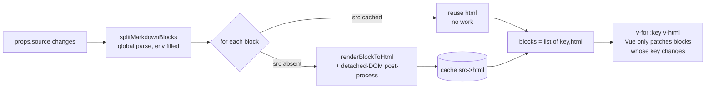

# Markdown — Incremental Block Rendering — Design

Status: design validated in discussion, **not yet implemented**.

**Internal** refactor of `frontend/src/components/ui/MarkdownContent.vue` (plus additions in
`frontend/src/utils/markdown.js`) to render Markdown **block by block** instead of a single
monolithic `v-html`. Goal: eliminate the flickering of Mermaid diagrams during streaming and cut
the CPU cost of rendering. **The component's public interface does not change** — no calling
component is modified.

## 1. Problem

An assistant message's content (and a thinking block) is rendered via Markdown-it → HTML string →
injection through **`v-html`** into a single container (`MarkdownContent.vue` l. 326-333). `v-html`
is **opaque** to Vue's reactivity: when the string changes, Vue **tears down and rebuilds the entire
DOM subtree**, with no fine-grained diffing.

During streaming:

- The displayed text grows ~60 times/second, smoothed by a `requestAnimationFrame` buffer
  (`frontend/src/utils/streamingBuffer.js`). The `source` prop therefore changes every frame.
- `watch(() => props.source, render)` (l. 144) re-runs `render()` **over the whole document**:
  `renderedHtml.value = await renderMarkdown(props.source)` → `nextTick()` →
  `renderMermaidDiagrams()`.
- Each frame, `v-html` re-injects the full HTML → **the already-present Mermaid SVG is destroyed**,
  replaced by its raw `<pre><code class="language-mermaid">`. `renderMermaidDiagrams()` (l. 67-93)
  then re-renders it **asynchronously** with a random `id`, **with no cache**.

Two distinct problems:

1. **Visual flash**: between re-injecting the raw code and finishing the async Mermaid render, there
   is a paint window → the diagram flickers. This repeats every frame while text streams below it.
   (Text/shiki code is also rebuilt every frame, but it is visually imperceptible because shiki is
   awaited *inside* `renderMarkdown`; Mermaid, on the other hand, is rendered *after* `nextTick`,
   hence the visible gap.)
2. **CPU cost**: the entire document (potentially several KB of Markdown) goes through Markdown-it +
   shiki + Mermaid every frame.

## 2. Goal & scope

- **Eliminate the flash** of Mermaid blocks (and any already-rendered content) during streaming.
- **Cut the cost**: only re-render what actually changes.

**Scope: streaming only.** The case of the virtual scroller unmounting/remounting an off-screen
message (and re-rendering it once when it returns to the viewport) is **out of scope**: no
persistent cross-mount cache. On remount, the component starts from an empty cache and re-renders
once — accepted behavior.

**Non-goals**: enriching UX per block type ("component per type" option, see §9), changing the
rendering engine, touching the backend or the streaming buffer.

## 3. Approach: root-block rendering

The lever is **not** "one Vue component per content type" but Vue's **keyed diffing over a list of
blocks**. We split the document into top-level blocks, each rendered in its own `v-html` inside a
`v-for :key`. Vue **preserves the DOM of any block whose `key` has not changed**; during streaming,
only the **last block** grows → only it is re-rendered, while every preceding block (including a
Mermaid diagram completed above) keeps its DOM intact.

**Markdown-it parses, we extract.** We reimplement no Markdown logic. `md.parse(source, env)`
produces tokens; each block token carries `.map = [startLine, endLine]` computed by Markdown-it. We
keep the root-level tokens (`level === 0` with a `.map`) and slice the source at the indicated lines.
This is extraction mechanics, not parsing.

Two levels of memoization compound:

- **Application cache `Map<contentHash, html>`** — avoids re-rendering shiki/Mermaid on stable blocks
  (content-addressed: two identical blocks share the same render).
- **Vue keyed diffing** (`v-for :key`) — Vue only touches the DOM of blocks whose `key` changes.

## 4. Feasibility validated (PoC)

The three unknowns were resolved by a throwaway validation script (scratch `blocks-poc/`, config
identical to `markdown.js`):

| Unknown | Verdict | Evidence |
|---|---|---|
| Shiki rendering of an isolated block | ✅ | A `python` block rendered alone via `renderAsync(blockSrc, env)` comes out highlighted (`class="shiki…"` + `style` spans). markdown-it-async's placeholder mechanism works per substring. |
| Mermaid → SVG string | ✅ | Already proven by existing code (l. 83): `const { svg } = await mermaid.render(id, source)` returns the SVG string without mounting in the visible DOM. |
| Cross-block references | ✅ | The global `parse` fills `env.references`. A paragraph `[x][ref]` rendered alone **but with the shared `env`** resolves `→ <a href=…>`. Counter-test: **without** the `env`, the link stays broken. Sharing the `env` is necessary and sufficient. |

Confirmed bonuses:

- **Reliable splitting**: `token.level === 0 && token.map` isolates exactly the root blocks with
  their line ranges.
- **Perfect HTML equivalence**: concatenation of per-block renders = monolithic render, **character
  for character** (1179 = 1179 on the test doc).
- A `[ref]: …` definition **produces no block** (pure metadata → no empty `<div>`).
- An **unclosed** Mermaid fence at the end of the stream is auto-closed at EOF by Markdown-it (token
  `fence`, `info="mermaid"`) → the last block being typed is handled as it is today.

## 5. Architecture

### 5.1 `frontend/src/utils/markdown.js` — two exposed functions

```js
// Markdown-it parses; we collect the boundaries via token.map.
// Also returns `env` (filled by the parse) to pass back into each block's render.
splitMarkdownBlocks(source) -> { blocks: [{ src, hash }], env }
    env = {}
    tokens = md.parse(source, env)
    blocks = tokens
        .filter(t => t.level === 0 && t.map)
        .map(t => { const src = sliceLines(source, t.map); return { src, hash: hashStr(src) } })

// Render ONE block: reuses renderAsync (shiki) + DOMPurify, with the shared env.
renderBlockToHtml(src, env) -> string
    return DOMPurify.sanitize(await md.renderAsync(src, env), DOMPURIFY_CONFIG)
```

The current `renderMarkdown(source)` stays (used outside sessions: whats-new, tips) or is
re-expressed on top of these primitives — plan author's choice.

### 5.2 `MarkdownContent.vue` — cache + render loop

```js
const blocks = ref([])           // [{ key, html }] -> what the template renders
const cache  = new Map()         // raw block source -> FINAL html (post-Mermaid). Component-level.

async function renderOneBlock(src, hash, env) {
    if (cache.has(hash)) return cache.get(hash)           // hit -> no work
    let html = await renderBlockToHtml(src, env)
    // Post-process on a DETACHED DOM node (never inserted in the page) -> final string.
    const tmp = document.createElement('div')
    tmp.innerHTML = html
    await renderMermaidIn(tmp)        // mermaid.render -> SVG string inlined into tmp
    addLanguageLabelsIn(tmp)
    annotateFileLinksIn(tmp)          // depends on the injected `fileLinks`, already available
    html = tmp.innerHTML
    cache.set(hash, html)
    return html
}

async function render() {
    const { blocks: raw, env } = splitMarkdownBlocks(props.source)
    const rendered = await Promise.all(
        raw.map((b, i) => renderOneBlock(b.src, b.hash, env)
            .then(html => ({ key: blockKey(b.hash, raw, i), html })))
    )
    evictStale(cache, raw)           // keep only the hashes present in `raw`
    blocks.value = rendered
    emit('rendered')                 // contract preserved (see §6), even if no parent listens today
}

watch(() => props.source, render)
onMounted(render)
```

### 5.3 Template

```html
<div v-show="!showRaw" class="markdown-body" v-highlight="highlightTerms" @click="handleLinkClick">
    <div v-for="b in blocks" :key="b.key" v-html="b.html"></div>
</div>
```

The `showRaw` mode (raw source) is kept as-is. `@click` and `v-highlight` remain on the parent
container (they operate on descendants, blocks included).

### 5.4 Data flow



### 5.5 The key flow change: post-process on a detached DOM node

Today, Mermaid/labels/file-links operate on the **visible container** *after* injection +
`nextTick` (hence the flash). From now on, the post-process runs on a **detached** `div` (created in
memory, never inserted); the Mermaid SVG is **inlined into the string** before it reaches the
template. Consequences:

- When Vue injects the block, the SVG is **already in it** → **the flash also disappears on the
  *first* render** of a block, not just on re-renders.
- The post-processed result is a string → **directly cacheable** and reusable as-is.
- The `container` ref is **no longer needed** for the post-process (it may remain for the scope of
  `@click`/`v-highlight`, which are carried by the wrapper).

## 6. Fine-grained decisions & invariants

- **Vue `key`**: `blockKey = contentHash + ':' + occurrenceIndex`, where `occurrenceIndex`
  disambiguates **identical** blocks in the current list (two `---`, two identical paragraphs…). Vue
  requires unique keys; the hash alone would collide. In append-only streaming, a stable block's
  `(hash, occurrence)` stays constant → DOM preserved.
- **Render cache keyed by raw block source**: the cache is a `Map<src, html>` (the raw block source
  is the key, not a hash) — two identical blocks share a single render, and a hash collision can
  never serve the wrong HTML. The `hash` is used *only* to build the compact Vue key above.
- **Eviction**: after each committing `render()`, prune from the cache the sources absent from the
  current list. Otherwise the last block (new source every frame) would grow the cache with all its
  intermediate versions.
- **Shared `env` mandatory**: the global `parse`'s `env` is passed back into each
  `renderBlockToHtml` → cross-block references resolved (see §4).
- **Sequential block rendering + overlap guard**: blocks are rendered one at a time (a `for` loop,
  not `Promise.all`). The streaming hot path is cache-hit dominated (only the last block actually
  renders), so sequential costs nothing there and sidesteps any concurrent `mermaid.render` concern.
  Because streaming fires `render()` every frame, successive async `render()` calls overlap; a
  monotonic `renderSeq` token ensures only the latest one commits its result, evicts, and emits — a
  slow older frame can never clobber a newer one (nor leave `rendering` stuck true).
- **Block in progress**: the last block changes source every frame → re-rendered (intended). An
  **incomplete** Mermaid block fails to render until it is closed (current behavior preserved,
  `suppressErrorRendering: true` keeps `<body>` clean).
- **Failed Mermaid renders are not cached**: `renderOneBlock` writes the cache only when every
  Mermaid diagram in the block rendered successfully. A failure (incomplete block mid-stream, or a
  transient while two overlapping `render()` calls hit the same just-completed diagram) must stay
  retryable — never frozen into the cache as an error state.
- **DOMPurify per block**: sanitization applied per block *before* the post-process. The Mermaid SVG
  is inlined **after** that sanitize (as today, where the SVG is injected via `innerHTML`
  post-sanitize): it is therefore **not re-sanitized**, and the cached HTML contains that
  non-re-purified SVG. **Do not** "fix" this with a second `DOMPurify.sanitize` on the final HTML —
  it would strip the Mermaid SVG (regression). Behavior strictly identical to current.
- **Interface unchanged**: props (`source`, `showToolbar`), emit `rendered` (still emitted at the
  end of `render()`, see §5.2 — although no parent listens today, the contract is honored verbatim),
  `showRaw` mode, `copySource` — all preserved. `TextContent.vue`, `ThinkingContent.vue`,
  `Reasoning.vue` do not change.

## 7. Changes (files)

- **`frontend/src/utils/markdown.js`**: add `splitMarkdownBlocks(source)` and
  `renderBlockToHtml(src, env)` (+ a small `hashString` FNV-1a helper for the Vue key; line slicing
  is inline). `renderMarkdown` is kept unchanged for the non-block usages (whats-new, tips).
- **`frontend/src/components/ui/MarkdownContent.vue`**: replace the single `renderedHtml` + `watch`
  with the block-by-block loop + cache + eviction; move `renderMermaidDiagrams` /
  `addLanguageLabels` / `annotateFileLinks` to variants operating on a detached node (`…In(node)`)
  and feeding the cache; switch the template to `v-for :key v-html`.

No migration, no backend change, no added dependency.

## 8. Edge cases & risks

- **Identical blocks** → key collision: handled by `occurrenceIndex` (§6).
- **Reference defined *after* its use during streaming**: the using block has a stable key and will
  not be re-rendered when the definition arrives further down → the link would stay broken. **Rare**
  case (ref defined after use, mid-stream). **Accepted**; if ever needed, we would include a hash of
  `env.references` in the key (heavier, not the default).
- **`v-highlight` (search highlighting)**: applied to the DOM after injection, over the blocks; the
  cache stores the **pre-highlight** HTML, so no cross-pollution (highlighting mutates the live DOM,
  never `tmp.innerHTML`). **Explicit checklist item for the plan**: verify the "search active while
  streaming a multi-block message" scenario (the directive walks the wrapper via
  `TreeWalker`/`querySelectorAll` and re-applies on each update — to confirm on the `v-for`
  structure).
- **Render regression**: per-block vs monolithic HTML equivalence is proven character for character
  (§4), which strongly bounds this risk.

## 9. Out of scope

- **Flash on scroll (virtual scroller remount)** — excluded (§2). Would need a persistent
  cross-mount cache (module-level or store), a separate decision.
- **Vue components per block type (option C)** — Markdown-it AST → one component per node type. More
  extensible (UX enrichable per type) but markedly heavier; not retained, block rendering captures
  the essence of the benefit without that complexity.
- **Throttle / deferred Markdown rendering during streaming** — band-aids discarded in favor of the
  structural solution.

## Note

In line with the project policy ("no tests"): manual validation + the feasibility PoC. The splitting
and render equivalence were verified empirically (§4) before any application code was written.
