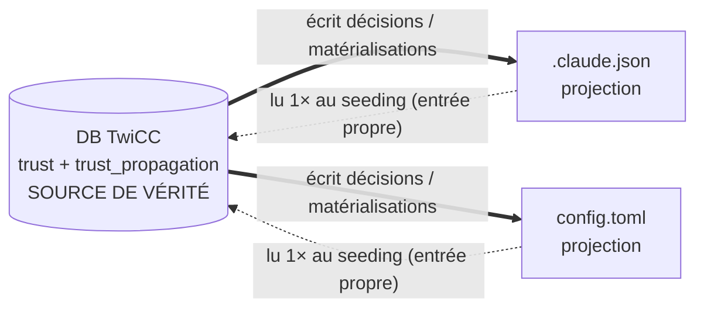
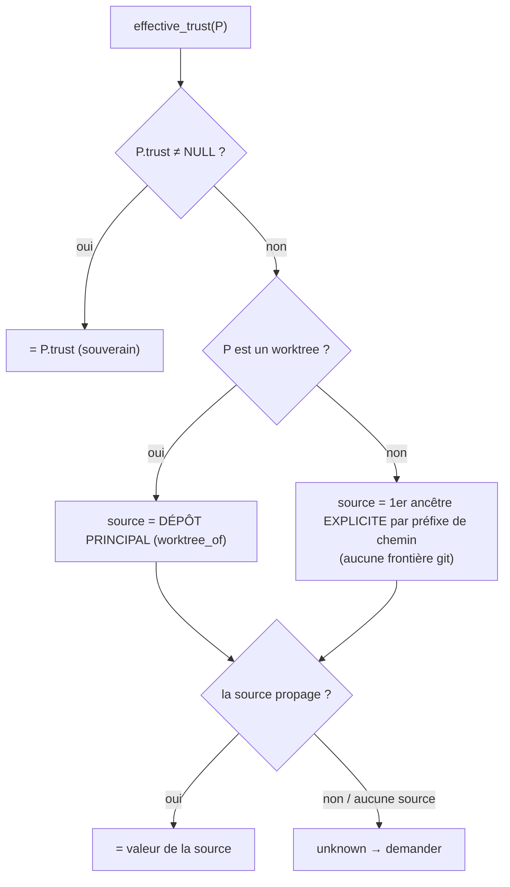
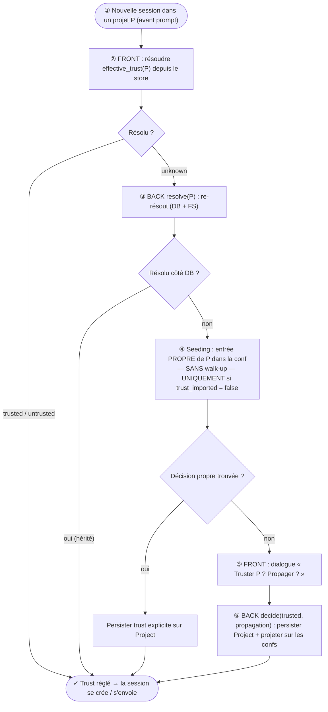

# Project Trust — Design

Statut : design validé en discussion, **non implémenté**.

Deux parties, par **domaine** :
- **Partie 1 — Gestion du trust au niveau projet** (Claude + Codex) : l'état (3 champs),
  la résolution, le gate, le dialogue, la **lecture et l'écriture** des deux confs providers,
  **y compris la matérialisation** (Codex + worktrees Claude) et le drapeau `trust_imported`.
  C'est l'objet de ce document.
- **Partie 2 — Exploitation du trust pour les sessions** : clamp des permission modes, retrait
  du flag `allow-dangerously-skip-permissions`, setting « default permission mode untrusted »,
  activation des outils worktree. = l'**enforcement**. Rappelée en fin de document.

## 1. Contexte & objectif

Claude Code et Codex ont chacun une notion de *trust* d'un projet, persistée dans leur conf :

- **Claude Code** — `~/.claude.json` → `projects["<dir>"].hasTrustDialogAccepted` (`true`/`false`/absent).
  Lecture **hiérarchique au runtime** : le CLI remonte les répertoires parents (**walk-up**, sans
  limite git) jusqu'à un ancêtre trusté. **Exception : les worktrees ne sont PAS hérités** (un patch
  de sécurité — GHSA-q5hj-mxqh-vv77, spoofing via `commondir` — a supprimé l'héritage worktree→repo).
- **Codex** — `~/.codex/config.toml` → `[projects."<racine>"].trust_level = "trusted" | "untrusted"`.
  Clé = **racine git** du cwd (sinon le cwd). Héritage **intra-repo seulement** : Codex s'arrête à
  la racine git, ne remonte jamais au-dessus.

Les SDK **court-circuitent** le dialogue de trust : aujourd'hui une session tourne sans jamais le
demander, et TwiCC ne lit/écrit aucun trust. **Pourquoi maintenant** : on veut activer
**prochainement** les outils worktree de Claude (`EnterWorktree`/`ExitWorktree`), que le binaire
n'autorise que si le dépôt **et le worktree** portent `hasTrustDialogAccepted`. Écrire le trust est
le prérequis.

## 2. Modèle de données — 3 champs sur `core.models.Project`

| Champ | Type | Sémantique |
|---|---|---|
| `trust` | `BooleanField(null=True)` | `True` = trusted explicite, `False` = untrusted explicite, `NULL` = pas de décision propre (→ hérite ou demande). |
| `trust_propagation` | `BooleanField` | La décision explicite **cascade** aux descendants `NULL`. Défaut posé **à la décision** = « le projet est sous git » (`resolve_git_from_path(directory) is not None`). |
| `trust_imported` | `BooleanField(default=False)` | Bookkeeping interne. `True` dès que TwiCC a traité le projet **une 1ʳᵉ fois au gate** (résolu / importé / décidé / **matérialisé**). Une fois `True` : **on ne relit plus jamais la conf provider** pour ce projet ; la DB fait autorité. Ne dit **rien** sur la valeur du trust. |

Invariants : on ne stocke **que des décisions explicites** ; le trust effectif d'un descendant
`NULL` est **toujours calculé**, jamais matérialisé en DB. `trust_propagation` n'a de sens que
quand `trust` est non-`NULL`.

Migration : ajout des 3 colonnes. Pas de data-migration lisant les confs (seeding paresseux, §5).

## 3. Source de vérité — autorité à sens unique

**La DB TwiCC fait foi. Les confs providers sont une projection.**
- **TwiCC → providers** : on **écrit** nos décisions et matérialisations.
- **providers → TwiCC** : on **lit une seule fois** par projet (l'import initial, gardé par
  `trust_imported`). Après, un changement fait **hors** TwiCC (CLI Claude/Codex) **n'est plus relu**.
- Choix acté : cible = utilisateurs travaillant surtout *dans* TwiCC. Conséquence assumée : une
  **révocation** externe (CLI) ne sera pas vue.

## 4. Résolution `effective_trust(P)` — toujours depuis la DB

1. `P.trust` non-`NULL` → c'est lui (le self est **souverain**).
2. **Si `P` est un worktree** (`P.worktree_of` renseigné) → règles **worktree** : on hérite du
   **dépôt principal** (`effective_trust(P.worktree_of)`) **s'il propage** ; sinon **non résolu**.
   On NE passe PAS par le préfixe de chemin — la worktree-ité **prime**.
3. **Sinon** (non-worktree) → règles de **parentage** : remonter au **premier ancêtre EXPLICITE**
   par **préfixe de chemin** (`realpath`, comparaison **par segments**) ; `trust_propagation = True`
   → on **hérite** ; `= False` → **non résolu** (pas de saut par-dessus un ancêtre explicite).
4. Aucune source → **non résolu**.

**Pas de frontière git** : la propagation par chemin coule par **pur préfixe** (volontaire — si on
truste un dossier **au-dessus** des racines git et qu'on propage, les repos dessous doivent hériter ;
un submodule hérite aussi, override `False` explicite possible).

> **Worktrees : ils propagent toujours** depuis leur dépôt principal, pour l'instant. Pas de
> distinction « code interne vs PR externe » (Claude ne la fait pas non plus). Reporté à la future
> **création de worktree côté TwiCC**, où la source sera connue.

## 5. Flux create / resume + seeding

Déclencheur = **« new session in project »** côté front (création du draft), **avant** le prompt.

- **Front résout d'abord** : si résolu, **aucun appel back** (champs sérialisés : `trust`,
  `trust_propagation`, `worktree_of`, `directory`, `git_root`).
- **Seeding** = lecture de la conf, **seulement** si non résolu **et** `trust_imported = false`, et
  **seulement l'entrée propre** de P (Claude : chemin exact ; Codex : racine git **quand P est sa
  racine**). **Pas de walk-up au seeding.** Collapse : *trusted sur l'un → trusted*.
- **`trust_imported` → `true` à la fin du 1er gate**, quelle que soit l'issue (résolu / importé /
  décidé / matérialisé). C'est ce qui empêche de **re-gober une entrée matérialisée** plus tard.
- Check défensif au back de création ; pas de bootstrap (seeding plié dans le gate).

## 6. Projection & réconciliation (écriture des confs)

À `decide()` et à chaque gate, on **réconcilie les entrées PROPRES de P** vers `effective(P)`
(écriture **seulement si ça diffère**). On matérialise l'entrée propre de P **uniquement quand le
provider ne verrait PAS P trusté nativement** :

| Cas (effective(P) = trusted) | Claude | Codex |
|---|---|---|
| Décision explicite sur P | écrire l'entrée exacte de P | écrire l'entrée (racine git de P) |
| Sous-dossier ordinaire hérité | **walk-up couvre → rien à écrire** | matérialiser **si la source est au-dessus du git root** (sinon couvert par l'entrée du repo) |
| **Worktree** hérité | **matérialiser l'entrée exacte** (walk-up ne couvre PAS) | **matérialiser** (racine du worktree) |

- Côté **Claude**, la seule matérialisation est donc **les worktrees** (les sous-dossiers ordinaires
  passent par le walk-up → ça minimise les écritures `~/.claude.json`, le fichier sensible).
- `trust_imported` garde **toutes** les matérialisations (Claude worktree + Codex).

Réconciliation **paresseuse** : un changement d'`effective(P)` (ex. on désactive `trust_propagation`
sur un ancêtre) ne touche **rien** en cascade. À la prochaine session de P : `effective(P)` redevient
`unknown`, `trust_imported` est déjà `true` → on **ne re-lit pas** l'entrée matérialisée → on
**demande**, puis on réécrit l'entrée vers la nouvelle décision.

> Fenêtre de péremption (entre le changement et la prochaine session de P) : effet uniquement sur le
> **CLI externe** ; TwiCC est toujours correct (résout depuis la DB).

### Exemple (le piège résolu par `trust_imported`)

`A` non-git trusted+propagation → on écrit `A`. `A/B` repo git ; 1ʳᵉ session : `effective(B)`=trusted
(hérité) → **matérialise** `B=trusted` (Codex, car au-dessus du git root) + `B.trust_imported=true`.
On désactive `trust_propagation` de `A` → `effective(B)`=unknown. Session suivante dans `B` :
`trust_imported=true` → on **ne re-lit pas** → on **demande**. Sans le drapeau, le seeding ré-adopterait
`B=trusted` en silence (= le bug).

## 7. Clés provider & mécanique d'écriture

### Codex — `~/.codex/config.toml` via RPC (validé sur la source Rust)

- **Méthode** : `config/batchWrite` (`ConfigEdit{keyPath, mergeStrategy, value}`) via `AsyncCodexClient`,
  comme `plugin_install.py`. `filePath` **omis** (défaut = user config). Le binaire gère
  lock/atomicité/format. (`app-server/src/config_manager_service.rs`)
- **`key_path` exact** : `projects."<realpath_canonique>".trust_level` — segment de chemin **entre
  guillemets doubles** (les `.` du chemin découperaient sinon ; échapper `"`/`.` internes par `\`).
  Parseur : `config_manager_service.rs:418-463`.
- **`mergeStrategy = upsert`** : crée les tables `[projects]`/`[projects."<root>"]` absentes **sans
  écraser** d'autres clés (`:470-525`).
- **`value`** : `"trusted"` / `"untrusted"` (lowercase).
- **Clé = realpath canonicalisé** (`dunce::canonicalize`) ; pas de trailing slash. Codex teste aussi
  la variante brute → écrire la forme realpath est sûr. (`config/src/loader/mod.rs:968-996`)
- **Worktree** : clé = **racine du worktree** canonicalisée (testée en priorité), pas le dépôt
  principal. Fonction in-repo à imiter : `set_project_trust_level` (`core/src/config/mod.rs:1869`).
- Lecture (seeding) : `tomllib` sur le fichier, ou `config/read`.

### Claude — `~/.claude.json` (édition fichier)

- **Clé** = chemin exact `realpath` (`Project.directory`). RMW **atomique** : `orjson` read → muter
  la seule clé `hasTrustDialogAccepted` → `temp` + `os.replace`, sous lock advisory sidecar,
  re-lecture juste avant. Préserver tout le reste.
- Écritures **rares** (décisions explicites + matérialisation **worktrees** seulement) → multi-session
  non bloquant ; risque résiduel = écraser une métadonnée volatile (auto-cicatrisant).
- Worktree : écrire la **racine résolue du worktree** (cohérent avec le patch anti-spoofing GHSA).
- **0 nouvelle dépendance** (Codex : RPC ; Claude : `orjson`/`fcntl`/`os.replace`).

Helpers : `git.resolve_git_from_path`, `git.resolve_worktree_main_repo`, `Project.worktree_of`
(peuplé en live + backfill, **survit à la suppression** du worktree), `os.path.realpath`. ⚠️ Pour la
racine git réelle, recalculer le toplevel **live** (`use_cache=False`), pas la colonne `git_root`
(fausse pour worktree supprimé).

## 8. Front

- **Serializer** : exposer `trust` + `trust_propagation` (`core/serializers.py:serialize_project`).
- **Résolveur léger (JS)** : mêmes règles qu'au §4 (worktree-first via `worktree_of`, sinon préfixe
  de chemin). Le back reste l'autorité (re-résolution FS).
- **Dialogue de trust** au « new session in project » : 2 questions (truster ? / propager ?), défaut
  propagation = sous-git. Pattern `ProjectEditDialog.vue`.
- **Fiche projet** : `trust` (Oui / Non / *hérite*) + `trust_propagation` éditables. Si `trust`=`NULL`,
  afficher le trust **résolu + provenance** (« hérité depuis `A` » / « depuis le dépôt principal » /
  « non résolu → sera demandé »).

## 9. Points d'insertion (fichier:ligne)

- **Gate front** : `frontend/src/components/message/MessageInput.vue` (`handleSend` ~1051, payload
  ~1062) et `frontend/src/stores/data.js:createDraftSession (~1027)` — ancré à la **création du draft**.
- **Check défensif create** : `core/services/session_creation.py` après résolution projet (~l.160),
  avant `manager.create_session` (l.285).
- **Resume** : `core/services/send_message.py` avant handoff (l.163) **et** branche WS resume
  `asgi.py` (`if exists:`, avant `manager.send_to_session` l.827) — helper commun.
- **Back actions** : `resolve_project_trust(project_id)` ; `decide_project_trust(project_id, trusted, propagation)`.
- **Écriture Claude / Codex** : nouveaux modules (RMW atomique `~/.claude.json` ; RPC calquée sur
  `providers/codex/plugin_install.py`).

## 10. Limites assumées

- **`untrusted` sur un sous-chemin d'un dépôt trusté n'est pas pleinement exprimable aux providers**
  (Codex partage la racine-git ; Claude walk-up renvoie l'ancêtre). TwiCC l'enregistre ; seul
  l'enforcement **Partie 2** l'imposera.
- **Révocation externe** (CLI) non vue après l'import.
- **Worktree de PR/code externe** : non distingué pour l'instant (propage comme les autres) — traité
  à la future création de worktree côté TwiCC.

## 11. Points empiriques — RÉSOLUS

1. **Codex `config/batchWrite`** : ✅ format confirmé sur la source (`key_path` quoté realpath,
   `upsert` crée la table, value lowercase, worktree = sa racine, cf. §7).
2. **Claude walk-up worktree** : ✅ **les worktrees ne sont PAS hérités** (patch sécu GHSA-q5hj-mxqh-vv77).
   → on **matérialise** l'entrée exacte du worktree (cf. §6). Sous-dossiers ordinaires : walk-up OK.

(Clé Claude = chemin brut `realpath` confirmée par l'état réel de `~/.claude.json`.)

## 12. Partie 2 (rappel, non détaillé)

Clamp `permission_mode` (Claude : retirer `auto`/`acceptEdits`/`bypassPermissions` → `default`/`plan`/`dontAsk` ;
Codex : retirer `auto`/`autonomous`/`yolo` → `read_only`/`strict`) ; réduction `setting_sources`
(Claude → `["user"]`) ; retrait conjoint de `bypassPermissions` **et** du flag
`allow-dangerously-skip-permissions` en untrusted ; setting « default permission mode untrusted » ;
**activation des outils worktree** + gestion du cas **worktree de PR externe** (distinction à la
création). Les outils worktree Claude sont déjà auto-désactivés par le binaire hors trust.

## 13. Part 2 — enforcement (detailed)

> Written in English (project doc-language standard). Supersedes the §12 stub.

### 13.0 Scope & non-goals

Phase 2 does exactly two things, no more:
1. **Declare** trust to the providers' configs — done in Part 1 (`hasTrustDialogAccepted` / `trust_level`).
2. **Clamp** the permission settings that make no sense for an untrusted project.

It is **not** our job to police what the agent does once launched (content-level
prompt injection, a malicious `AGENTS.md`/`CLAUDE.md`, harness/model reliability).
We declare trust and remove the modes/sources that don't belong in untrusted; the
rest is the provider's responsibility. This boundary is deliberate.

Driving intent of "untrusted" (user framing): **don't let repo-controlled
config/tooling hijack the agent** (`.mcp.json`, project hooks, project agents,
project commands, project settings). Writing files is **not** the threat.

Two enforcement layers, different responsibilities:
- **Frontend** — UX: pre-fill the right default, clamp the offered choices,
  surface the forced value. Convenience, not security.
- **Backend** — the security floor: a forged WS payload must not be able to run
  `bypassPermissions` in an untrusted project. Mandatory, independent of the front.

### 13.1 The dual permission-mode default

Introduce a second default, **`permission_mode_if_untrusted`**, alongside the
existing `permission_mode`. It exists, **per provider**, at three levels: global
synced settings, presets, per-project `default_agent_settings[provider]`.

- **Not a closed-bundle field.** The 7-field bundle maps 1:1 to `Session`
  columns; a session stores a single resolved `permission_mode`.
  `permission_mode_if_untrusted` is a *default-shaping* field — it lives only in
  the default/preset/project-default configs, never on `Session`.
- **Both fields inherit up the same chain** (`projectAgentDefaults.js`:
  self → `worktree_of`/path-ancestor → … → global).
- **Independent of the project's own trust state.** Both are always editable and
  meaningful in the editor — neither is clamped by the project's current trust.
  Which one is *used* is decided at session-creation time by the effective trust.
- **Allowed values of the untrusted field = the untrusted-allowed set** (§13.2).
  The trusted field keeps the full set.

### 13.2 Untrusted-allowed sets + hard defaults (per provider)

The criterion (agreed after implementation, superseding the earlier stricter
sets): **every mode that keeps at least one structural guardrail is allowed** —
a permission prompt, read-only, auto-deny, the CLI's safety checks (Claude
`auto`) or the workspace-write sandbox (Codex `auto`/`autonomous`). Only the
no-guardrail-at-all modes are removed. Untrusted is about not loading
repo-controlled config, not about forbidding reads/writes.

| Provider | Full set | Untrusted-allowed | Removed | Hard default (untrusted) |
| --- | --- | --- | --- | --- |
| Claude | default, auto, acceptEdits, plan, dontAsk, bypassPermissions | default, auto, acceptEdits, plan, dontAsk | **bypassPermissions** | **`default`** |
| Codex | read_only, strict, auto, autonomous, yolo | read_only, strict, auto, autonomous | **yolo** | **`read_only`** |

The hard default is the read-only-ish mode **that still asks** (Claude `default`
prompts before each write/exec; Codex `read_only` = read-only sandbox +
`on-request`, asks to write/escalate) — **not** the silent-reject one (`dontAsk` /
`strict`). It lives in:
- backend `SYNCED_SETTINGS_DEFAULTS` (`providers/claude_code/constants.py:42`,
  `providers/codex/constants.py:14`) — add `claudeCodeDefaultUntrustedPermissionMode
  = "default"`, `codexDefaultUntrustedPermissionMode = "read_only"`, with the
  matching `AGENT_SETTINGS_FIELDS_MAPPING`-style entries;
- frontend provider store (`providers/{provider}/store.js`) — a
  `defaultUntrustedPermissionMode` ref + setter, sibling of `defaultPermissionMode`.

### 13.3 Trust-dependent field selection (the resolution rule)

Wherever a `permission_mode` is materialized from a default/preset, pick the field
by effective trust of the target project:
- effective trust **trusted** → use `permission_mode`;
- effective trust **untrusted / unknown** → use `permission_mode_if_untrusted`
  (unknown is treated as untrusted, agreed).

Applies at **three** interaction points, not just creation:
1. **Draft pre-fill** — `stores/data.js:createDraftSession` (option A snapshot).
2. **Apply preset** — `AgentSettingsPopover.vue` preset application.
3. **Reset** — the reset stack in `useSessionAgentSettings.js`.

The session stores the single chosen value (snapshot). The model alias rule is
unchanged.

### 13.4 Backend security clamp (mandatory floor)

At the agent-build points, re-resolve effective trust (backend `twicc.trust`
resolver, Part 1) and clamp. This is the security boundary; it does not trust the
frontend.

**Claude** — `providers/claude_code/agent/agent.py`, just before
`ClaudeAgentOptions(...)` (~l.823):
- `permission_mode`: if untrusted/unknown and the incoming value ∉ untrusted-allowed
  → replace with the **global** untrusted-default. (Normal flow never hits this:
  the frontend already baked a safe value at creation.)
- `setting_sources`: `["user"]` (currently `["user","project","local"]`, l.830) —
  drops project/local settings, hooks, `.mcp.json`, project agents.
- `extra_args`: drop `allow-dangerously-skip-permissions` (currently always set,
  l.768) — paired with removing `bypassPermissions`.
- Slash commands: expose only the user/managed set (`discover_global_commands`),
  drop `discover_project_commands`.

**Codex** — `providers/codex/permission_modes.py` (`resolve_codex_policy` +
`resolve_codex_turn_overrides`): if untrusted/unknown, clamp `(sandbox, approval)`
to the untrusted-allowed set (fallback = global untrusted-default). The native
`trust_level` gate (written in Part 1) already cuts project-local config/MCP/hooks
(see §13.5), so there is nothing else to do for the config-injection surface.

**Floor uses the global default, not the project chain.** Option A stays intact
(frontend resolves the chain, backend = floor + legacy): the clamp's fallback is
the *global* untrusted-default, never a re-resolved per-project value. The
per-project untrusted-default is honored via the frontend snapshot at creation; the
backend only catches anomalies (forged payload, legacy session, post-revocation
resume).

**Resume.** Same clamp on the build path: if a project became untrusted after
creation, a now-too-permissive stored `permission_mode` is clamped (→ global
untrusted-default) and surfaced as **forced** (reuse the `isContextMaxForced`
machinery) + a **toast**. No live re-clamp of a running process (decided:
resume-only; Codex re-clamps per-turn for free).

### 13.5 Codex enforcement facts (empirical, from the Rust source)

Checked against `~/dev/codex`, the app-server v2 path TwiCC uses.
- The binary **does not** clamp the `sandbox`/`approval` we pass explicitly:
  `derive_permission_profile` (`config/src/config_toml.rs`) and the approval
  default (`core/src/config/mod.rs`) apply the trust-based default **only when the
  value is unset**; an explicit override always wins (the `requirements` clamp is
  gated `!was_explicit`). ⇒ Codex enforcement is **entirely on us**.
- `trust_level != Trusted` **natively gates** "project-local config, hooks, and
  exec policies" (incl. project-defined MCP) — `config/src/loader/mod.rs:833`.
  Part 1 already writes `trusted`/`untrusted`, so this is wired for free.
- Writing `untrusted` also **neutralizes Codex auto-trust**: `thread_processor.rs`
  auto-persists `Trusted` on an elevated request only when `trust_level.is_none()`;
  an explicit `untrusted` blocks it.
- `AGENTS.md` is loaded regardless of trust (`core/src/agents_md.rs`) — **out of
  scope** (policing instructions is not our job; see §13.0).

### 13.6 Insertion points (file:line)

Backend:
- `providers/claude_code/constants.py` (`SYNCED_SETTINGS_DEFAULTS` l.42,
  `AGENT_SETTINGS_FIELDS_MAPPING` l.94) — add the untrusted-default key/mapping;
  same for `providers/codex/constants.py` (l.14 / l.38).
- `views.py:_clean_project_agent_defaults` (l.302) — **whitelist
  `permission_mode_if_untrusted`** as an allowed key (it is *not* in
  `AgentSettings._fields`, so the current `allowed_fields` check at ~l.341 rejects
  it), and validate its value against the provider's untrusted-allowed set.
- New helper `clamp_for_trust(provider, project, settings)` + call sites: Claude
  `agent/agent.py` (before `ClaudeAgentOptions`), Codex `permission_modes.py`
  (`resolve_codex_policy` / `resolve_codex_turn_overrides`). Reuses
  `twicc.trust` / `core.services.trust`.
- `enforce_agent_settings_consistency` stays the capability clamp; the trust clamp
  is a *sibling* applied where the project is in scope, not threaded into it.

Frontend:
- `providers/{provider}/store.js` — `defaultUntrustedPermissionMode` state + setter.
- `utils/projectAgentDefaults.js` — resolve `permission_mode_if_untrusted` up the
  chain like the other fields.
- `composables/useSessionAgentSettings.js` — trust-aware field selection at
  pre-fill/preset/reset; forced display when clamped.
- `stores/data.js:createDraftSession` — pick the field by effective trust.
- `components/project/ProjectAgentDefaultsSection.vue` — paired field per provider
  ("Permission mode (trusted)" / "(untrusted)", Inherit sentinel; untrusted choices
  limited to the allowed set).
- the global agent-defaults UI (same surface that edits `defaultPermissionMode`) —
  add the sibling field.
- `utils/presetFormat.js` — carry `permission_mode_if_untrusted` in the preset
  shape/summary.
- `AgentSettingsPopover.vue` — forced display + toast on clamp.

Validation/choices are enforced **both** front (choices) and back
(`_clean_project_agent_defaults` + the clamp).

### 13.7 Sequencing (revised after the v1.8.0 incident)

Gate (Part 1) and draft pre-fill both fire at session creation. The original
"pre-fill reads the store after the gate" wiring proved racy: a backend seed
settles the DB but the `project_updated` broadcast can land *after* the draft
seed, so the draft froze the untrusted default for a project that had just been
seeded trusted (observed in the field: session stuck on `default`, lock badge
shown, then everything "fixed itself" once the store caught up). Hardened as:

- **The gate's result is authoritative**: `ensureProjectTrust` returns the
  settled `{state}` and every creation path passes it straight to
  `createDraftSession(projectId, trustState)` — no re-resolution of the store
  between gate and seed. HTTP/exception failures return `{state: null}` with a
  console warning (and no dialog: the backend may have partially settled).
- **Startup backfill** (`backfill_unimported_trust`, run as a boot task): seeds
  every `trust_imported=False` project from the provider configs, so the
  post-upgrade stock is settled immediately instead of lazily at each project's
  first gate. New projects keep the lazy gate (correct: nothing to import yet,
  re-checked at next boot anyway).
- **Gate at draft send**: sending a draft whose project is still unresolved
  (pre-upgrade hydrated drafts, failed-gate leftovers) runs the gate first; if
  it settles trusted and the draft still carries the automatic untrusted seed,
  the permission mode is re-seeded to the resolved default.
- **Provider projections off the request path**: the resolve/decide endpoints
  settle the DB, respond, and run the Claude/Codex config writes as background
  tasks (the Codex write spawns an app-server subprocess — serialized by a
  module lock); the resolve endpoint never 500s (degrades to `state: null`).

### 13.8 Deferred / out of scope

- **Worktree tools** (`EnterWorktree`/`ExitWorktree`) activation + the external-PR
  worktree distinction — related but separate; not part of this enforcement spec.
- **Untrusted badge** on project/session — end of Phase 2.
- **CLI-created sessions** inheriting the untrusted default — same "CLI inheritance
  deferred" trade as project-defaults (§9 of the agent-defaults doc).
- Policing agent behavior / `AGENTS.md` / content injection — explicitly not ours
  (§13.0).
