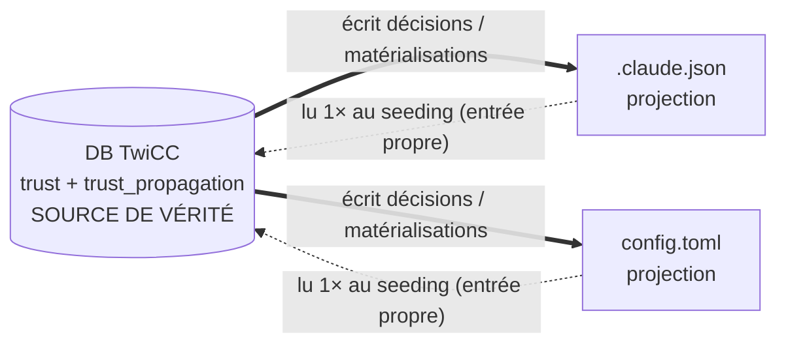
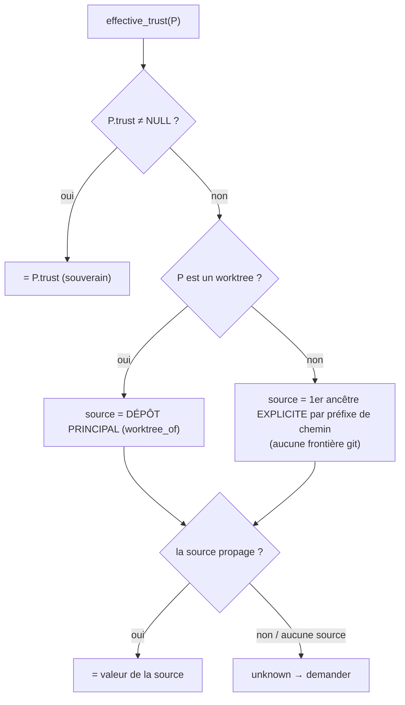

# Project Trust — Design

Statut : design validé en discussion, **non implémenté**.

Deux parties, par **domaine** :
- **Partie 1 — Gestion du trust au niveau projet** (Claude + Codex) : l'état (3 champs),
  la résolution, le gate, le dialogue, la **lecture et l'écriture** des deux confs providers,
  **y compris la matérialisation** (Codex + worktrees Claude) et le drapeau `trust_imported`.
  C'est l'objet de ce document.
- **Partie 2 — Exploitation du trust pour les sessions** : clamp des permission modes, retrait
  du flag `allow-dangerously-skip-permissions`, setting « default permission mode untrusted »,
  activation des outils worktree. = l'**enforcement**. Rappelée en fin de document.

## 1. Contexte & objectif

Claude Code et Codex ont chacun une notion de *trust* d'un projet, persistée dans leur conf :

- **Claude Code** — `~/.claude.json` → `projects["<dir>"].hasTrustDialogAccepted` (`true`/`false`/absent).
  Lecture **hiérarchique au runtime** : le CLI remonte les répertoires parents (**walk-up**, sans
  limite git) jusqu'à un ancêtre trusté. **Exception : les worktrees ne sont PAS hérités** (un patch
  de sécurité — GHSA-q5hj-mxqh-vv77, spoofing via `commondir` — a supprimé l'héritage worktree→repo).
- **Codex** — `~/.codex/config.toml` → `[projects."<racine>"].trust_level = "trusted" | "untrusted"`.
  Clé = **racine git** du cwd (sinon le cwd). Héritage **intra-repo seulement** : Codex s'arrête à
  la racine git, ne remonte jamais au-dessus.

Les SDK **court-circuitent** le dialogue de trust : aujourd'hui une session tourne sans jamais le
demander, et TwiCC ne lit/écrit aucun trust. **Pourquoi maintenant** : on veut activer
**prochainement** les outils worktree de Claude (`EnterWorktree`/`ExitWorktree`), que le binaire
n'autorise que si le dépôt **et le worktree** portent `hasTrustDialogAccepted`. Écrire le trust est
le prérequis.

## 2. Modèle de données — 3 champs sur `core.models.Project`

| Champ | Type | Sémantique |
|---|---|---|
| `trust` | `BooleanField(null=True)` | `True` = trusted explicite, `False` = untrusted explicite, `NULL` = pas de décision propre (→ hérite ou demande). |
| `trust_propagation` | `BooleanField` | La décision explicite **cascade** aux descendants `NULL`. Défaut posé **à la décision** = « le projet est sous git » (`resolve_git_from_path(directory) is not None`). |
| `trust_imported` | `BooleanField(default=False)` | Bookkeeping interne. `True` dès que TwiCC a traité le projet **une 1ʳᵉ fois au gate** (résolu / importé / décidé / **matérialisé**). Une fois `True` : **on ne relit plus jamais la conf provider** pour ce projet ; la DB fait autorité. Ne dit **rien** sur la valeur du trust. |

Invariants : on ne stocke **que des décisions explicites** ; le trust effectif d'un descendant
`NULL` est **toujours calculé**, jamais matérialisé en DB. `trust_propagation` n'a de sens que
quand `trust` est non-`NULL`.

Migration : ajout des 3 colonnes. Pas de data-migration lisant les confs (seeding paresseux, §5).

## 3. Source de vérité — autorité à sens unique

**La DB TwiCC fait foi. Les confs providers sont une projection.**
- **TwiCC → providers** : on **écrit** nos décisions et matérialisations.
- **providers → TwiCC** : on **lit une seule fois** par projet (l'import initial, gardé par
  `trust_imported`). Après, un changement fait **hors** TwiCC (CLI Claude/Codex) **n'est plus relu**.
- Choix acté : cible = utilisateurs travaillant surtout *dans* TwiCC. Conséquence assumée : une
  **révocation** externe (CLI) ne sera pas vue.

## 4. Résolution `effective_trust(P)` — toujours depuis la DB

1. `P.trust` non-`NULL` → c'est lui (le self est **souverain**).
2. **Si `P` est un worktree** (`P.worktree_of` renseigné) → règles **worktree** : on hérite du
   **dépôt principal** (`effective_trust(P.worktree_of)`) **s'il propage** ; sinon **non résolu**.
   On NE passe PAS par le préfixe de chemin — la worktree-ité **prime**.
3. **Sinon** (non-worktree) → règles de **parentage** : remonter au **premier ancêtre EXPLICITE**
   par **préfixe de chemin** (`realpath`, comparaison **par segments**) ; `trust_propagation = True`
   → on **hérite** ; `= False` → **non résolu** (pas de saut par-dessus un ancêtre explicite).
4. Aucune source → **non résolu**.

**Pas de frontière git** : la propagation par chemin coule par **pur préfixe** (volontaire — si on
truste un dossier **au-dessus** des racines git et qu'on propage, les repos dessous doivent hériter ;
un submodule hérite aussi, override `False` explicite possible).

> **Worktrees : ils propagent toujours** depuis leur dépôt principal, pour l'instant. Pas de
> distinction « code interne vs PR externe » (Claude ne la fait pas non plus). Reporté à la future
> **création de worktree côté TwiCC**, où la source sera connue.

## 5. Flux create / resume + seeding

Déclencheur = **« new session in project »** côté front (création du draft), **avant** le prompt.

- **Front résout d'abord** : si résolu, **aucun appel back** (champs sérialisés : `trust`,
  `trust_propagation`, `worktree_of`, `directory`, `git_root`).
- **Seeding** = lecture de la conf, **seulement** si non résolu **et** `trust_imported = false`, et
  **seulement l'entrée propre** de P (Claude : chemin exact ; Codex : racine git **quand P est sa
  racine**). **Pas de walk-up au seeding.** Collapse : *trusted sur l'un → trusted*.
- **`trust_imported` → `true` à la fin du 1er gate**, quelle que soit l'issue (résolu / importé /
  décidé / matérialisé). C'est ce qui empêche de **re-gober une entrée matérialisée** plus tard.
- Check défensif au back de création ; pas de bootstrap (seeding plié dans le gate).

## 6. Projection & réconciliation (écriture des confs)

À `decide()` et à chaque gate, on **réconcilie les entrées PROPRES de P** vers `effective(P)`
(écriture **seulement si ça diffère**). On matérialise l'entrée propre de P **uniquement quand le
provider ne verrait PAS P trusté nativement** :

| Cas (effective(P) = trusted) | Claude | Codex |
|---|---|---|
| Décision explicite sur P | écrire l'entrée exacte de P | écrire l'entrée (racine git de P) |
| Sous-dossier ordinaire hérité | **walk-up couvre → rien à écrire** | matérialiser **si la source est au-dessus du git root** (sinon couvert par l'entrée du repo) |
| **Worktree** hérité | **matérialiser l'entrée exacte** (walk-up ne couvre PAS) | **matérialiser** (racine du worktree) |

- Côté **Claude**, la seule matérialisation est donc **les worktrees** (les sous-dossiers ordinaires
  passent par le walk-up → ça minimise les écritures `~/.claude.json`, le fichier sensible).
- `trust_imported` garde **toutes** les matérialisations (Claude worktree + Codex).

Réconciliation **paresseuse** : un changement d'`effective(P)` (ex. on désactive `trust_propagation`
sur un ancêtre) ne touche **rien** en cascade. À la prochaine session de P : `effective(P)` redevient
`unknown`, `trust_imported` est déjà `true` → on **ne re-lit pas** l'entrée matérialisée → on
**demande**, puis on réécrit l'entrée vers la nouvelle décision.

> Fenêtre de péremption (entre le changement et la prochaine session de P) : effet uniquement sur le
> **CLI externe** ; TwiCC est toujours correct (résout depuis la DB).

### Exemple (le piège résolu par `trust_imported`)

`A` non-git trusted+propagation → on écrit `A`. `A/B` repo git ; 1ʳᵉ session : `effective(B)`=trusted
(hérité) → **matérialise** `B=trusted` (Codex, car au-dessus du git root) + `B.trust_imported=true`.
On désactive `trust_propagation` de `A` → `effective(B)`=unknown. Session suivante dans `B` :
`trust_imported=true` → on **ne re-lit pas** → on **demande**. Sans le drapeau, le seeding ré-adopterait
`B=trusted` en silence (= le bug).

## 7. Clés provider & mécanique d'écriture

### Codex — `~/.codex/config.toml` via RPC (validé sur la source Rust)

- **Méthode** : `config/batchWrite` (`ConfigEdit{keyPath, mergeStrategy, value}`) via `AsyncCodexClient`,
  comme `plugin_install.py`. `filePath` **omis** (défaut = user config). Le binaire gère
  lock/atomicité/format. (`app-server/src/config_manager_service.rs`)
- **`key_path` exact** : `projects."<realpath_canonique>".trust_level` — segment de chemin **entre
  guillemets doubles** (les `.` du chemin découperaient sinon ; échapper `"`/`.` internes par `\`).
  Parseur : `config_manager_service.rs:418-463`.
- **`mergeStrategy = upsert`** : crée les tables `[projects]`/`[projects."<root>"]` absentes **sans
  écraser** d'autres clés (`:470-525`).
- **`value`** : `"trusted"` / `"untrusted"` (lowercase).
- **Clé = realpath canonicalisé** (`dunce::canonicalize`) ; pas de trailing slash. Codex teste aussi
  la variante brute → écrire la forme realpath est sûr. (`config/src/loader/mod.rs:968-996`)
- **Worktree** : clé = **racine du worktree** canonicalisée (testée en priorité), pas le dépôt
  principal. Fonction in-repo à imiter : `set_project_trust_level` (`core/src/config/mod.rs:1869`).
- Lecture (seeding) : `tomllib` sur le fichier, ou `config/read`.

### Claude — `~/.claude.json` (édition fichier)

- **Clé** = chemin exact `realpath` (`Project.directory`). RMW **atomique** : `orjson` read → muter
  la seule clé `hasTrustDialogAccepted` → `temp` + `os.replace`, sous lock advisory sidecar,
  re-lecture juste avant. Préserver tout le reste.
- Écritures **rares** (décisions explicites + matérialisation **worktrees** seulement) → multi-session
  non bloquant ; risque résiduel = écraser une métadonnée volatile (auto-cicatrisant).
- Worktree : écrire la **racine résolue du worktree** (cohérent avec le patch anti-spoofing GHSA).
- **0 nouvelle dépendance** (Codex : RPC ; Claude : `orjson`/`fcntl`/`os.replace`).

Helpers : `git.resolve_git_from_path`, `git.resolve_worktree_main_repo`, `Project.worktree_of`
(peuplé en live + backfill, **survit à la suppression** du worktree), `os.path.realpath`. ⚠️ Pour la
racine git réelle, recalculer le toplevel **live** (`use_cache=False`), pas la colonne `git_root`
(fausse pour worktree supprimé).

## 8. Front

- **Serializer** : exposer `trust` + `trust_propagation` (`core/serializers.py:serialize_project`).
- **Résolveur léger (JS)** : mêmes règles qu'au §4 (worktree-first via `worktree_of`, sinon préfixe
  de chemin). Le back reste l'autorité (re-résolution FS).
- **Dialogue de trust** au « new session in project » : 2 questions (truster ? / propager ?), défaut
  propagation = sous-git. Pattern `ProjectEditDialog.vue`.
- **Fiche projet** : `trust` (Oui / Non / *hérite*) + `trust_propagation` éditables. Si `trust`=`NULL`,
  afficher le trust **résolu + provenance** (« hérité depuis `A` » / « depuis le dépôt principal » /
  « non résolu → sera demandé »).

## 9. Points d'insertion (fichier:ligne)

- **Gate front** : `frontend/src/components/message/MessageInput.vue` (`handleSend` ~1051, payload
  ~1062) et `frontend/src/stores/data.js:createDraftSession (~1027)` — ancré à la **création du draft**.
- **Check défensif create** : `core/services/session_creation.py` après résolution projet (~l.160),
  avant `manager.create_session` (l.285).
- **Resume** : `core/services/send_message.py` avant handoff (l.163) **et** branche WS resume
  `asgi.py` (`if exists:`, avant `manager.send_to_session` l.827) — helper commun.
- **Back actions** : `resolve_project_trust(project_id)` ; `decide_project_trust(project_id, trusted, propagation)`.
- **Écriture Claude / Codex** : nouveaux modules (RMW atomique `~/.claude.json` ; RPC calquée sur
  `providers/codex/plugin_install.py`).

## 10. Limites assumées

- **`untrusted` sur un sous-chemin d'un dépôt trusté n'est pas pleinement exprimable aux providers**
  (Codex partage la racine-git ; Claude walk-up renvoie l'ancêtre). TwiCC l'enregistre ; seul
  l'enforcement **Partie 2** l'imposera.
- **Révocation externe** (CLI) non vue après l'import.
- **Worktree de PR/code externe** : non distingué pour l'instant (propage comme les autres) — traité
  à la future création de worktree côté TwiCC.

## 11. Points empiriques — RÉSOLUS

1. **Codex `config/batchWrite`** : ✅ format confirmé sur la source (`key_path` quoté realpath,
   `upsert` crée la table, value lowercase, worktree = sa racine, cf. §7).
2. **Claude walk-up worktree** : ✅ **les worktrees ne sont PAS hérités** (patch sécu GHSA-q5hj-mxqh-vv77).
   → on **matérialise** l'entrée exacte du worktree (cf. §6). Sous-dossiers ordinaires : walk-up OK.

(Clé Claude = chemin brut `realpath` confirmée par l'état réel de `~/.claude.json`.)

## 12. Partie 2 (rappel, non détaillé)

Clamp `permission_mode` (Claude : retirer `auto`/`acceptEdits`/`bypassPermissions` → `default`/`plan`/`dontAsk` ;
Codex : retirer `auto`/`autonomous`/`yolo` → `read_only`/`strict`) ; réduction `setting_sources`
(Claude → `["user"]`) ; retrait conjoint de `bypassPermissions` **et** du flag
`allow-dangerously-skip-permissions` en untrusted ; setting « default permission mode untrusted » ;
**activation des outils worktree** + gestion du cas **worktree de PR externe** (distinction à la
création). Les outils worktree Claude sont déjà auto-désactivés par le binaire hors trust.
