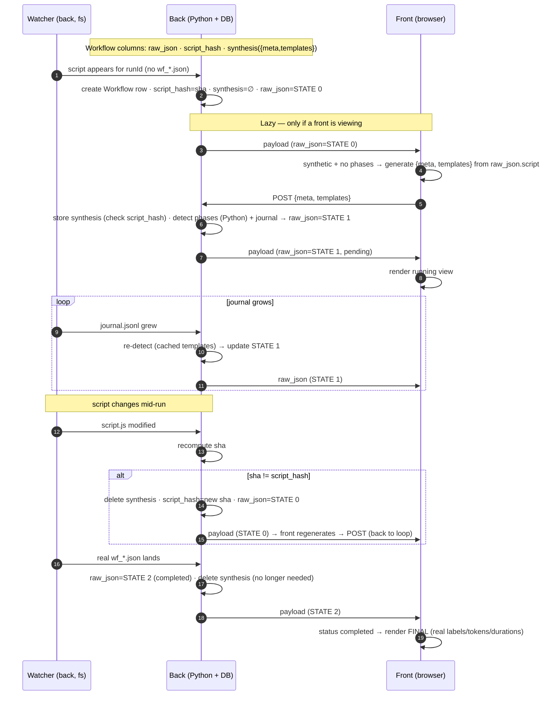

# Claude Code Workflows — integration handoff (2026-06-26, updated 2026-06-28)

Branch: `claude-workflows` (git worktree at `.worktrees/claude-workflows`).
Goal: surface Claude Code **workflows** (the `Workflow` tool / `wf_*.json` runs) inside TwiCC — list them in the Workflows tab, open subagents, link the in-chat `Workflow` tool to its run, and (next) show a run **while it is still running**, with each agent tagged by its phase.

This doc captures the state, the empirical findings, the locked decisions, and the (now mostly **built**) plan for the running view, so work can resume after a context compaction.

> **2026-06-27 update.** §5 was rewritten. The old plan (a Python regex/AST phase extractor) is **superseded** by a **browser-side JS simulator** that *executes* the workflow script (validated 163/163). A full reference implementation exists as an interactive playground artifact (§5.6), and the real TwiCC integration architecture is locked (§5.7). §1–§4 are unchanged and still accurate.

> **2026-06-28 update — the running-view data pipeline is BUILT, committed, and verified live.** The §5.7 architecture now exists in code. Commits (newest last): `e9c45e76` (P1 — model + lifecycle: row created at launch, 3-state `raw_json` + `script_hash`/`synthesis` columns), `9588fd40` (P2 — back: `detect_phase` + `build_state1` + the synthesis endpoint + the journal trigger; **163/163** in Python end-to-end), `37338aa3` (P3 — front: in-browser `generateTemplates` + POST on STATE 0), `2f9a9820` (cleanup — removed the temp probes).

> **2026-06-28 update (later) — the RENDERER is built too (the deferred "Phase 4"), + envelope enrichment.** The Workflows tab dropped the raw `JsonHumanView` for a **tab bar** (one URL-driven tab per run) → a structured detail (`WorkflowRunDetail.vue`: info · description · arguments · phases · result), where a phase expands to **agent rows** (chat-style; "View Agent" opens the workflow subagent), each agent showing its prompt + result. TwiCC also **enriches** the stored envelope with the full prompts/results + per-agent cost (durable past Claude deleting the run's files). Commits (newest last): `5ac1c632` (run view: header + structured body), `88dce8b9` (per-agent metadata + `cost`/`phases_cost` columns), `9549c688` (tabbed view + arguments), `6b78790e` (URL-driven tabs), `4ea038d8` (a phase's agents + View Agent), `ebff2409` (full prompt+result enrichment), `010d171a` (agent info line: state/duration/cost + polish). Full breakdown in §2. **What's left:** the streamed-journal **episode timeline** (§5.4) — a structured *static* view ships, but the line-by-line "phase started/ended" replay does not. See §8.

---

## 1. On-disk layout (Claude Code, per session)

```
~/.claude/projects/<project_id>/<session_id>/
  workflows/
    wf_<runId>.json                      # the run ENVELOPE (see §4) — written ONCE at completion
    scripts/<name>-wf_<runId>.js         # the workflow script (has `const meta`) — written at LAUNCH
  subagents/
    agent-a<hex>.jsonl  (+ .meta.json)   # a NORMAL subagent (Task/Agent tool)
    workflows/<runId>/
      agent-a<hex>.jsonl (+ .meta.json)  # a WORKFLOW subagent — written DURING the run
      journal.jsonl                      # resume journal — written LIVE/incrementally (see §4)
```

Normal subagent `.meta.json` = `{agentType, description, toolUseId}`.
Workflow subagent `.meta.json` = `{agentType:"workflow-subagent"}` only (no phase/label/toolUseId).

---

## 2. What is COMMITTED (4 ingestion commits + 4 running-view commits, on top of the pre-existing `has_workflows`/empty-tab commits)

- **`908dbb8c` ingestion**
  - `core.Workflow` model = `session` FK + `run_id` (unique) + `raw_json` (TextField) + `updated_at`. Migration `0115_workflow`. `raw_json` is the **source of truth** (the wf json schema is undocumented & version-evolving — keep the whole blob, extract at read time).
  - Workflow subagents ingested as `Session` `type=SUBAGENT`, `parent_session=<main session>`, **composite id `"<runId>:<agentId>"`** (unique across runs, distinguishes from normal subagents; no extra column, no AgentLink — they're engine-spawned; cost rolls up via `parent_session`). Done in `claude_code/sessions_watcher.parse_session_file` (6-segment branch) + `initial_sync.scan_subagents` (also walks `subagents/workflows/<runId>/`).
  - Envelope persisted: watcher `_upsert_workflow_run` (live) + `initial_sync._sync_session_workflows` backfill via new `db_writer.UpsertWorkflowPayload`.
- **`ec007886` endpoint + tab** — `GET /api/projects/<pid>/sessions/<sid>/workflows/` → `[{run_id, updated_at, raw}]` (raw = parsed envelope, newest first). `WorkflowsPane.vue` fetches it.
- **`4a808baf` in-chat link + human view**
  - "View Workflow" button on the `Workflow` tool_use, mirroring "View Agent" (right-aligned via the same `with-right-part` summary class).
  - The `tool_use_id ↔ run_id` link is **derived, not stored**: `GET .../workflow-links/` scans the session's tool_result `SessionItem`s for `toolUseResult.runId` (stale-safe, no batch path, no extra column). Live via `workflow_link_created` WS event (emitted by compute when the tool_result syncs; mirror of `agent_link_created`).
  - Route `workflows/:runId?`; `SessionView` reads the param → `WorkflowsPane :focus-run-id` → opens + scrolls the run.
  - Workflows tab renders each run with the shared **`JsonHumanView`** (read-only) inside a per-run `wa-details` whose body is **lazy** (`v-if`).
- **`6de3ba0d` live-refresh** — the watcher broadcasts `workflow_changed` on each `Workflow` upsert; `useWebSocket` relays it as a `twicc:workflow-changed` window event; `WorkflowsPane` debounced-refetches (400 ms), preserves which runs are open, refetches on a "View Workflow" click when the targeted run isn't loaded yet. Surfaces a *finished* run promptly; **not** live progress (the wf json is a completion snapshot — see §4).

### Running view — STATE 0→1→2 (2026-06-28, the §5.7 architecture)
- **`e9c45e76` P1 — model + lifecycle.** `Workflow` gains `script_hash` (sha256 of the launch script) + `synthesis` (JSONField `{meta, templates}`); migration `0116_workflow_synthesis_fields`. `raw_json` now has 3 documented states (0 minimalist / 1 synthesized / 2 real). The watcher creates the row **at launch** when `workflows/scripts/<name>-<runId>.js` first appears (`_workflow_script_target` + `_handle_workflow_script` + `_save_workflow_script` → STATE 0 / reset-on-script-change / never downgrade a completed row). Completion (`_save_workflow_run` + boot `_apply_upsert_workflow_payload`) purges `synthesis`. `initial_sync` unchanged.
- **`9588fd40` P2 — back synthesis.** New module `providers/claude_code/workflow_synthesis.py`: `detect_phase` (Python port of Script B) + `build_state1` (assembles the common format from the live `journal.jsonl` + each agent's prompt via `get_first_user_message("<runId>:<agentId>")` in DB + `synthesis.templates`; **no agent JSONL parsed**) + `rebuild_state1` (shared entry point). Endpoint `POST .../workflows/<run_id>/synthesis/` `{meta, templates, script_hash}` (`views.workflow_synthesis` + `_store_synthesis_and_build`; re-validates the hash → 409 stale; 409 completed; 404 unknown). The journal matcher is promoted to the real handler `_handle_workflow_journal` (rebuild on each journal write, lazy until `synthesis` exists). Validated **163/163** vs the real envelopes' `phaseTitle`, in Python end-to-end.
- **`37338aa3` P3 — front generation.** `frontend/src/utils/workflowTemplates.js` (`generateTemplates(scriptText)` via `new AsyncFunction` + meta/body extraction, `sha256Hex`); `WorkflowsPane` detects STATE 0 (`synthetic` && no `phases`), generates `{meta, templates}` from `raw.script` and POSTs (deduped per `runId:hash`). No rendering change. Verified live on a real workflow.
- **`2f9a9820` cleanup** — removed the temp `[wf-probe]` + the `change_type` threading (the `[journal-probe]` was already superseded by `_handle_workflow_journal` in P2).

### Running view — the renderer + envelope enrichment (2026-06-28, the deferred §8 "Phase 4")
The Workflows tab dropped the per-run `JsonHumanView` for a structured, tab-based UI; the back enriches the envelope so the full data is durable.
- **`5ac1c632`** — the run view. Tool-row-style header (title-cased name + status icon) over a structured body (`WorkflowRunDetail.vue`): info line, full description, phases (each a disclosure with a **derived** running/completed/pending status — agents grouped by `phaseIndex`), lazy `JsonHumanView` result. `build_state1` now injects `startTime` (= launch script mtime, the only live signal) and emits **1-based** `phaseIndex` (mirrors the engine; phases[0] → index 1).
- **`88dce8b9`** — per-agent metadata + cost. `build_state1` stamps each synthetic agent with `index` (journal order, 1-based) / `model` / `startedAt` / `lastProgressAt` / `durationMs`, from the synced agent `Session` (`_agent_sessions`). Two new columns: **`Workflow.cost`** (sum of agents' `total_cost`, migration `0117_workflow_cost`) + **`Workflow.phases_cost`** (`{phaseIndex(str): cost}`, migration `0118_workflow_phases_cost`), recomputed at **every** row write via `Workflow.compute_costs(run_id, envelope)`. Endpoint exposes both; front shows them gated on the **"Show costs"** setting (`settingsStore.areCostsShown`).
- **`9549c688`** — the tab bar: one `wa-tab` per run (label = title-cased name + status icon; `@wa-tab-show.stop` so switches don't leak to the parent DockRegion tab-group) + a new **Arguments** section (string-that-is-JSON → `JsonHumanView`, plain text → markdown).
- **`6b78790e`** — URL-driven tabs: clicking a tab `router.replace`s `…/workflows/<runId>`; the route param flows back as `focusRunId` (bidirectional; re-affirmation guard so programmatic changes don't rewrite the URL).
- **`4ea038d8`** — a phase's agents. Expanding a phase lists its agents as chat-style rows (name = label when the engine gives one, else agent id; spinner while running; **"View Agent"**). "View Agent" opens the workflow subagent in its own tab via the chat's subagent route — the subagent's `Session` id is the composite `<runId>:<agentId>` and its `parent_session` is the run's **main** session, so the route + `subagent/<sid>/` endpoints resolve it (verified). Phase/agent bodies are lazy (`v-if` on open).
- **`ebff2409`** — durability. `enrich_previews(envelope, project_id, session_id, run_id)` swaps the engine's **truncated** `promptPreview`/`resultPreview` for the **full** prompt (agent session's first user message) + **full** result (run journal `result` event), with graceful fallback. Wired into both the live watcher path (`_save_workflow_run`, once at completion) and the boot db-writer backfill (`_apply_upsert_workflow_payload`, lazy CC import). `build_state1` stores them full too (no truncation; result kept as the structured value → clean JHV). Survives Claude eventually deleting the run's files. (deep-research `raw_json` ≈ **1 MB** for 99 agents — acceptable, per the user.)
- **`010d171a`** — agent info line (state + duration + cost; **per-agent `cost`** added to entries from `Session.total_cost`). Shared **`WorkflowStateBadge.vue`** (icon + label: running/completed/failed/pending) used first in the workflow, phase, and agent info lines. Agent **prompt** and **result** moved to their own collapsible `wa-details` (closed by default) — one open-key `Set` (`phase:`/`agent:`/`prompt:`/`result:`) with `:open` bound back, so nothing heavy mounts until expanded and state survives a parent collapse/reopen. Plus polish: prominent section labels, `::part(content)` top padding 0, View-Agent pinned right.

New frontend files: `components/workflows/WorkflowRunDetail.vue`, `WorkflowStateBadge.vue` (+ heavy edits to `WorkflowsPane.vue`, `workflowTemplates.js`). Backend additions: `workflow_synthesis.py` (`enrich_previews`, `_agent_sessions`, `_launch_args` [STATE-1 args from the launching tool_use], per-agent cost), `core/models.py` (`Workflow.cost`/`phases_cost`/`compute_costs`/`agent_cost`), migrations `0117`/`0118`, endpoint `cost`/`phases_cost`/`args` exposure.

### Key files
Backend: `core/models.py`, `core/migrations/0115_workflow.py`, `providers/claude_code/sessions_watcher.py`, `providers/claude_code/initial_sync.py`, `providers/compute_base.py` (`WorkflowLinkUpdate`, `create/extract_workflow_info_from_tool_result`, return tuple `workflow_link_updates`), `providers/claude_code/compute.py`, `providers/sessions_watcher.py` (base: unpacking + `workflow_link_created` broadcast), `providers/db_writer.py` (`UpsertWorkflowPayload` + `_apply_upsert_workflow_payload`), `views.py` (`session_workflows`, `workflow_links`, `_derive_workflow_links`), `urls.py`.
Frontend: `stores/data.js` (`workflowLinks` cache), `composables/useWebSocket.js`, `components/session/detail/items/ToolUseContent.vue` (button), `components/session/detail/SessionItemsList.vue` (fetch gated on `has_workflows`), `router.js`, `views/SessionView.vue`, `components/workflows/WorkflowsPane.vue`.

All DB writes go through the existing `_db_write_lock` (watcher via `run_under_db_write_lock`; payloads via the serialised queue).

---

## 3. Working-tree state

**Clean.** All running-view work is committed — the data pipeline (P1–P3 + cleanup) **and** the renderer + enrichment (the 7 commits `5ac1c632`…`010d171a`, see §2). The temp probes are gone (the journal probe became `_handle_workflow_journal`; `[wf-probe]` + `change_type` removed in `2f9a9820`). Migrations `0116`/`0117`/`0118` are applied in the worktree DB; the existing 9 test runs were **re-enriched** one-off (full prompts/results + per-agent cost). The worktree backend was restarted onto the current code. Only this handoff is uncommitted while being edited.

---

## 4. Empirical findings (proven with the probes — do NOT re-assume)

- **`wf_<runId>.json` is written ONCE, at completion.** File mtime = `startTime + durationMs`. NOT updated during the run ⇒ a run cannot be shown *from the envelope* until it finishes (delay ≈ run duration; deep-research ≈ 20 min).
- **`journal.jsonl` IS written LIVE / incrementally** (every ~10–15 s, while the wf json is still absent). Per agent: `{type:"started"|"result", key, agentId, result?}`. `result` (on `"result"` events) is the agent's schema output object. The `key` is `v2:<sha256>` = cache-format version, **NOT the phase**. `agentId` (e.g. `a81073104525473d6`) matches the `agent-<agentId>.jsonl` filename.
- **The script is written at LAUNCH** (`scripts/<name>-<runId>.js`) and is also in the conversation (`Workflow` tool_use input carries `script` + `args`), AND inside the final envelope (`wf_json.script`). Its `export const meta = {name, description, phases:[{title,detail}], whenToUse?}` is a **pure literal** (per the tool spec).
- **`wf_*.json` envelope keys** (19): `runId, timestamp(=write time), taskId, script, scriptPath, args(string), result(free shape), agentCount, logs[], durationMs, summary(=meta.description), workflowName(=meta.name), status, startTime(ms), phases[{title,detail}], defaultModel, workflowProgress[], totalTokens, totalToolCalls`. `workflowProgress` = N `{type:"workflow_phase",index,title}` + N `{type:"workflow_agent", agentId, label, phaseIndex, phaseTitle, model, state, queuedAt/startedAt/lastProgressAt, durationMs, attempt, lastToolName/Summary, promptPreview, resultPreview, tokens, toolCalls}`.
- **Agent → phase is NOT recorded anywhere during the run** (journal key = hash; subagent meta.json = type only; transcripts indistinguishable). It only exists in the final wf json's `workflowProgress[].phaseTitle`. **This is the whole problem the running view solves** — see §5.
- **The `Workflow` tool I/O** (from `@anthropic-ai/claude-code/sdk-tools.d.ts`): `WorkflowOutput` carries `runId`, `workflowName`, `scriptPath`, `taskId` **at launch** (in the tool_result) — i.e. before the wf json exists. The full tool description (script hooks: `agent/phase/parallel/pipeline/log/workflow/budget/args`) is the `Workflow` tool's `description`, compiled into the native CLI binary (`…/claude-code-linux-x64/claude`); not a doc file. `args` is structured JSON in the tool input but **serialised to a string** in the envelope. `remote`/CCR runs are out of scope (no local wf json).

---

## 5. The "running view" — BUILT (2026-06-28); renderer still deferred

The one missing piece was **agent → phase while the run is live**. We solve it by **executing the workflow script** with stubbed hooks to learn, per `agent()` call, its phase + the static parts of its prompt ("templates"), then matching each live agent's first prompt against those templates. §5.1–§5.3 + §5.5 + §5.7 are now **shipped** (see §2 for commit-by-commit + file map). §5.4 (streamed journal + episode markers) and the structured rendering of §5.5 remain **unbuilt** — that's the deferred renderer (§8). The text below is preserved as the design record + the spec for that renderer.

### 5.1 Key realization — NO Node on the server
The simulator is JS, and **TwiCC's frontend is a JS/browser app** with **no CSP** (verified: nothing in `src/twicc` outside artifacts, nor `settings.py`/`index.html`/vite). So `new AsyncFunction` is allowed → **template generation runs in the user's browser**. The Python backend never executes the script — it only **reads files** and serves text. Phase **detection** is pure substring matching → trivially done **in Python on the back**. Net: zero Node subprocess, zero sandboxing concern (workflow scripts get only the injected hooks + pure JS builtins — no fs/net/require).

### 5.2 The two scripts (clean split)
- **Script A — template generator (JS, runs in the browser).** `generateTemplates(workflowScriptText, {runs}) → [{phase, segments}]`. Executes the script `runs` times with stubbed hooks + randomized results, records `(phase, prompt)` per `agent()` call, splits each prompt into static segments on a dynamic marker, unions + dedupes. **Also extracts `meta`** (name/description/phases). Output = `{meta, templates}`.
- **Script B — phase detector (pure string matching; JS or Python).** `detectPhase(prompt, templates) → phase|null`. For each template, count segments present (substring) in the prompt; a template is a candidate if **≥ half** its segments are present; the candidate matching the **most total text** wins → its phase. All templates of a phase carry the same phase label (within-phase variants are harmless); different phases have distinct instruction blocks (no cross-phase confusion). The "≥ half" tolerates a baked enum the agent lacks, or a truncated first message.

### 5.3 The simulator (Script A) — how it executes the script
Wrap the script body in `new AsyncFunction('agent','phase','parallel','pipeline','log','workflow','budget','args', body)` (after `export const meta` → `const meta`). This makes top-level `return`/`await` legal and injects the hooks as **parameters** = our stubs. This is exactly how the real engine runs the script; we just pass fake hooks. `agent(prompt, opts)` records `{phase: opts.phase ?? currentPhase, prompt}` and **returns a value SHAPED BY `opts.schema`** — the critical insight (credit: the user) that made it work:

- **object** → real keys (so `{...result}` spread preserves them, e.g. `{...claim, sourceUrl}`);
- **array** → 2 elements (so `.map`/`.filter`/spread drive nested `agent()` fan-out);
- **string** → the marker (``), so it splits cleanly out of the prompt;
- **number/integer** → `numberish(randomInRange)`: an object that **stringifies to the marker** (`${score}` → clean template) but **is a real number in arithmetic/comparison** (`if (score>=3)` → real branch). Resolves the dual-use conflict (a number interpolated into a prompt must be the marker; one used in a condition must be a real number). Works because `${}`/`>=`/`-` go through `Symbol.toPrimitive` with different hints.
- **enum** → **50% the marker, 50% a random member** (per draw). Cannot be a `numberish`-style dual value because `===` does **not** coerce (and `${x}` vs `obj[x]` share the `'string'` hint). The marker draws yield clean templates; the real-member draws fire `===`-gated branches. (Enums interpolated into prompts therefore mint extra harmless template variants.)
- **no schema** → a permissive sentinel `Proxy` (text result that survives `.map`/`.split`/property access/iteration and coerces to the marker).
- **`args`** → randomly a string OR an object (covers `typeof args === "string"` guards like deep-research's).

**Randomized multi-run union (credit: the user).** Run the script N times (fixed, e.g. **100**) with random draws; union + dedupe the templates. Branches gated on an agent result are entered in *some* run → their inner agents' templates get captured. Seeded PRNG (mulberry32) → reproducible. **Liveness guards** (not security): budget depletes per `agent()` call, hard CAP of 400 recorded calls, per-pipeline-stage / per-parallel-thunk `try/catch` (partial records kept on a throw). A pure-JS infinite loop with no `agent()` between iterations (never seen) is only caught by an external timeout.

**Measured (deep-research, the hard case, 99 agents/5 phases):** 100 runs ≈ **25 ms** (0.25 ms/run). Correct phase for **all 99 agents reached in 2–4 runs** (median 2 across seeds), never regresses. Match score is maxed almost immediately while the template count keeps climbing (random enums mint variants forever) — so **do NOT** stop on "templates stable"; just run a fixed N (or stop on "phase set stable for K runs"). **Validated 163/163** across all 8 real workflows (deep-research 99; slogan/telephone/blind-riddle/refine/tiny 10 each; haiku ×2 7 each).

**Why this beats regex/AST (the old §5 plan).** regex/AST are *static* → blind to **computed values**: a variable/computed phase name (`phase(p.title)` in a loop, `{phase: somePhaseVar}`) extracts **nothing** with a regex; loop/`Array.join`-built prompts likewise. The simulator runs the real JS so all construction (templates, concat, builder fns, variables, loops, computed phases) works for free. (An earlier Python regex prototype also reached 99/99 but has these documented blind spots AND needs Node server-side; the simulator supersedes it.)

### 5.4 Streamed journal + phase markers (episode model)
Detection is done once (all agents at once). The **display** streams the journal **one line at a time** (simulating agents arriving live), inserting phase markers:
- **"phase started"** marker (before an agent line) when an agent of phase P starts while P is **inactive** (opens an episode).
- **"phase ended (assumed)"** marker (after an agent line) when **every agent that started since the episode began has returned**. It is a guess (P may re-open later) — accepted by design.
- Per-phase **independent** episodes → parallel phases each track their own (proven on deep-research: `Search` and `Fetch` overlap — Fetch starts while Search is still active). Sequential phases **fragment** into one episode per agent (proven on telephone: `Whisper` = 8 episodes start→return→ENDED).

### 5.5 The unified "view model" (common format) — the centerpiece
The front renders **the same shape** whether a run is running or done. It maps to the real envelope: `{runId, status, workflowName(=meta.name), summary(=meta.description), phases:[{title,detail}], workflowProgress:[ {type:"workflow_phase",index,title} … , {type:"workflow_agent", agentId, phaseTitle, phaseIndex, state, resultPreview?, promptPreview?} … ], script, scriptPath, agentCount}`.
- **completed** → straight from the real `wf_*.json` (phases already there; **no detection**).
- **running** → **synthesized**: `phases`/`workflowName`/`summary` ← `meta`; agent entries ← journal (state) × detection (`phaseTitle`) × agent prompts (`promptPreview`) × journal result (`resultPreview`); marked `synthetic:true`, `status:"pending"`.

### 5.6 Reference implementation — the interactive playground artifact
A complete, validated reference lives at:
```
/home/twidi/.twicc/artifacts/f1ecf849-9d54-42be-a0c7-688f13415b7f/phase-detector/
  index.html                    # the playground (pick workflow → meta → Generate → Run detection → streamed journal)
  harness.mjs                   # Script A engine: makeHarness(body,{runs}) (stubs, synthFromSchema, numberish, sentinel, dedupe). No eval.
  detect-phase.mjs              # Script B: detectPhase(prompt, templates)
  workflows.json                # index of the 8 example workflows
  build/
    generate-template.tmpl.mjs  # template with // __META_EXPORT__ and // __WORKFLOW_BODY__ placeholders
    build.py                    # injects each <folder>/script.js into the template → <folder>/generate-template.mjs (lifts `export const meta` to module scope, brace-matched)
    dump-templates.mjs          # imports each generated module → writes <folder>/templates.json
  <8 folders>/                  # script.js · agents.json ([{agentId,prompt}]) · journal.jsonl · generate-template.mjs (GENERATED, exports `meta`+`generateTemplates`) · templates.json
```
Regenerate after editing the template: `python build/build.py` then `node build/dump-templates.mjs`. The per-workflow `generate-template.mjs` (workflow baked into a static module) is the **CSP workaround** for the artifact iframe (which forbids eval); the **real app needs none of this** — it evals the script text directly (§5.1). Validated end-to-end (split scripts): **163/163**. The playground also demonstrates the streamed journal + phase markers and shows generation time (~25 ms) and detection time per agent.

### 5.7 Real TwiCC integration — BUILT (was LOCKED)
**STATUS: implemented exactly as below (P1–P3, §2).** Where each piece lives: model + columns + migration → `core/models.py` `Workflow`, `core/migrations/0116_workflow_synthesis_fields.py`. Lifecycle (STATE 0 at launch / reset / no-downgrade / STATE 2) → `providers/claude_code/sessions_watcher.py` (`_workflow_script_target`, `_handle_workflow_script`, `_save_workflow_script`, `_save_workflow_run`) + `db_writer._apply_upsert_workflow_payload`. Detection + STATE 1 build → `providers/claude_code/workflow_synthesis.py` (`detect_phase`, `build_state1`, `rebuild_state1`). Journal trigger → `sessions_watcher._handle_workflow_journal`. Endpoint → `views.workflow_synthesis` + `_store_synthesis_and_build`, `urls.py`. Front generation → `frontend/src/utils/workflowTemplates.js` + `components/workflows/WorkflowsPane.vue` (`maybeSynthesize`/`postSynthesis`).

**`Workflow` model: one field `raw_json` (3 states) + 2 new columns.**
- `raw_json` — the front-facing view (the common format §5.5). Three states:
  - **STATE 0 (minimalist)** `{ runId, script, status:"pending", synthetic:true }` — no phases yet; the front's cue to generate.
  - **STATE 1 (synthesized)** the common format with `phases` + agents-with-`phaseTitle`, `status:"pending"`, `synthetic:true` — built by the **back** from `synthesis.meta` + `synthesis.templates` + journal.
  - **STATE 2 (real)** the actual `wf_*.json`, `status:"completed"`, no `synthetic`.
- `script_hash` — sha of the script text; cache key; updated when the script changes.
- `synthesis` (JSON) — `{ meta, templates }`, **POSTed by the front**, used by the back to build STATE 1. **Deleted** when the script changes (hash differs) OR when the real wf json lands (no longer needed).

**Watcher now triggers on THREE things:** script appears / **script modified** · journal grows · wf_json final. (Today the `Workflow` row is created at completion; the new design **creates it at launch** when the script is first seen — the `runId` is known then, see §4.)

**The script lives INSIDE `raw_json`** (the real envelope already has a `script` key; STATE 0 includes it) → **no separate `script` column**. The front gets the script from `raw_json.script`.

**Front responsibilities shrink to two:** (a) render from `raw_json`; (b) when it sees STATE 0 (`synthetic` && no phases), generate `{meta, templates}` from `raw_json.script` and **POST** them. The **back** does everything else in Python (detection with the front's templates + journal → STATE 1; swap to STATE 2 at completion).

**Lazy:** STATE 0→1 only fires when a front actually views. No viewer ⇒ the row stays STATE 0 until the wf json lands ⇒ STATE 2 directly.

**Sequence (the locked flow):**



**Temporary `raw_json` (STATE 1) example** — mimics the real envelope, `synthetic:true`, filled from what we have (slogan mid-run: Propose, 4 started, 2 returned):
```jsonc
{
  "synthetic": true, "status": "pending", "runId": "wf_6e7ccab7-726",
  "workflowName": "slogan-vote-test",                       // meta.name
  "summary": "Minimal 3-phase test workflow …",             // meta.description
  "phases": [ {"title":"Propose","detail":"…"}, {"title":"Vote","detail":"…"}, {"title":"Decide","detail":"…"} ],
  "script": "export const meta = {…} …", "scriptPath": "…", "agentCount": 4,
  "workflowProgress": [
    {"type":"workflow_phase","index":0,"title":"Propose"},
    {"type":"workflow_phase","index":1,"title":"Vote"},
    {"type":"workflow_phase","index":2,"title":"Decide"},
    {"type":"workflow_agent","agentId":"a6d5…","phaseTitle":"Propose","phaseIndex":0,"state":"completed",
     "resultPreview":"{\"slogan\":\"Charge your adventures…\"}","promptPreview":"Write ONE catchy marketing slogan…"},
    {"type":"workflow_agent","agentId":"aa9f…","phaseTitle":"Propose","phaseIndex":0,"state":"completed","resultPreview":"…","promptPreview":"…"},
    {"type":"workflow_agent","agentId":"a716…","phaseTitle":"Propose","phaseIndex":0,"state":"running","promptPreview":"…"},
    {"type":"workflow_agent","agentId":"a810…","phaseTitle":"Propose","phaseIndex":0,"state":"running","promptPreview":"…"}
  ]
  // ABSENT until STATE 2 (real envelope fills them): result, durationMs, startTime, timestamp, taskId,
  //   defaultModel, logs[], totalTokens, totalToolCalls, and per agent: model, tokens, toolCalls, durations.
}
```
Filled fields & sources: `workflowName`/`summary`/`phases` ← `meta`; agent `state`/`resultPreview`/`promptPreview` ← journal + agent prompts; agent `phaseTitle`/`phaseIndex` ← detection; `runId`/`script`/`scriptPath`/`agentCount` ← known. The rest are null/omitted until completion. The front renders STATE 1 and STATE 2 with the **same code**, just hiding the absent metrics while `pending`.

### 5.8 Locked decisions (this design — all implemented)
- All JS in the **browser**; **no Node server**; detection in **Python** on the back.
- `Workflow` = `raw_json` (3 states) + `script_hash` + `synthesis({meta,templates})`. Script lives inside `raw_json` (no script column). Create the row **at launch** (script seen), not at completion.
- `synthesis` cleaned on script-change OR completion. `script_hash` = cache key.
- Front: render from `raw_json` + generate-and-POST `{meta,templates}` on STATE 0 only. Back: detect + build STATE 1 + swap STATE 2.
- Agent `state` values from the journal: **`running`** / **`completed`**. STATE 1 agent entries were since **enriched** beyond `state` (commits `88dce8b9`/`ebff2409`/`010d171a`): `index` (journal order), `model`, `startedAt`/`lastProgressAt`/`durationMs`, per-agent `cost` (← `Session.total_cost`), and **full** (untruncated) `promptPreview` + `resultPreview` (result kept structured). `label` is a STATE-2-only field (front falls back to the agent id). STATE 1 also gains `startTime` (script mtime) + `args` (recovered from the launching `Workflow` tool_use via `_launch_args`). The envelope's truncated previews are likewise replaced with the full values at STATE 2 ingestion (`enrich_previews`) — durable past Claude deleting the run's files.
- Phase markers via the **episode model** (§5.4). Generation = fixed N runs (≈100), seeded.
- Template generation needs eval → relies on the main app having **no CSP**. If a strict (`unsafe-eval`-less) CSP is ever added, fall back to the codegen/Blob-URL module approach (the playground's `build.py` style).

---

## 6. Locked design decisions (committed work — §2)
- Composite subagent id `"<runId>:<agentId>"`; **no** extra column; **no** AgentLink for workflow subagents; cost rolls up via `parent_session`.
- `Workflow` model = `session` + `run_id` + `raw_json` + `script_hash` + `synthesis` (P1, §5.7) + `cost` + `phases_cost` (renderer, migrations `0117`/`0118`); `raw_json` is the source of truth, a 3-state envelope **enriched** with full prompts/results + per-agent metadata/cost; the row is created **at launch** (script seen), not at completion.
- "View Workflow" link is **derived** from tool_results (not persisted) + broadcast live; **no** `tool_use_id` column.
- Targeting a run = URL param `workflows/<run_id>`.

---

## 7. Test data & ops
- **deep-research** (hard case, 99 agents/5 phases): project `-home-twidi-dev-twicc-poc`, session `422c45a8-57d9-4a86-baa7-866fa43ade5f`, run `wf_cd590ff1-f54`.
- **test workflows**: project `-home-twidi-dev-twicc-poc--worktrees-claude-workflows`, session `826edb1e-a150-412c-bb63-b67fef43b260`, runs `wf_2301e9e5-a5d` (tiny), `wf_6e7ccab7-726` (slogan), `wf_41a77a75-69b` (telephone), `wf_bad8feb6-5c7` (riddle), `wf_d01e5087-4d3` (refine). Plus session `c8100f1d-22e7-4bbe-9ce1-7beac98224a0`, runs `wf_4f736a60-8f3` + `wf_ccb3f69b-bb7` (haiku-contest ×2).
- **Phase-detector playground** (reference impl + 163/163 validation): `/home/twidi/.twicc/artifacts/f1ecf849-9d54-42be-a0c7-688f13415b7f/phase-detector/` (§5.6). All 8 workflows' script/agents/journal/templates are captured there as static files.
- Servers (worktree): `uv run ./devctl.py start|stop|restart all`. User-permitted to restart this worktree. Safe sequence: `stop all` → verify `.venv` python/vite dead + ports `3501/5174` free → `start all`. Backend changes need a restart; frontend is HMR. URLs: http://localhost:5174 (front), :3501 (back).
- Verify Django changes off-prod: `cd <worktree> && TWICC_DATA_DIR=$PWD uv run python -m django <cmd> --settings=twicc.settings`. Wiring signal in `<worktree>/logs/backend.log`: a `POST …/workflows/<run_id>/synthesis/ 200` line (`uvicorn.access`) = the front fired generation. (The temp probes are removed — §3.)
- **Reproducing the back checkpoint** (163/163, no front): `build_state1(run_id, project_id, session_id, {meta, templates}, script)` against a test run's on-disk `journal.jsonl` + DB subagents, with `templates` from the playground's `<folder>/templates.json` and `meta` from the real envelope; diff the produced `phaseTitle` against the envelope's `workflowProgress[].phaseTitle`.

## 8. TODO to finish

**DONE:** the running-view data pipeline (§5.7) **and** the renderer (§2's renderer subsection). The Workflows tab is a URL-driven tab bar of structured run details (info · description · arguments · phases → agent rows · result), STATE 1 and STATE 2 rendered by the **same** `WorkflowRunDetail.vue` (metrics absent while `pending` just don't show). The old §8 items: item 1 (structured running view) = **DONE**; item 3 (STATE 2 presentation) = **DECIDED** — the same structured view, no separate raw inspector. Verified 163/163 offline + live; "View Agent" verified against the subagent endpoints.

**REMAINING — the streamed-journal episode timeline (§5.4).** The shipped view is *static*: phases + agents with a **derived** per-phase status (running/completed/pending), computed from `raw.workflowProgress`. NOT built: the line-by-line journal **replay** with "phase started" / "phase ended (assumed)" markers per the **episode model** (per-phase independent; parallel phases overlap, sequential phases fragment). The playground `index.html` (§5.6) is the reference for the timeline + markers. This is the only deferred presentation piece.

**Doc sync (do before merge):**
- **`CLAUDE.md` Database Models** — the `Workflow` model gained `script_hash`, `synthesis`, **`cost`**, **`phases_cost`**, and its `raw_json` is now an enriched 3-state envelope (full prompts/results, per-agent metadata/cost). Update that bullet, then mirror into **`AGENTS.md`**. No CLI/skill change → no `SKILLS-AND-CLI.md`.

**Other (no action needed):**
- `synthesis` carries front-supplied data; `script_hash` is re-validated on POST (generation is deterministic + seeded). No further hardening.
- `enrich_previews` reads the journal in the boot db-writer backfill path — a localized exception to "writer = DB only" (one fast local file read, lazy CC import), accepted because workflows are Claude-Code-only and the durability requirement is explicit. The backfill only runs for runs **not already stored** (so it never clobbers a live-enriched row).
