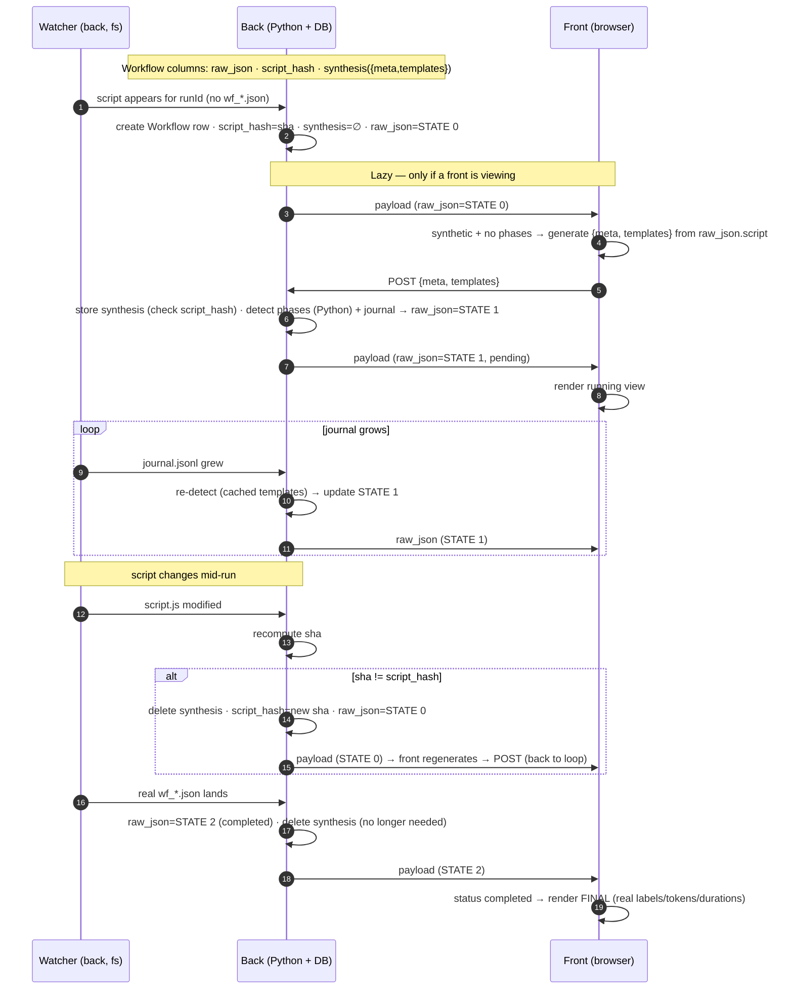

# Claude Code Workflows — integration handoff (2026-06-26, updated 2026-06-28)

Branch: `claude-workflows` (git worktree at `.worktrees/claude-workflows`).
Goal: surface Claude Code **workflows** (the `Workflow` tool / `wf_*.json` runs) inside TwiCC — list them in the Workflows tab, open subagents, link the in-chat `Workflow` tool to its run, and (next) show a run **while it is still running**, with each agent tagged by its phase.

This doc captures the state, the empirical findings, the locked decisions, and the (now mostly **built**) plan for the running view, so work can resume after a context compaction.

> **2026-06-27 update.** §5 was rewritten. The old plan (a Python regex/AST phase extractor) is **superseded** by a **browser-side JS simulator** that *executes* the workflow script (validated 163/163). A full reference implementation exists as an interactive playground artifact (§5.6), and the real TwiCC integration architecture is locked (§5.7). §1–§4 are unchanged and still accurate.

> **2026-06-28 update — the running-view data pipeline is BUILT, committed, and verified live.** The §5.7 architecture now exists in code. Commits (newest last): `e9c45e76` (P1 — model + lifecycle: row created at launch, 3-state `raw_json` + `script_hash`/`synthesis` columns), `9588fd40` (P2 — back: `detect_phase` + `build_state1` + the synthesis endpoint + the journal trigger; **163/163** in Python end-to-end), `37338aa3` (P3 — front: in-browser `generateTemplates` + POST on STATE 0), `2f9a9820` (cleanup — removed the temp probes).

> **2026-06-28 update (later) — the RENDERER is built too (the deferred "Phase 4"), + envelope enrichment.** The Workflows tab dropped the raw `JsonHumanView` for a **tab bar** (one URL-driven tab per run) → a structured detail (`WorkflowRunDetail.vue`: info · description · arguments · phases · result), where a phase expands to **agent rows** (chat-style; "View Agent" opens the workflow subagent), each agent showing its prompt + result. TwiCC also **enriches** the stored envelope with the full prompts/results + per-agent cost (durable past Claude deleting the run's files). Commits (newest last): `5ac1c632` (run view: header + structured body), `88dce8b9` (per-agent metadata + `cost`/`phases_cost` columns), `9549c688` (tabbed view + arguments), `6b78790e` (URL-driven tabs), `4ea038d8` (a phase's agents + View Agent), `ebff2409` (full prompt+result enrichment), `010d171a` (agent info line: state/duration/cost + polish). Full breakdown in §2. **What's left on the renderer: nothing.** The §5.4 streamed-journal **episode timeline** is **decided not wanted** (2026-06-28): the shipped per-phase live status (derived at the front from the journal-built agents) is the intended view; the episode replay was only the playground's tool to *validate* detection. See §8.

> **2026-06-28 update (later still) — incomplete + interrupted runs (`aff0821f`).** Two run-completion truths are now stamped into `raw_json` (read by the tab + the CLI, no front guessing): `phaseCompletion` flags a `completed` run that skipped phases (warning callout), and a normalized `statusKind` (run + per-agent) + an `interrupted` phase state handle a `killed`/cut-short run — which the engine **does** materialize as a `wf_*.json` with `status:"killed"` (§4). The guessed `failed` mapping was dropped. See §2 / §8.

> **2026-06-29 update — orphaned runs + phase-detection failures.** Two more "unhappy path" cases, both surfaced **without persisting anything new**. **Orphaned runs** (`b95ed824`): a still-`synthetic` run whose `Workflow.updated_at` predates its `Session.cutoff` (= max of `last_started_at`/`last_stopped_at`) belonged to a run that has since restarted or stopped without writing its envelope → shown as `interrupted`, **derived at read time** (REST + CLI), never stored (no file event fires for a crash that writes nothing). **Phase-detection failures** (`3f22b473`): when the browser can't execute a script to build templates, it still POSTs `meta` + empty templates + a flag → the back logs it and builds a degraded view (phases shown, agents Unassigned) with a `detectionUnavailable` callout. See §2 / §8.

> **2026-06-29 update (later) — resume + reconnect resilience.** **Resume** (`768b096e`): a workflow keeps its `runId` and the **same `journal.jsonl`** when resumed, so a completed run that restarts is detected by file mtimes (journal newer than the `wf_*.json`, or the envelope deleted) and re-synthesized to a live STATE 1 from its **retained** templates (completion no longer purges `synthesis`); the final envelope rewrite flips it back to STATE 2. **Reconnect** (`9885ef6b`): a `workflow_changed` broadcast dropped during a WS outage (a stop also kills the socket) left the tab stale until a manual reload — `SessionView` now refetches the Workflows pane on `twicc:ws-reconnected`, like PlanPane/FilesPanel. See §2 / §8.

> **2026-06-29 update (last) — agent discovery latency fixed (union).** A live STATE 1 used to discover its agents from the **bursty** `journal.jsonl`, so a phase's agents appeared **in a block** at the next journal flush, not one-by-one as they started (the user: "0 agents for ~15–20s, then 3 started + 1 done at once"). `build_state1` now discovers agents from the **union of the agent Sessions and the journal** — the Sessions sync in real time, the journal only supplies `completed` + `result` — and the watcher rebuilds on **any** workflow-agent Session sync that brings a new agent (in-memory `_workflow_surfaced` dedups the storm). An agent still surfaces only once its first message is synced (phase detectable → no Unassigned flicker), but now the instant its Session lands, not at the next journal burst. This **replaced** the old pending-prompt mechanism (`pending_prompt_agent_ids` / `_workflow_pending_prompt` / `_maybe_resolve_pending_phase`, all removed). Verified 163/163 + live. See §2 / §8.

---

## 1. On-disk layout (Claude Code, per session)

```
~/.claude/projects/<project_id>/<session_id>/
  workflows/
    wf_<runId>.json                      # the run ENVELOPE (see §4) — written ONCE at completion
    scripts/<name>-wf_<runId>.js         # the workflow script (has `const meta`) — written at LAUNCH
  subagents/
    agent-a<hex>.jsonl  (+ .meta.json)   # a NORMAL subagent (Task/Agent tool)
    workflows/<runId>/
      agent-a<hex>.jsonl (+ .meta.json)  # a WORKFLOW subagent — written DURING the run
      journal.jsonl                      # resume journal — written LIVE/incrementally (see §4)
```

Normal subagent `.meta.json` = `{agentType, description, toolUseId}`.
Workflow subagent `.meta.json` = `{agentType:"workflow-subagent"}` only (no phase/label/toolUseId).

---

## 2. What is COMMITTED (4 ingestion commits + 4 running-view commits, on top of the pre-existing `has_workflows`/empty-tab commits)

- **`908dbb8c` ingestion**
  - `core.Workflow` model = `session` FK + `run_id` (unique) + `raw_json` (TextField) + `updated_at`. Migration `0115_workflow`. `raw_json` is the **source of truth** (the wf json schema is undocumented & version-evolving — keep the whole blob, extract at read time).
  - Workflow subagents ingested as `Session` `type=SUBAGENT`, `parent_session=<main session>`, **composite id `"<runId>:<agentId>"`** (unique across runs, distinguishes from normal subagents; no extra column, no AgentLink — they're engine-spawned; cost rolls up via `parent_session`). Done in `claude_code/sessions_watcher.parse_session_file` (6-segment branch) + `initial_sync.scan_subagents` (also walks `subagents/workflows/<runId>/`).
  - Envelope persisted: watcher `_upsert_workflow_run` (live) + `initial_sync._sync_session_workflows` backfill via new `db_writer.UpsertWorkflowPayload`.
- **`ec007886` endpoint + tab** — `GET /api/projects/<pid>/sessions/<sid>/workflows/` → `[{run_id, updated_at, raw}]` (raw = parsed envelope, newest first). `WorkflowsPane.vue` fetches it.
- **`4a808baf` in-chat link + human view**
  - "View Workflow" button on the `Workflow` tool_use, mirroring "View Agent" (right-aligned via the same `with-right-part` summary class).
  - The `tool_use_id ↔ run_id` link is **derived, not stored**: `GET .../workflow-links/` scans the session's tool_result `SessionItem`s for `toolUseResult.runId` (stale-safe, no batch path, no extra column). Live via `workflow_link_created` WS event (emitted by compute when the tool_result syncs; mirror of `agent_link_created`).
  - Route `workflows/:runId?`; `SessionView` reads the param → `WorkflowsPane :focus-run-id` → opens + scrolls the run.
  - Workflows tab renders each run with the shared **`JsonHumanView`** (read-only) inside a per-run `wa-details` whose body is **lazy** (`v-if`).
- **`6de3ba0d` live-refresh** — the watcher broadcasts `workflow_changed` on each `Workflow` upsert; `useWebSocket` relays it as a `twicc:workflow-changed` window event; `WorkflowsPane` debounced-refetches (400 ms), preserves which runs are open, refetches on a "View Workflow" click when the targeted run isn't loaded yet. Surfaces a *finished* run promptly; **not** live progress (the wf json is a completion snapshot — see §4).

### Running view — STATE 0→1→2 (2026-06-28, the §5.7 architecture)
- **`e9c45e76` P1 — model + lifecycle.** `Workflow` gains `script_hash` (sha256 of the launch script) + `synthesis` (JSONField `{meta, templates}`); migration `0116_workflow_synthesis_fields`. `raw_json` now has 3 documented states (0 minimalist / 1 synthesized / 2 real). The watcher creates the row **at launch** when `workflows/scripts/<name>-<runId>.js` first appears (`_workflow_script_target` + `_handle_workflow_script` + `_save_workflow_script` → STATE 0 / reset-on-script-change / never downgrade a completed row). Completion (`_save_workflow_run` + boot `_apply_upsert_workflow_payload`) purges `synthesis`. `initial_sync` unchanged.
- **`9588fd40` P2 — back synthesis.** New module `providers/claude_code/workflow_synthesis.py`: `detect_phase` (Python port of Script B) + `build_state1` (assembles the common format from the live `journal.jsonl` + each agent's prompt via `get_first_user_message("<runId>:<agentId>")` in DB + `synthesis.templates`; **no agent JSONL parsed**) + `rebuild_state1` (shared entry point). Endpoint `POST .../workflows/<run_id>/synthesis/` `{meta, templates, script_hash}` (`views.workflow_synthesis` + `_store_synthesis_and_build`; re-validates the hash → 409 stale; 409 completed; 404 unknown). The journal matcher is promoted to the real handler `_handle_workflow_journal` (rebuild on each journal write, lazy until `synthesis` exists). Validated **163/163** vs the real envelopes' `phaseTitle`, in Python end-to-end.
- **`37338aa3` P3 — front generation.** `frontend/src/utils/workflowTemplates.js` (`generateTemplates(scriptText)` via `new AsyncFunction` + meta/body extraction, `sha256Hex`); `WorkflowsPane` detects STATE 0 (`synthetic` && no `phases`), generates `{meta, templates}` from `raw.script` and POSTs (deduped per `runId:hash`). No rendering change. Verified live on a real workflow.
- **`2f9a9820` cleanup** — removed the temp `[wf-probe]` + the `change_type` threading (the `[journal-probe]` was already superseded by `_handle_workflow_journal` in P2).

### Running view — the renderer + envelope enrichment (2026-06-28, the deferred §8 "Phase 4")
The Workflows tab dropped the per-run `JsonHumanView` for a structured, tab-based UI; the back enriches the envelope so the full data is durable.
- **`5ac1c632`** — the run view. Tool-row-style header (title-cased name + status icon) over a structured body (`WorkflowRunDetail.vue`): info line, full description, phases (each a disclosure with a **derived** running/completed/pending status — agents grouped by `phaseIndex`), lazy `JsonHumanView` result. `build_state1` now injects `startTime` (= launch script mtime, the only live signal) and emits **1-based** `phaseIndex` (mirrors the engine; phases[0] → index 1).
- **`88dce8b9`** — per-agent metadata + cost. `build_state1` stamps each synthetic agent with `index` (journal order, 1-based) / `model` / `startedAt` / `lastProgressAt` / `durationMs`, from the synced agent `Session` (`_agent_sessions`). Two new columns: **`Workflow.cost`** (sum of agents' `total_cost`, migration `0117_workflow_cost`) + **`Workflow.phases_cost`** (`{phaseIndex(str): cost}`, migration `0118_workflow_phases_cost`), recomputed at **every** row write via `Workflow.compute_costs(run_id, envelope)`. Endpoint exposes both; front shows them gated on the **"Show costs"** setting (`settingsStore.areCostsShown`).
- **`9549c688`** — the tab bar: one `wa-tab` per run (label = title-cased name + status icon; `@wa-tab-show.stop` so switches don't leak to the parent DockRegion tab-group) + a new **Arguments** section (string-that-is-JSON → `JsonHumanView`, plain text → markdown).
- **`6b78790e`** — URL-driven tabs: clicking a tab `router.replace`s `…/workflows/<runId>`; the route param flows back as `focusRunId` (bidirectional; re-affirmation guard so programmatic changes don't rewrite the URL).
- **`4ea038d8`** — a phase's agents. Expanding a phase lists its agents as chat-style rows (name = label when the engine gives one, else agent id; spinner while running; **"View Agent"**). "View Agent" opens the workflow subagent in its own tab via the chat's subagent route — the subagent's `Session` id is the composite `<runId>:<agentId>` and its `parent_session` is the run's **main** session, so the route + `subagent/<sid>/` endpoints resolve it (verified). Phase/agent bodies are lazy (`v-if` on open).
- **`ebff2409`** — durability. `enrich_previews(envelope, project_id, session_id, run_id)` swaps the engine's **truncated** `promptPreview`/`resultPreview` for the **full** prompt (agent session's first user message) + **full** result (run journal `result` event), with graceful fallback. Wired into both the live watcher path (`_save_workflow_run`, once at completion) and the boot db-writer backfill (`_apply_upsert_workflow_payload`, lazy CC import). `build_state1` stores them full too (no truncation; result kept as the structured value → clean JHV). Survives Claude eventually deleting the run's files. (deep-research `raw_json` ≈ **1 MB** for 99 agents — acceptable, per the user.)
- **`010d171a`** — agent info line (state + duration + cost; **per-agent `cost`** added to entries from `Session.total_cost`). Shared **`WorkflowStateBadge.vue`** (icon + label: running/completed/failed/pending) used first in the workflow, phase, and agent info lines. Agent **prompt** and **result** moved to their own collapsible `wa-details` (closed by default) — one open-key `Set` (`phase:`/`agent:`/`prompt:`/`result:`) with `:open` bound back, so nothing heavy mounts until expanded and state survives a parent collapse/reopen. Plus polish: prominent section labels, `::part(content)` top padding 0, View-Agent pinned right.

New frontend files: `components/workflows/WorkflowRunDetail.vue`, `WorkflowStateBadge.vue` (+ heavy edits to `WorkflowsPane.vue`, `workflowTemplates.js`). Backend additions: `workflow_synthesis.py` (`enrich_previews`, `_agent_sessions`, `_launch_args` [STATE-1 args from the launching tool_use], per-agent cost), `core/models.py` (`Workflow.cost`/`phases_cost`/`compute_costs`/`agent_cost`), migrations `0117`/`0118`, endpoint `cost`/`phases_cost`/`args` exposure.

### Running view — STATE 1 latency fix + orphan-agent bucket (2026-06-28, this commit)
Two refinements once a run is live.
- **Faster phase assignment (back).** STATE 1 detects an agent's phase from its first user message; the journal often reports an agent `started` *before* that message has synced to the DB, so the agent stayed phase-less until the **next** journal tick (~10-15s). Fix: the CC watcher keeps an in-memory `_workflow_pending_prompt` (`dict[run_id, set[agent_id]]`) of agents seen `started` but prompt-less. The flag set is `pending_prompt_agent_ids(envelope)` — workflow agents with **no** `promptPreview`; an agent that *has* a prompt but no detected phase is deliberately excluded, else its flag would never clear (its prompt is present, a rebuild changes nothing). `_rebuild_workflow_state1` (the shared rebuild, refactored out of `_handle_workflow_journal`) refreshes that set wholesale on every rebuild. `sync_and_broadcast` is **overridden** in the CC watcher: when a flagged workflow agent's own file syncs, `_maybe_resolve_pending_phase` re-checks `agent_first_message(run_id, agent_id)` and — if the prompt is now there — rebuilds at once, so the phase lands without waiting for the journal. A run with nothing flagged never triggers a rebuild here. The set is purged for a run at completion (`_handle_workflow_run`). In-memory only (a restart re-resolves on the next tick). New `workflow_synthesis` helpers: `agent_first_message`, `pending_prompt_agent_ids`. **(Superseded 2026-06-29 by the union-discovery fix below — this whole pending-prompt mechanism was removed: `pending_prompt_agent_ids` is gone, `_workflow_pending_prompt` → `_workflow_surfaced`, `_maybe_resolve_pending_phase` → `_maybe_rebuild_on_agent_sync`. It sped an agent's *phase* assignment but not its *discovery*, which was the real latency.)**
- **Unassigned-agent bucket (front).** A phase-less agent matched no `phaseRows` entry yet still counted in the header `agentCount` → it vanished silently. `WorkflowRunDetail.vue` now appends an **Unassigned** bucket (rendered exactly like a phase — same agent rows, status, count, summed cost — last, omitted when empty) listing every agent whose `phaseIndex` matches no declared phase. Covers both the STATE 1 transient (the agent migrates to its real phase once detected — fast, thanks to the latency fix above) and a permanent detection miss (stays visible instead of lost). `mapAgents` factored out of `phaseRows`; `displayRows = phaseRows (+ unassignedRow)`.

### Agent discovery latency — union fix (2026-06-29)
The latency fix above sped an agent's *phase* assignment but not its *discovery*: `build_state1` learned the agent **list** by reading the **bursty** `journal.jsonl`, so a phase's agents surfaced **in a block** at the next journal flush (the user saw "0 agents for ~15–20s, then 3 started + 1 done at once"), even though each agent's own `Session` (its first message) had synced **in real time**, earlier. The resolver couldn't help — it only re-ran `build_state1`, which re-read the same journal. Fix:
- **Discovery from the union of Sessions + journal (`build_state1`).** Agents now come from `set(journal_state) | set(_agent_sessions(run_id))` — the agent Sessions (keyed `<run_id>:<agent_id>`, synced live, one per agent as its first message lands) are the real-time discovery source; the journal only supplies an agent's `completed` state + its structured `result`. Ordered by the Session's `last_started_at` (the engine's start order). The first-message **skip** stays (no prompt → not surfaced, so the phase is always detectable, no Unassigned flicker), but an agent now appears the instant its Session lands, not at the next journal burst. Verified through the new path: phaseTitle **163/163** unchanged vs the real envelopes (telephone 10/10, slogan 10/10, deep-research 99/99), `index` contiguous, `startedAt` non-decreasing.
- **Widened trigger + dedup (watcher).** `sync_and_broadcast` rebuilds STATE 1 on **any** workflow-agent Session sync that brings an agent **not yet surfaced** (`_maybe_rebuild_on_agent_sync`); an in-memory `_workflow_surfaced` (`dict[run_id, set[agent_id]]`, filled by every rebuild) dedups so a busy agent's many file writes don't each force a rebuild — its later state changes ride the journal. A prompt pre-check (`agent_first_message`) avoids rebuilding before the first message is in the DB; `rebuild_state1` self-gates a run with no live STATE 1.
- **Removed** the pending-prompt mechanism it replaces (see the superseded note above): `pending_prompt_agent_ids` (gone), `_workflow_pending_prompt` → `_workflow_surfaced`, `_maybe_resolve_pending_phase` → `_maybe_rebuild_on_agent_sync`; `agent_first_message` kept. **Cost note:** a run with no viewer pays one cheap indexed check per agent sync (same order as the existing per-write journal trigger) — accepted. No front change (it already renders `workflowProgress` agents identically).

### Beyond the renderer — phase state on the back, CLI, run-tab navigation (2026-06-28)
- **Phase state on the back (`5edabe33`).** The per-phase status was derived only on the front; now `stamp_phase_states(envelope)` (`workflow_synthesis.py`, a port of the front's `phaseStatusOf`/`classifyAgent`) stamps a `state` (`pending`/`running`/`completed`) onto each `workflow_phase` entry, identically for STATE 1 (`build_state1`) and STATE 2 (both `enrich_previews` call sites). The front reads `phase.state`, falling back to `phaseStatusOf` for old envelopes + the Unassigned bucket. ISO (a failed agent counts as finished — no phase-level `failed` yet). Stored runs re-stamped.
- **CLI (`4a4b9d89`).** `session <id> workflows [--limit/--offset]` (list, newest first) + `session <id> workflow <ID>` (one run) — each the full `raw_json`, `runId` exposed as `id`. Claude-Code-only. `SKILLS-AND-CLI.md` + the `twicc-session` SKILL.md synced; plugin bumped.
- **Run-tab navigation — shortcuts (`b3afa906`) + palette (`e69b4d45`).** Alt+Ctrl+Shift+{1-9 / ←→ / ↑↓} drive the per-run tabs in `WorkflowsPane` (clone of the terminal-tab system; route sets extracted to `utils/tabRoutes.js`). Palette: Go to Previous/Next + Go to … pickers for terminal (multi-scope — the visible `TerminalPanel` announces its `activeContextKey` + active index into the `terminalTabs` store) **and** workflow (new `stores/workflowRuns.js` fed by `WorkflowsPane`), route-gated + hidden under 2 tabs, current tab marked. Navigation reuses the shortcut CustomEvents.
- **Polish + post-merge fix.** Running agents pulse the View-Agent robot, not a spinner (`e5049ff4`); CHANGELOG `Workflows tab` entry (`65e6c1cf`). After rebasing on `main`'s `f715b501` (frame-preserving `sessionRouteLocation`), **View Workflow** + the workflow **View Agent** were re-routed through it (`56e04b7b`) — View Workflow had silently broken on `main`'s removed `isAllProjectsMode`.

### Incomplete + interrupted runs (2026-06-28, `aff0821f`)
Both truths stamped into `raw_json` by `stamp_phase_states`, so the tab + the CLI read the same value (no front-side guessing of the engine's undocumented status vocabulary):
- **`phaseCompletion` `{total, completed, allCompleted}`** — surfaces a run the engine marks `completed` that didn't run every phase (stopped early, e.g. a budget cap: `status` stays `completed` yet a declared phase has no finished agent). Warning callout, between the info line and the description. Derived from the agents actually observed — `result`/`logs` are script-built and unreliable.
- **`statusKind` (run + per-agent) + an `interrupted` phase state**, normalized **by exclusion**: any terminal status that isn't a known success (`completed`/`success`/`done`) → `interrupted`, never the old forever-spinning `running`. Covers `killed` (clean Ctrl-C: agents frozen at `progress`, §4) and any unseen status. The run badge relays the raw status verbatim (`Killed`) + a dedicated callout; an interrupted agent no longer pulses. The guessed `failed`/`error`/`cancelled` mapping is **dropped** (never observed; it missed the real `killed`/`progress`). No new DB column — both fields live in `raw_json`; stored runs re-stamped one-off.

### Orphaned runs + phase-detection failures (2026-06-29)
- **Orphaned runs (`b95ed824`).** A run still `synthetic` (STATE 0/1 — no real `wf_*.json` ever landed) whose `Workflow.updated_at` predates its `Session.cutoff` (= `max(last_started_at, last_stopped_at)`) belonged to a run that has since **restarted or stopped** without writing its envelope — i.e. it died. `apply_orphan_status(envelope, updated_at, cutoff)` (`workflow_synthesis.py`) stamps it `status="interrupted"` then re-runs `stamp_phase_states`, **derived at read time** in the one helper both `session_workflows` (REST) and the CLI's `_workflow_envelope` call — never persisted (no file event fires for a crash that writes *nothing*). `_run_status_kind` now honors an explicit `interrupted` status even while `synthetic`; the front's live duration ticker is gated on `statusKind === 'running'` so an orphan stops counting up. Residue: a hard-killed-and-never-resumed run, or an external/hybrid session (no `last_stopped_at`, "our processes only") — see §8.
- **Phase-detection failures (`3f22b473`).** When the browser can't *execute* the launch script to build templates (`generateTemplates` no longer throws → `{meta, templates:[], failed:true}`), the front still POSTs `meta` + empty templates + `detection_unavailable`. The back logs it (`logger.warning`), stores the flag in `synthesis`, and builds a **degraded** STATE 1 — phases shown from `meta`, every agent Unassigned for lack of detection — carrying a `detectionUnavailable` flag → the front shows a dedicated callout. Distinct from the normal odd-agent Unassigned (no callout there). Retry only on a script change (hash dedup). Uncovered edge: a script that loops forever without throwing (needs a Web Worker) — out of scope.

### Resume + reconnect resilience (2026-06-29)
- **Resume re-synthesis (`768b096e`).** A workflow keeps its `runId` and **appends to the same `journal.jsonl`** when resumed, but once the `wf_*.json` landed (STATE 2) the journal was ignored and the templates purged → a resume showed no live progress until the final envelope. Now `rebuild_state1` treats a STATE 2 run as resumed when `_run_resumed` (journal mtime > `wf_*.json` mtime, **or** the envelope was deleted) and re-synthesizes a live STATE 1 from the **retained** templates. To keep them, `_save_workflow_run` + the boot backfill (`_apply_upsert_workflow_payload`) **no longer purge `synthesis`** at completion (still purged on a script change). The final `wf_*.json` rewrite (newer mtime) flips it back to STATE 2. Detection is by **file mtimes**, not the agent count — a finished resume keeps a longer journal than its envelope (the count would false-positive forever; the mtime self-clears once the envelope is rewritten).
- **Refetch on WS reconnect (`9885ef6b`).** A `workflow_changed` broadcast can be dropped while the socket is down (a stop also kills the WS), leaving the tab on a stale `running` view until a manual reload. `WorkflowsPane` now exposes `reload` and `SessionView.handleWsReconnected` calls it (via a ref) alongside `planPaneRef`/`artifactsPanelRef` — `SessionView` is the **stable** listener; a per-pane `window` listener proved unreliable (the pane's mount state is less stable).

### UI polish — tab auto-activation, pending animation, resume hint (2026-06-29)
Three small **front-only** refinements (the back is untouched):
- **A new run's tab auto-activates** (`WorkflowsPane.vue`). When a run's tab appears live it becomes the active tab — but **only at the moment it's added** (diffed against the run_ids known from the last load, kept in `knownRunIds`), so a later refetch of a running run never yanks the user off a tab they switched to. The first load is unchanged (default newest / a "View Workflow" nav still governs); selecting the new run also syncs the URL so the stale `focusRunId` can't revert it within the same `load()`.
- **The pending hourglass hops** (`WorkflowStateBadge.vue` + `WorkflowRunDetail.vue`). The `hourglass-start` icon of a `pending` state (the run/phase/agent badge **and** the phase status icon) got a light "hop + squash" CSS animation (`@keyframes wf-hop`, 1s, `transform-origin: center bottom`, the translate in `em` so it scales with the icon) so a waiting state reads as alive — with a `prefers-reduced-motion: reduce` guard. The user picked this from a preview artifact (variant "D").
- **The interrupted callout hints at resume** (`WorkflowRunDetail.vue`). The interrupted-run callout (which also covers `killed` — it normalizes to `interrupted`) now adds "You can ask the agent to try resuming it if needed" — the engine reuses the runId + journal on resume (the path already detected, see "Resume + reconnect resilience").

### Key files
Backend: `core/models.py`, `core/migrations/0115_workflow.py`, `providers/claude_code/sessions_watcher.py`, `providers/claude_code/initial_sync.py`, `providers/compute_base.py` (`WorkflowLinkUpdate`, `create/extract_workflow_info_from_tool_result`, return tuple `workflow_link_updates`), `providers/claude_code/compute.py`, `providers/sessions_watcher.py` (base: unpacking + `workflow_link_created` broadcast), `providers/db_writer.py` (`UpsertWorkflowPayload` + `_apply_upsert_workflow_payload`), `views.py` (`session_workflows`, `workflow_links`, `_derive_workflow_links`), `urls.py`.
Frontend: `stores/data.js` (`workflowLinks` cache), `composables/useWebSocket.js`, `components/session/detail/items/ToolUseContent.vue` (button), `components/session/detail/SessionItemsList.vue` (fetch gated on `has_workflows`), `router.js`, `views/SessionView.vue`, `components/workflows/WorkflowsPane.vue`.

All DB writes go through the existing `_db_write_lock` (watcher via `run_under_db_write_lock`; payloads via the serialised queue).

---

## 3. Working-tree state

**Rebased on `main`** — now on top of `main`'s stop/force-kill, scope-memory, file-links and layout commits; the **6 shared front files** (`App.vue`, `SettingsPopover.vue`, `useWebSocket.js`, `stores/data.js`, `scopeMemory.js`, `SessionView.vue`) **auto-merged with no conflict**, full prod build green, tree clean. **40 commits ahead, 0 behind — fast-forward-mergeable into `main`.** Tip now the **resume hint** (*feat(workflow): hint that an interrupted workflow can be resumed*). Everything in §2 is committed: the data pipeline, renderer + enrichment, latency fix + Unassigned bucket, **the agent-discovery union fix** (which removed the superseded pending-prompt mechanism), phase-state-on-the-back, CLI, run-tab shortcuts + palette, the nav fix, incomplete + interrupted runs, orphaned-run detection, phase-detection failures, resume re-synthesis, the WS-reconnect refetch, and the **UI polish** (tab auto-activation, pending-hourglass animation, resume hint) — plus the `CLAUDE.md`/`AGENTS.md` `Workflow` bullet and the handoff updates. No migration anywhere — every derived field (`phaseCompletion`/`statusKind`/`detectionUnavailable`) lives inside `raw_json`; the orphan path is a read-time derivation, migrations `0116`/`0117`/`0118` were already applied. The worktree backend was restarted onto the rebased code; the front is HMR. **Caveat:** repeated rebases on `main` rewrote every commit hash — find a commit by its message, not its sha. **Note:** completion now **keeps** `synthesis` (templates) for resume — a small per-run storage cost, deliberate (it was purged before `768b096e`).

---

## 4. Empirical findings (proven with the probes — do NOT re-assume)

- **`wf_<runId>.json` is written ONCE, at completion — or on a clean kill.** File mtime = `startTime + durationMs`. NOT updated during a normal run ⇒ a run can't be shown *from the envelope* until it finishes (delay ≈ run duration; deep-research ≈ 20 min). **But** a clean Ctrl-C *does* write one, with `status:"killed"` and the in-flight agents frozen at `state:"progress"` (verified, `wf_36ef066b-0b6`) — so many interruptions are materialized; only a hard crash / `kill -9` leaves no envelope (the true orphan, still unhandled — §8).
- **`journal.jsonl` IS written LIVE / incrementally** (in **bursts**, NOT on a fixed timer — the "~10–15 s" was an unverified probe note; the symptom that exposed it (agents appearing in a block) is now **moot**: STATE 1 discovers agents from the live agent Sessions, not the journal — §2 "Agent discovery latency — union fix". The journal still gates `completed` state + `result`, so a single agent's state transition can lag up to one burst). Per agent: `{type:"started"|"result", key, agentId, result?}`. `result` (on `"result"` events) is the agent's schema output object. The `key` is `v2:<sha256>` = cache-format version, **NOT the phase**. `agentId` (e.g. `a81073104525473d6`) matches the `agent-<agentId>.jsonl` filename. The journal carries **no failure event** — only `started`/`result` (98/98 paired in successful runs); a frozen/killed agent is a `started` with no `result`.
- **Status vocabulary observed (undocumented).** Run `status`: `completed` (success) or `killed` (clean kill) — never saw `failed`/`error`/`cancelled`. Agent `state`: `done` (success) or `progress` (in-flight, e.g. frozen by a kill). TwiCC normalizes **by exclusion** (any terminal non-success → `interrupted`) rather than enumerating guessed tokens — see §2 "Incomplete + interrupted runs".
- **The script is written at LAUNCH** (`scripts/<name>-<runId>.js`) and is also in the conversation (`Workflow` tool_use input carries `script` + `args`), AND inside the final envelope (`wf_json.script`). Its `export const meta = {name, description, phases:[{title,detail}], whenToUse?}` is a **pure literal** (per the tool spec).
- **`wf_*.json` envelope keys** (19): `runId, timestamp(=write time), taskId, script, scriptPath, args(string), result(free shape), agentCount, logs[], durationMs, summary(=meta.description), workflowName(=meta.name), status, startTime(ms), phases[{title,detail}], defaultModel, workflowProgress[], totalTokens, totalToolCalls`. `workflowProgress` = N `{type:"workflow_phase",index,title}` + N `{type:"workflow_agent", agentId, label, phaseIndex, phaseTitle, model, state, queuedAt/startedAt/lastProgressAt, durationMs, attempt, lastToolName/Summary, promptPreview, resultPreview, tokens, toolCalls}`.
- **Agent → phase is NOT recorded anywhere during the run** (journal key = hash; subagent meta.json = type only; transcripts indistinguishable). It only exists in the final wf json's `workflowProgress[].phaseTitle`. **This is the whole problem the running view solves** — see §5.
- **The `Workflow` tool I/O** (from `@anthropic-ai/claude-code/sdk-tools.d.ts`): `WorkflowOutput` carries `runId`, `workflowName`, `scriptPath`, `taskId` **at launch** (in the tool_result) — i.e. before the wf json exists. The full tool description (script hooks: `agent/phase/parallel/pipeline/log/workflow/budget/args`) is the `Workflow` tool's `description`, compiled into the native CLI binary (`…/claude-code-linux-x64/claude`); not a doc file. `args` is structured JSON in the tool input but **serialised to a string** in the envelope. `remote`/CCR runs are out of scope (no local wf json).

---

## 5. The "running view" — BUILT (2026-06-28)

The one missing piece was **agent → phase while the run is live**. We solve it by **executing the workflow script** with stubbed hooks to learn, per `agent()` call, its phase + the static parts of its prompt ("templates"), then matching each live agent's first prompt against those templates. §5.1–§5.3 + §5.5 + §5.7 are now **shipped** (see §2 for commit-by-commit + file map), including the structured rendering of §5.5. **§5.4 (streamed journal + episode markers) is NOT built and not wanted** (decided 2026-06-28, see §8): it was the playground's way to *validate* detection, never a target UI — the shipped per-phase live status covers the need. The text below is preserved as the design record.

### 5.1 Key realization — NO Node on the server
The simulator is JS, and **TwiCC's frontend is a JS/browser app** with **no CSP** (verified: nothing in `src/twicc` outside artifacts, nor `settings.py`/`index.html`/vite). So `new AsyncFunction` is allowed → **template generation runs in the user's browser**. The Python backend never executes the script — it only **reads files** and serves text. Phase **detection** is pure substring matching → trivially done **in Python on the back**. Net: zero Node subprocess, zero sandboxing concern (workflow scripts get only the injected hooks + pure JS builtins — no fs/net/require).

### 5.2 The two scripts (clean split)
- **Script A — template generator (JS, runs in the browser).** `generateTemplates(workflowScriptText, {runs}) → [{phase, segments}]`. Executes the script `runs` times with stubbed hooks + randomized results, records `(phase, prompt)` per `agent()` call, splits each prompt into static segments on a dynamic marker, unions + dedupes. **Also extracts `meta`** (name/description/phases). Output = `{meta, templates}`.
- **Script B — phase detector (pure string matching; JS or Python).** `detectPhase(prompt, templates) → phase|null`. For each template, count segments present (substring) in the prompt; a template is a candidate if **≥ half** its segments are present; the candidate matching the **most total text** wins → its phase. All templates of a phase carry the same phase label (within-phase variants are harmless); different phases have distinct instruction blocks (no cross-phase confusion). The "≥ half" tolerates a baked enum the agent lacks, or a truncated first message.

### 5.3 The simulator (Script A) — how it executes the script
Wrap the script body in `new AsyncFunction('agent','phase','parallel','pipeline','log','workflow','budget','args', body)` (after `export const meta` → `const meta`). This makes top-level `return`/`await` legal and injects the hooks as **parameters** = our stubs. This is exactly how the real engine runs the script; we just pass fake hooks. `agent(prompt, opts)` records `{phase: opts.phase ?? currentPhase, prompt}` and **returns a value SHAPED BY `opts.schema`** — the critical insight (credit: the user) that made it work:

- **object** → real keys (so `{...result}` spread preserves them, e.g. `{...claim, sourceUrl}`);
- **array** → 2 elements (so `.map`/`.filter`/spread drive nested `agent()` fan-out);
- **string** → the marker (``), so it splits cleanly out of the prompt;
- **number/integer** → `numberish(randomInRange)`: an object that **stringifies to the marker** (`${score}` → clean template) but **is a real number in arithmetic/comparison** (`if (score>=3)` → real branch). Resolves the dual-use conflict (a number interpolated into a prompt must be the marker; one used in a condition must be a real number). Works because `${}`/`>=`/`-` go through `Symbol.toPrimitive` with different hints.
- **enum** → **50% the marker, 50% a random member** (per draw). Cannot be a `numberish`-style dual value because `===` does **not** coerce (and `${x}` vs `obj[x]` share the `'string'` hint). The marker draws yield clean templates; the real-member draws fire `===`-gated branches. (Enums interpolated into prompts therefore mint extra harmless template variants.)
- **no schema** → a permissive sentinel `Proxy` (text result that survives `.map`/`.split`/property access/iteration and coerces to the marker).
- **`args`** → randomly a string OR an object (covers `typeof args === "string"` guards like deep-research's).

**Randomized multi-run union (credit: the user).** Run the script N times (fixed, e.g. **100**) with random draws; union + dedupe the templates. Branches gated on an agent result are entered in *some* run → their inner agents' templates get captured. Seeded PRNG (mulberry32) → reproducible. **Liveness guards** (not security): budget depletes per `agent()` call, hard CAP of 400 recorded calls, per-pipeline-stage / per-parallel-thunk `try/catch` (partial records kept on a throw). A pure-JS infinite loop with no `agent()` between iterations (never seen) is only caught by an external timeout.

**Measured (deep-research, the hard case, 99 agents/5 phases):** 100 runs ≈ **25 ms** (0.25 ms/run). Correct phase for **all 99 agents reached in 2–4 runs** (median 2 across seeds), never regresses. Match score is maxed almost immediately while the template count keeps climbing (random enums mint variants forever) — so **do NOT** stop on "templates stable"; just run a fixed N (or stop on "phase set stable for K runs"). **Validated 163/163** across all 8 real workflows (deep-research 99; slogan/telephone/blind-riddle/refine/tiny 10 each; haiku ×2 7 each).

**Why this beats regex/AST (the old §5 plan).** regex/AST are *static* → blind to **computed values**: a variable/computed phase name (`phase(p.title)` in a loop, `{phase: somePhaseVar}`) extracts **nothing** with a regex; loop/`Array.join`-built prompts likewise. The simulator runs the real JS so all construction (templates, concat, builder fns, variables, loops, computed phases) works for free. (An earlier Python regex prototype also reached 99/99 but has these documented blind spots AND needs Node server-side; the simulator supersedes it.)

### 5.4 Streamed journal + phase markers (episode model)
Detection is done once (all agents at once). The **display** streams the journal **one line at a time** (simulating agents arriving live), inserting phase markers:
- **"phase started"** marker (before an agent line) when an agent of phase P starts while P is **inactive** (opens an episode).
- **"phase ended (assumed)"** marker (after an agent line) when **every agent that started since the episode began has returned**. It is a guess (P may re-open later) — accepted by design.
- Per-phase **independent** episodes → parallel phases each track their own (proven on deep-research: `Search` and `Fetch` overlap — Fetch starts while Search is still active). Sequential phases **fragment** into one episode per agent (proven on telephone: `Whisper` = 8 episodes start→return→ENDED).

### 5.5 The unified "view model" (common format) — the centerpiece
The front renders **the same shape** whether a run is running or done. It maps to the real envelope: `{runId, status, workflowName(=meta.name), summary(=meta.description), phases:[{title,detail}], workflowProgress:[ {type:"workflow_phase",index,title} … , {type:"workflow_agent", agentId, phaseTitle, phaseIndex, state, resultPreview?, promptPreview?} … ], script, scriptPath, agentCount}`.
- **completed** → straight from the real `wf_*.json` (phases already there; **no detection**).
- **running** → **synthesized**: `phases`/`workflowName`/`summary` ← `meta`; agent entries ← journal (state) × detection (`phaseTitle`) × agent prompts (`promptPreview`) × journal result (`resultPreview`); marked `synthetic:true`, `status:"pending"`.

### 5.6 Reference implementation — the interactive playground artifact
A complete, validated reference lives at:
```
/home/twidi/.twicc/artifacts/f1ecf849-9d54-42be-a0c7-688f13415b7f/phase-detector/
  index.html                    # the playground (pick workflow → meta → Generate → Run detection → streamed journal)
  harness.mjs                   # Script A engine: makeHarness(body,{runs}) (stubs, synthFromSchema, numberish, sentinel, dedupe). No eval.
  detect-phase.mjs              # Script B: detectPhase(prompt, templates)
  workflows.json                # index of the 8 example workflows
  build/
    generate-template.tmpl.mjs  # template with // __META_EXPORT__ and // __WORKFLOW_BODY__ placeholders
    build.py                    # injects each <folder>/script.js into the template → <folder>/generate-template.mjs (lifts `export const meta` to module scope, brace-matched)
    dump-templates.mjs          # imports each generated module → writes <folder>/templates.json
  <8 folders>/                  # script.js · agents.json ([{agentId,prompt}]) · journal.jsonl · generate-template.mjs (GENERATED, exports `meta`+`generateTemplates`) · templates.json
```
Regenerate after editing the template: `python build/build.py` then `node build/dump-templates.mjs`. The per-workflow `generate-template.mjs` (workflow baked into a static module) is the **CSP workaround** for the artifact iframe (which forbids eval); the **real app needs none of this** — it evals the script text directly (§5.1). Validated end-to-end (split scripts): **163/163**. The playground also demonstrates the streamed journal + phase markers and shows generation time (~25 ms) and detection time per agent.

### 5.7 Real TwiCC integration — BUILT (was LOCKED)
**STATUS: implemented exactly as below (P1–P3, §2).** Where each piece lives: model + columns + migration → `core/models.py` `Workflow`, `core/migrations/0116_workflow_synthesis_fields.py`. Lifecycle (STATE 0 at launch / reset / no-downgrade / STATE 2) → `providers/claude_code/sessions_watcher.py` (`_workflow_script_target`, `_handle_workflow_script`, `_save_workflow_script`, `_save_workflow_run`) + `db_writer._apply_upsert_workflow_payload`. Detection + STATE 1 build → `providers/claude_code/workflow_synthesis.py` (`detect_phase`, `build_state1`, `rebuild_state1`). Journal trigger → `sessions_watcher._handle_workflow_journal`. Endpoint → `views.workflow_synthesis` + `_store_synthesis_and_build`, `urls.py`. Front generation → `frontend/src/utils/workflowTemplates.js` + `components/workflows/WorkflowsPane.vue` (`maybeSynthesize`/`postSynthesis`).

**`Workflow` model: one field `raw_json` (3 states) + 2 new columns.**
- `raw_json` — the front-facing view (the common format §5.5). Three states:
  - **STATE 0 (minimalist)** `{ runId, script, status:"pending", synthetic:true }` — no phases yet; the front's cue to generate.
  - **STATE 1 (synthesized)** the common format with `phases` + agents-with-`phaseTitle`, `status:"pending"`, `synthetic:true` — built by the **back** from `synthesis.meta` + `synthesis.templates` + journal.
  - **STATE 2 (real)** the actual `wf_*.json`, `status:"completed"`, no `synthetic`.
- `script_hash` — sha of the script text; cache key; updated when the script changes.
- `synthesis` (JSON) — `{ meta, templates }`, **POSTed by the front**, used by the back to build STATE 1. **Deleted** when the script changes (hash differs) OR when the real wf json lands (no longer needed).

**Watcher now triggers on THREE things:** script appears / **script modified** · journal grows · wf_json final. (Today the `Workflow` row is created at completion; the new design **creates it at launch** when the script is first seen — the `runId` is known then, see §4.)

**The script lives INSIDE `raw_json`** (the real envelope already has a `script` key; STATE 0 includes it) → **no separate `script` column**. The front gets the script from `raw_json.script`.

**Front responsibilities shrink to two:** (a) render from `raw_json`; (b) when it sees STATE 0 (`synthetic` && no phases), generate `{meta, templates}` from `raw_json.script` and **POST** them. The **back** does everything else in Python (detection with the front's templates + journal → STATE 1; swap to STATE 2 at completion).

**Lazy:** STATE 0→1 only fires when a front actually views. No viewer ⇒ the row stays STATE 0 until the wf json lands ⇒ STATE 2 directly.

**Sequence (the locked flow):**



**Temporary `raw_json` (STATE 1) example** — mimics the real envelope, `synthetic:true`, filled from what we have (slogan mid-run: Propose, 4 started, 2 returned):
```jsonc
{
  "synthetic": true, "status": "pending", "runId": "wf_6e7ccab7-726",
  "workflowName": "slogan-vote-test",                       // meta.name
  "summary": "Minimal 3-phase test workflow …",             // meta.description
  "phases": [ {"title":"Propose","detail":"…"}, {"title":"Vote","detail":"…"}, {"title":"Decide","detail":"…"} ],
  "script": "export const meta = {…} …", "scriptPath": "…", "agentCount": 4,
  "workflowProgress": [
    {"type":"workflow_phase","index":0,"title":"Propose"},
    {"type":"workflow_phase","index":1,"title":"Vote"},
    {"type":"workflow_phase","index":2,"title":"Decide"},
    {"type":"workflow_agent","agentId":"a6d5…","phaseTitle":"Propose","phaseIndex":0,"state":"completed",
     "resultPreview":"{\"slogan\":\"Charge your adventures…\"}","promptPreview":"Write ONE catchy marketing slogan…"},
    {"type":"workflow_agent","agentId":"aa9f…","phaseTitle":"Propose","phaseIndex":0,"state":"completed","resultPreview":"…","promptPreview":"…"},
    {"type":"workflow_agent","agentId":"a716…","phaseTitle":"Propose","phaseIndex":0,"state":"running","promptPreview":"…"},
    {"type":"workflow_agent","agentId":"a810…","phaseTitle":"Propose","phaseIndex":0,"state":"running","promptPreview":"…"}
  ]
  // ABSENT until STATE 2 (real envelope fills them): result, durationMs, startTime, timestamp, taskId,
  //   defaultModel, logs[], totalTokens, totalToolCalls, and per agent: model, tokens, toolCalls, durations.
}
```
Filled fields & sources: `workflowName`/`summary`/`phases` ← `meta`; agent `state`/`resultPreview`/`promptPreview` ← journal + agent prompts; agent `phaseTitle`/`phaseIndex` ← detection; `runId`/`script`/`scriptPath`/`agentCount` ← known. The rest are null/omitted until completion. The front renders STATE 1 and STATE 2 with the **same code**, just hiding the absent metrics while `pending`.

### 5.8 Locked decisions (this design — all implemented)
- All JS in the **browser**; **no Node server**; detection in **Python** on the back.
- `Workflow` = `raw_json` (3 states) + `script_hash` + `synthesis({meta,templates})`. Script lives inside `raw_json` (no script column). Create the row **at launch** (script seen), not at completion.
- `synthesis` cleaned on script-change OR completion. `script_hash` = cache key.
- Front: render from `raw_json` + generate-and-POST `{meta,templates}` on STATE 0 only. Back: detect + build STATE 1 + swap STATE 2.
- Agent `state` values from the journal: **`running`** / **`completed`**. STATE 1 agent entries were since **enriched** beyond `state` (commits `88dce8b9`/`ebff2409`/`010d171a`): `index` (journal order), `model`, `startedAt`/`lastProgressAt`/`durationMs`, per-agent `cost` (← `Session.total_cost`), and **full** (untruncated) `promptPreview` + `resultPreview` (result kept structured). `label` is a STATE-2-only field (front falls back to the agent id). STATE 1 also gains `startTime` (script mtime) + `args` (recovered from the launching `Workflow` tool_use via `_launch_args`). The envelope's truncated previews are likewise replaced with the full values at STATE 2 ingestion (`enrich_previews`) — durable past Claude deleting the run's files.
- Phase markers via the **episode model** (§5.4). Generation = fixed N runs (≈100), seeded.
- Template generation needs eval → relies on the main app having **no CSP**. If a strict (`unsafe-eval`-less) CSP is ever added, fall back to the codegen/Blob-URL module approach (the playground's `build.py` style).

---

## 6. Locked design decisions (committed work — §2)
- Composite subagent id `"<runId>:<agentId>"`; **no** extra column; **no** AgentLink for workflow subagents; cost rolls up via `parent_session`.
- `Workflow` model = `session` + `run_id` + `raw_json` + `script_hash` + `synthesis` (P1, §5.7) + `cost` + `phases_cost` (renderer, migrations `0117`/`0118`); `raw_json` is the source of truth, a 3-state envelope **enriched** with full prompts/results + per-agent metadata/cost; the row is created **at launch** (script seen), not at completion.
- "View Workflow" link is **derived** from tool_results (not persisted) + broadcast live; **no** `tool_use_id` column.
- Targeting a run = URL param `workflows/<run_id>`.

---

## 7. Test data & ops
- **deep-research** (hard case, 99 agents/5 phases): project `-home-twidi-dev-twicc-poc`, session `422c45a8-57d9-4a86-baa7-866fa43ade5f`, run `wf_cd590ff1-f54`.
- **test workflows**: project `-home-twidi-dev-twicc-poc--worktrees-claude-workflows`, session `826edb1e-a150-412c-bb63-b67fef43b260`, runs `wf_2301e9e5-a5d` (tiny), `wf_6e7ccab7-726` (slogan), `wf_41a77a75-69b` (telephone), `wf_bad8feb6-5c7` (riddle), `wf_d01e5087-4d3` (refine). Plus session `c8100f1d-22e7-4bbe-9ce1-7beac98224a0`, runs `wf_4f736a60-8f3` + `wf_ccb3f69b-bb7` (haiku-contest ×2).
- **Phase-detector playground** (reference impl + 163/163 validation): `/home/twidi/.twicc/artifacts/f1ecf849-9d54-42be-a0c7-688f13415b7f/phase-detector/` (§5.6). All 8 workflows' script/agents/journal/templates are captured there as static files.
- Servers (worktree): `uv run ./devctl.py start|stop|restart all`. User-permitted to restart this worktree. Safe sequence: `stop all` → verify `.venv` python/vite dead + ports `3501/5174` free → `start all`. Backend changes need a restart; frontend is HMR. URLs: http://localhost:5174 (front), :3501 (back).
- Verify Django changes off-prod: `cd <worktree> && TWICC_DATA_DIR=$PWD uv run python -m django <cmd> --settings=twicc.settings`. Wiring signal in `<worktree>/logs/backend.log`: a `POST …/workflows/<run_id>/synthesis/ 200` line (`uvicorn.access`) = the front fired generation. (The temp probes are removed — §3.)
- **Reproducing the back checkpoint** (163/163, no front): `build_state1(run_id, project_id, session_id, {meta, templates}, script)` against a test run's on-disk `journal.jsonl` + DB subagents, with `templates` from the playground's `<folder>/templates.json` and `meta` from the real envelope; diff the produced `phaseTitle` against the envelope's `workflowProgress[].phaseTitle`.

## 8. TODO to finish

**DONE:** the running-view data pipeline (§5.7) **and** the renderer (§2's renderer subsection). The Workflows tab is a URL-driven tab bar of structured run details (info · description · arguments · phases → agent rows · result), STATE 1 and STATE 2 rendered by the **same** `WorkflowRunDetail.vue` (metrics absent while `pending` just don't show). The old §8 items: item 1 (structured running view) = **DONE**; item 3 (STATE 2 presentation) = **DECIDED** — the same structured view, no separate raw inspector. Verified 163/163 offline + live; "View Agent" verified against the subagent endpoints. Two later refinements (§2's "STATE 1 latency fix + orphan-agent bucket"): a flagged-agent **rebuild on agent-sync** so a phase lands without waiting for the next journal tick, and an **Unassigned** bucket so a phase-less agent is visible instead of silently dropped. Then the post-renderer work (§2's "Beyond the renderer"): **phase state computed on the back**, the **CLI** sub-commands, **run-tab shortcuts + command palette**, and the post-merge `sessionRouteLocation` nav fix. Finally (§2's "Incomplete + interrupted runs", `aff0821f`): a `completed` run that skipped phases shows a warning callout (`phaseCompletion`), and a `killed`/cut-short run renders as **interrupted** (normalized `statusKind`, by exclusion) instead of spinning forever; the guessed `failed` mapping was dropped. Then 2026-06-29 (§2's "Orphaned runs + phase-detection failures"): **orphaned runs** (`b95ed824`) — a `synthetic` run whose session restarted or stopped after it (read-time compare against `Session.cutoff`) shows as `interrupted` — and **phase-detection failures** (`3f22b473`) — a script the browser can't execute still yields a degraded view (phases shown, agents Unassigned) + a `detectionUnavailable` callout + a back log, instead of a mute STATE 0. Finally, resume + reconnect resilience: a **resumed** run re-synthesizes a live STATE 1 from its retained templates (`768b096e`, detected by file mtimes), and the Workflows tab **refetches on WS reconnect** (`9885ef6b`) so a broadcast dropped during a stop-induced socket outage no longer leaves it stale.

**DONE — agent discovery latency (union fix, 2026-06-29, §2's "Agent discovery latency — union fix").** Agents in a live STATE 1 used to appear in a **block** (the user: "0 agents for ~15–20 s, then 3 started + 1 done at once") because `build_state1` discovered the agent list from the **bursty** `journal.jsonl` — the old rebuild-on-agent-sync resolver couldn't help (it re-read the same journal). Now `build_state1` discovers agents from the **union of the agent Sessions and the journal**: the Sessions sync in real time (one per agent as its first message lands), so each agent surfaces the instant its prompt is in the DB — in its detected phase, one-by-one — while the journal only supplies `completed` + the structured `result`. Agents are ordered by the Session's `last_started_at`. The watcher rebuilds on **any** workflow-agent Session sync that brings a not-yet-surfaced agent (`_maybe_rebuild_on_agent_sync`), deduped by the in-memory `_workflow_surfaced` so a busy agent's many writes don't storm rebuilds. The first-message **skip** is preserved (no prompt → not surfaced → no Unassigned flicker; an agent appears only once its phase is detectable). This **replaced** the pending-prompt mechanism entirely (`pending_prompt_agent_ids` removed; `_workflow_pending_prompt`/`_maybe_resolve_pending_phase` renamed to the surfaced-set/agent-sync forms). Verified through the new path: phaseTitle **163/163** + contiguous `index` + non-decreasing `startedAt` (telephone/slogan/deep-research), and live-confirmed by the user. The journal's exact write cadence (the old "~10–15 s" note) is now **irrelevant to discovery** — see §4.

**Still open (not started):**
- **The residual orphan** — most orphans are now caught at read time (§2: a `synthetic` run older than its `Session.cutoff`), covering a session that **restarted or stopped**. What's left: a run **hard-killed (`kill -9`) and never resumed**, or an **external/hybrid** session (no `last_stopped_at`, "our processes only"). It stays STATE 1 `running` until the session is next resumed/stopped; catching it sooner would need the journal mtime (a heuristic we declined — disk read at serve time, breaks on a deleted journal). Accepted limitation.
- **Real failure vocabulary unknown** — no `failed` envelope has ever been observed, so the by-exclusion `interrupted` stays the honest default until one is.
- **Won't do (decided 2026-06-29):** nested workflows (`workflow()` hook — its agents fall to Unassigned, never measured), `logs[]` / `tokens` / `toolCalls` display, mid-run single-agent failure (no journal signal), the journal `v2:` format guard, and the CSP/eval dependency.

**WON'T DO — the streamed-journal episode timeline (§5.4).** Decided 2026-06-28: not wanted. "Static" was a misleading label — the shipped view is **not** stale: each `workflow_phase` carries a `state` (running/completed/pending/interrupted) **stamped on the back** (`stamp_phase_states`, the Python port of the front's old `phaseStatusOf`), computed from the agents `build_state1` builds live from the journal, so the status follows the run in real time (`pending` = no agent started, `running` = ≥1 started agent unfinished, `completed` = all started agents finished); the front just reads `phase.state` (with `phaseStatusOf` as a fallback). The §5.4 episode **replay** (line-by-line journal, "phase started"/"phase ended (assumed)" markers, a sequential phase fragmenting into N episodes, parallel phases overlapping) was the **playground's tool to validate detection** (§5.6), never a target UI. §5.4 stays as a design record only — no work pending.

**Doc sync — done.** A concise `Workflow` model bullet was added to the Database Models of `CLAUDE.md` + `AGENTS.md`; the CLI/skill side (`SKILLS-AND-CLI.md` + the `twicc-session` SKILL.md + plugin bump) was already synced. **Nothing left before merge.**

**Other (no action needed):**
- `synthesis` carries front-supplied data; `script_hash` is re-validated on POST (generation is deterministic + seeded). No further hardening.
- `enrich_previews` reads the journal in the boot db-writer backfill path — a localized exception to "writer = DB only" (one fast local file read, lazy CC import), accepted because workflows are Claude-Code-only and the durability requirement is explicit. The backfill only runs for runs **not already stored** (so it never clobbers a live-enriched row).
