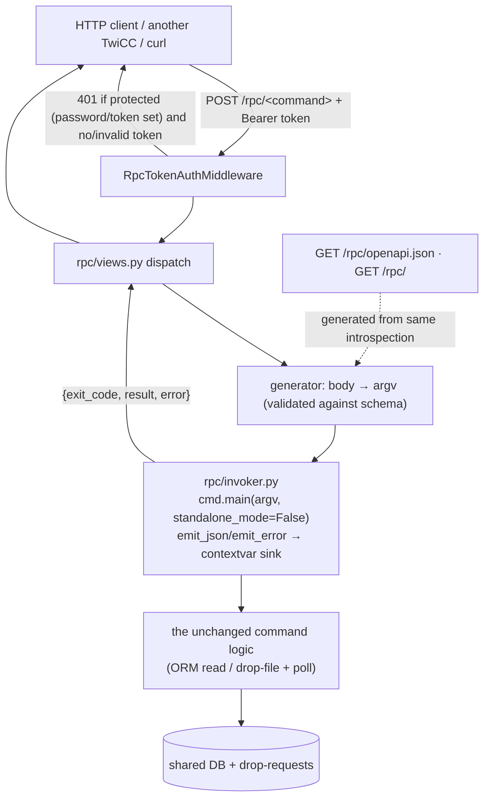

# RPC API auto-generated from the TwiCC CLI

**Status:** Draft
**Date:** 2026-06-04
**Author:** Twidi (with Claude)
**Scope:** Server-side RPC API only. The CLI-side `--remote <url>` forwarder that *consumes* this API is a deliberate phase 2 and is **out of scope** here (the API is designed to serve it — see §11).

## 1. Goal

Expose the entire `twicc` CLI surface as an HTTP API, **auto-generated** from the existing Typer command tree — there is no hand-maintained endpoint list to keep in sync. One route per command under a new `/rpc/` namespace, each backed by the *exact same* command logic the terminal CLI runs, executed **in-process, in Python** (never a subprocess, never a shell). Calls are authenticated by per-instance API tokens.

**This API is a self-contained deliverable, valuable on its own** — any HTTP client, script, CI job, dashboard, or another TwiCC instance can drive a TwiCC over HTTP, with no CLI involvement at all. The later `--remote` forwarder (phase 2) is a *complementary convenience layer* layered on top: it lets the local `twicc` CLI target another instance **without the caller speaking HTTP directly**. The two are independent — the API does not need `--remote` to be useful, and `--remote` is just one of its consumers.

One motivating use case that spans both phases: let one TwiCC instance — or any HTTP client, or another container — drive *another* instance's operations, most importantly **spawning and messaging sessions on a remote instance** that shares no filesystem with the caller. Today the CLI reaches its backend only by sharing the data directory (DB + drop-requests dir); a separate instance on another port/container has no such shared channel, so HTTP is the only way in. This spec delivers that HTTP surface — which also stands on its own for every other client.

## 2. Out of scope (this phase)

- **The `--remote <url>` CLI forwarder** (phase 2). No CLI client changes ship here. §11 records the forward-compatibility hooks the API keeps so phase 2 stays a thin client.
- **Named remote registry**, `--remote-token` flag, `TWICC_REMOTE_TOKEN` env — all phase 2.
- **The forwarder turning a local file *path* into bytes client-side** (phase 2). Attachments themselves ARE fully supported in this phase: `--attach` accepts **either a file path or a `data:<mime>;base64,<data>` URI** (extended in `cli/_drop_request/attachments.py` — the data-URI bytes are decoded, the real MIME re-sniffed, then run through the exact same validate/resize/encode pipeline, producing identical base64 SDK dicts in the drop-file; the read side is unchanged). So any HTTP/API caller — even a remote one with no shared filesystem — can attach files by passing the bytes inline as a data URI. What's deferred to phase 2 is only the `--remote` forwarder's *convenience* of reading a local **path** and converting it to a data URI automatically. `--annotations-file` and prompt-as-path still reference server-local paths (over the API, use inline `--annotation KEY=VALUE` / inline prompt text instead).
- **REST-idiomatic resource routes.** We mirror the CLI 1:1 (RPC), we do not design a REST resource model.
- **SPA / frontend consumption of `/rpc/`.** The Vue SPA keeps using `/api/` with cookie auth, untouched.
- **Exposing human/local-only commands**: `password`, `claude`, `codex`, `run`, the new `token` sub-app, and `whoami` (see §6.1).

## 3. Context (current architecture)

### 3.1 The CLI

- `twicc` is a **Typer** app (`src/twicc/cli/__init__.py`), lazy-loading each subcommand module so `--help` never pays for Django startup.
- Two ways commands reach the backend:
  - **Read commands** (`sessions`, `projects`, `session`, `search`, `topology`, `processes`, `process`, `usage`, `info`, `status`, …) query the shared SQLite DB directly via the Django ORM, or read sidecar files (`status`). Most work whether or not a backend is running.
  - **Write commands** (`create-session`, `send-message`, `update-session …`, `create/update-project`, `…workspace`, `process(es) stop`) write a request file into `<data_dir>/drop-requests/` that the **live backend's** watcher (`src/twicc/drop_requests_watcher.py`) consumes, then poll the DB for the server's final status (bounded by `--timeout`).
- **The CLI talks to the backend by sharing the data directory, never over HTTP.** This is the exact coupling the API breaks open.

### 3.2 Single JSON output choke point

- Every structured command emits its result through **`emit_json`** in `src/twicc/cli/_output.py`. Since the recent centralization the CLI **speaks JSON unconditionally** on every structured command — there is no text/progress mode and no `--json` toggle to get right (`src/twicc/cli/_drop_request/output.py` docstring: *"There is no text / progress mode anymore"*).
- The only commands that never call `emit_json` are the human-only ones (`password`, the `claude`/`codex` passthroughs, `run`); they print their own text.
- **Errors** currently bypass `emit_json`: commands write plain text to stderr via `typer.echo(..., err=True)` and `raise typer.Exit(code)`. There is no single error choke point yet — this spec adds one (`emit_error`, §5).

### 3.3 The existing web API and auth

- `/api/…` (Django views in `src/twicc/views.py`, routed in `src/twicc/urls.py`) is a hand-written, SPA-oriented surface, protected by `PasswordAuthMiddleware` (`src/twicc/auth/middleware.py`) using **session-cookie** auth keyed off `TWICC_PASSWORD_HASH`. The catch-all `re_path(r"^(?!api/|static/|ws/|artifacts/).*$")` serves the SPA; a new top-level prefix must be added to that exclusion set.
- Reusable auth building blocks: `src/twicc/auth/hashers.py` (stdlib-only PBKDF2 + legacy SHA-256), `session_auth.py`, and the `password` sub-app (`src/twicc/cli/password.py`) — the structural patron for the new `token` sub-app.
- `PasswordAuthMiddleware` only enforces on `/api/` and `PROTECTED_NON_API_PREFIXES`; **`/rpc/` would fall through it untouched**, which is exactly what we want (it gets its own token gate, §7.3).

## 4. Architecture overview

Three server components built on **one shared invoker**:

| Component | Module(s) | Role |
|---|---|---|
| **A. Execution seam** | `cli/_output.py` (edit), `rpc/invoker.py` (new) | Run a command in-process; capture result + error + exit code, concurrency-safe, no stdout capture, no subprocess |
| **B. RPC generator + OpenAPI** | `rpc/generator.py`, `rpc/schema.py`, `rpc/views.py`, `rpc/openapi.py` (new), `urls.py` (edit) | Introspect the Typer tree → one route per command under `/rpc/`, typed body schemas, an OpenAPI 3.1 document |
| **C. Token auth** | `cli/token.py`, `auth/tokens.py` (new), `auth/middleware.py` (edit), `paths.py` (edit) | Per-instance API tokens (`twicc token …`) gating every `/rpc/` call |



The same `invoke()` is what the local terminal CLI effectively runs too (same parsing, same logic): **zero behavioural divergence between CLI and API**.

## 5. Component A — Execution seam

### 5.1 Two contextvar-interceptable choke points in `_output.py`

```python
import contextvars

# When set (API mode), structured output and errors are captured into the
# sink instead of being written to stdout/stderr. contextvars are isolated
# per thread / per asyncio task and propagate across asyncio.to_thread,
# so concurrent /rpc/ requests never clash on a global stream.
_capture: contextvars.ContextVar["_Sink | None"] = contextvars.ContextVar("emit_capture", default=None)

class _Sink:
    __slots__ = ("result", "error")
    def __init__(self):
        self.result = None
        self.error = None

def emit_json(payload) -> None:
    sink = _capture.get()
    if sink is not None:
        sink.result = payload
        return
    sys.stdout.buffer.write(orjson.dumps(payload, option=orjson.OPT_INDENT_2))
    sys.stdout.buffer.write(b"\n")

def emit_error(message: str, *, code: int = 1) -> None:
    """Single choke point for CLI error output. Always raises typer.Exit(code)."""
    sink = _capture.get()
    if sink is not None:
        sink.error = message
        raise typer.Exit(code)
    typer.echo(message, err=True)
    raise typer.Exit(code)
```

> `_capture` lives in `_output.py`; `rpc/invoker.py` imports the same object so the seam is exactly one ContextVar.

### 5.2 `emit_error` migration

A mechanical pass over the **API-eligible** command modules: replace each `typer.echo(<msg>, err=True); raise typer.Exit(<n>)` pair with `emit_error(<msg>, code=<n>)`. This is the symmetric counterpart of the `emit_json` centralization already done. Human-only commands (`password`, `claude`, `codex`, `run`) are **not** touched. Cross-field validation that lives in the Typer callbacks of `cli/__init__.py` (e.g. the mutually-exclusive `--include-hidden` / `--only-hidden` checks) is migrated the same way so its message reaches the API caller.

**Not migrated — already captured.** The write commands report their *primary* failure channel through `emit_validation_errors(...)` / the drop-request status helpers in `cli/_drop_request/output.py`, which already call `emit_json` with a structured payload (`{"status": "validation_error", …}`, `{"status": "rejected", …}`, `{"status": "failed", …}`) and then `raise typer.Exit(n)`. Because they route through `emit_json`, the seam captures them into `sink.result` unchanged — they need **no** migration. The implementer must leave these call sites alone; the failure surfaces as a structured `result` with a non-zero `exit_code` (see §8).

Rationale (explicitly requested): without this, an API caller would receive a non-zero `exit_code` but no reason — the API would be hard to use. With it, the envelope carries the failure message (§8).

### 5.3 The invoker (`rpc/invoker.py`)

```python
from typing import NamedTuple
import click, typer
from twicc.cli import app
from twicc.cli._output import _capture, _Sink

class InvocationResult(NamedTuple):
    exit_code: int
    result: object | None      # the emit_json payload, or None
    error: str | None          # the emit_error / ClickException message, or None

def invoke(argv: list[str]) -> InvocationResult:
    cmd = typer.main.get_command(app)        # the Typer app as a click.Command
    sink = _Sink()
    tok = _capture.set(sink)
    try:
        cmd.main(args=argv, prog_name="twicc", standalone_mode=False)
        code = 0
    except (click.exceptions.Exit, SystemExit) as e:
        code = getattr(e, "exit_code", getattr(e, "code", 0)) or 0
    except click.ClickException as e:         # parse/usage errors (bad params)
        code = e.exit_code
        if sink.error is None:
            sink.error = e.format_message()
    finally:
        _capture.reset(tok)
    return InvocationResult(exit_code=code, result=sink.result, error=sink.error)
```

Why this shape:

- **`standalone_mode=False`** makes Click invoke the callback and **never call `sys.exit`, never touch the global `stdout`/`stderr`** — `Exit`/`ClickException`/`Abort` propagate as exceptions we catch. Combined with the `_capture` ContextVar there is **no global stream mutation**, so the invoker is safe under concurrency without any lock.
- It runs the **real** Typer parsing + validation + command logic. A read command hits the ORM; a write command drops its request file and polls. When the write path runs *inside the live backend process*, the backend's own watcher consumes the drop file exactly as for a terminal CLI call — **same path, zero divergence** (the slight irony of the backend dropping a file for its own watcher is acceptable and keeps one code path).
- **Django is already configured** in the backend process; the lazy `django.setup()` inside command modules is idempotent.

**Blocking.** Write commands poll up to `--timeout` seconds. The Django async view runs the invoker in a worker thread (`await asyncio.to_thread(invoke, argv)`); `asyncio.to_thread` copies the current context, so the `_capture` ContextVar set just before the call propagates into the thread. The event loop is never blocked; concurrent calls each get their own thread + sink.

| Outcome | `exit_code` | `result` | `error` |
|---|---|---|---|
| Success | `0` | payload | `None` |
| Command-level failure (`emit_error`) | the code passed | usually `None` | the message |
| Status-bearing read (e.g. `status` not running) | `1` | payload | `None` (payload already emitted before exit) |
| Write validation/rejection (`emit_validation_errors` etc.) | `1` | structured `{"status": "validation_error"\|"rejected"\|"failed", …}` | `None` |
| Parse/usage error (`ClickException`) | `2` | `None` | Click's formatted message |
| Unhandled exception | — | — | propagates → HTTP 500 (§8) |

## 6. Component B — RPC generator + OpenAPI

### 6.1 Allowlist / denylist

Exposed = every command **except** a denylist:

| Excluded | Why |
|---|---|
| `password` | Manages this instance's own auth secret; interactive/local only. |
| `claude`, `codex` | Interactive passthroughs to the bundled provider CLIs — nonsensical over HTTP. |
| `run` | Starts the server itself. |
| `token` (new, §7.2) | Chicken-and-egg: you cannot manage an instance's tokens remotely without already holding a token. Local/human only. |
| `whoami` | Resolves the *calling process's* session via local PID ancestry — there is no caller PID over HTTP. |

The denylist is applied **before** schema extraction (§6.3): the generator never tries to introspect a body schema for an excluded command. This matters for `claude` / `codex`, whose `context_settings` (`allow_extra_args`, `ignore_unknown_options`, variadic `ctx.args`) give them no introspectable parameter shape — filtering them out first avoids the generator choking on them.

Note on `self` / `parent` **argument values** (e.g. `update-session self`, `send-message parent`): they resolve via local PID ancestry too. Over the API there is no calling session, so the command's own resolution fails and surfaces as an `emit_error` in the envelope. API callers must pass explicit ids. This is documented, not specially intercepted.

### 6.2 Command → route mapping

The route path mirrors the CLI command path; **leading positional arguments go in the request body, not the URL** (uniform, no per-command path-param mapping). Every command is **`POST` with all parameters in the JSON body** — no query-string, no per-command `GET`/`POST` split (which would force classifying reads vs writes and force-encoding arrays / typed values into the URL).

| CLI | Route | Body fields (illustrative) |
|---|---|---|
| `create-session <prompt>` | `POST /rpc/create-session` | `prompt`, `project`, `provider`, `preset`, `model`, … |
| `sessions` | `POST /rpc/sessions` | `project`, `limit`, `offset`, filiation/annotation filters |
| `sessions get <ids…>` | `POST /rpc/sessions/get` | `session_ids: [..]` |
| `session <id>` | `POST /rpc/session` | `session_id` |
| `session <id> content <range>` | `POST /rpc/session/content` | `session_id`, `range` |
| `session <id> messages` | `POST /rpc/session/messages` | `session_id`, `role`, `tail`, … |
| `update-session <id> settings` | `POST /rpc/update-session/settings` | `session_id`, `model`, `effort`, … |
| `process <id> wait <status…>` | `POST /rpc/process/wait` | `session_id`, `statuses: [..]`, `timeout` |
| `topology <id>` | `POST /rpc/topology` | `session_id`, `processes`, `full_sessions` |

### 6.3 Parameter schema extraction (`rpc/schema.py`)

For each exposed leaf command, walk the Click **group → command chain** and collect every `click.Parameter` from each level (group callbacks contribute their args/options too, e.g. the `session` group's `session_id`). Translate to a JSON Schema for the request body:

- **Argument**, required → required field. `nargs == -1` (variadic, e.g. `session_ids`) → `array`.
- **Option** → optional field with its `default`. `multiple=True` (repeatable, e.g. `--annotation`) → `array`. Boolean flag → `boolean`. `click.Choice` → `enum`.
- Types: `STRING`→string, `INT`→integer, `FLOAT`→number, `BOOL`→boolean, `Choice`→enum, `Path`→string.
- `help` text → field `description`.

### 6.4 Body → argv rendering (the crux, `rpc/generator.py`)

Given a validated body and a command's introspected spec, render the argv the invoker will run:

1. Walk the group chain root→leaf. For each non-root level: append the level's **name token**, then its **arguments in declared order** (positional). Example: `session` group (arg `session_id`) + `content` command (arg `range`) → `["session", body["session_id"], "content", body["range"]]`.
2. Append the leaf command's **options**:
   - Boolean flag with a secondary (off) form (`--thinking/--no-thinking`): emit the primary if `True`, the secondary if `False`, omit if the value equals the default and no explicit value was sent.
   - Boolean flag without an off form: emit the flag only when `True`.
   - `multiple` / array: repeat `--opt v1 --opt v2`.
   - Scalar option: `--opt value` when present/non-default.
3. All rendered tokens are strings (`str(value)`); the invoker re-parses them through the real Typer types, so a single source of truth governs coercion and validation.

The generator stores, per command: `{path, group_chain, arguments[], options[], json_schema}`. Built once (at import/startup) into a **route registry**.

### 6.5 Dispatch & Django wiring (`rpc/views.py`, `urls.py`)

- `urls.py` adds `path("rpc/openapi.json", rpc_views.openapi)`, `path("rpc/", rpc_views.index)`, and `re_path(r"^rpc/(?P<command_path>[a-z0-9/-]+)/?$", rpc_views.dispatch)`. The SPA catch-all exclusion becomes `^(?!api/|rpc/|static/|ws/|artifacts/).*$`.
- `dispatch` (async): look up `command_path` in the registry → 404 if unknown. Parse the JSON body, validate against the command's JSON Schema → 400 with details on mismatch. Render argv (§6.4). `result = await asyncio.to_thread(invoke, argv)`. Return the envelope (§8).
- `index` returns the list of exposed commands (paths + summaries). `openapi` returns the generated document (§6.6).

### 6.6 OpenAPI document (`rpc/openapi.py`)

`GET /rpc/openapi.json` returns an **OpenAPI 3.1** document generated from the same registry: one `POST` path per command, `requestBody` = the command's JSON Schema, `responses.200` = the envelope schema, a `bearerAuth` security scheme applied globally, and `summary`/`description` from the command's Typer help. This gives external tooling (and the colleague) a real, browsable, typed contract with zero hand-maintenance. Generated in-house from Click introspection — no extra heavy dependency required.

**Live, not codegen.** The route registry is built by **runtime introspection at startup** — there are **no generated server source files** to commit or regenerate, so the API can never drift from the CLI (add a command → its endpoint appears automatically). The SDK-style codegen familiar from the dev world lives **downstream, on the client side**: anyone generates a typed client (Python, TS, …) from `/rpc/openapi.json`. Standard contract-first split — the server introspects, the OpenAPI is the contract, clients are generated from it.

## 7. Component C — Token auth

### 7.1 Token model & storage (`auth/tokens.py`)

- A token is a **high-entropy random string**: `twicc_pat_` + `secrets.token_urlsafe(32)` (256 bits).
- Stored as a **plain SHA-256 hex digest**, not PBKDF2. **Rationale (explicit decision):** PBKDF2's 600k iterations exist to slow brute force of *low-entropy* passwords; a 256-bit random token is not brute-forceable, so a fast digest is the standard, safe choice for API keys — and it gives **O(1) dict lookup + constant-time compare** per request instead of N×600k iterations.
- File: `<data_dir>/api-tokens.json`, `chmod 600` (new `get_api_tokens_path()` in `paths.py`):

```json
{"version": 1, "tokens": [
  {"id": "tok_8f3a2b1c", "name": "ci-bot", "digest": "<sha256hex>",
   "created_at": "2026-06-04T…Z", "last_used_at": null}
]}
```

`id` is a short public handle (e.g. first 8 hex of a random value), safe to show in `list`/logs.

### 7.2 `twicc token` sub-app (`cli/token.py`)

Structural patron = `cli/password.py`. **Local/human only — never exposed via `/rpc/`** (§6.1).

- `twicc token create --name "ci-bot"` → mints a token, **prints the secret once** (plain text, not via `emit_json` so it is never capturable through the API path), persists only `{id, name, digest, created_at}`.
- `twicc token list` → `{id, name, created_at, last_used_at}` per token; **never the secret/digest**.
- `twicc token revoke <id>` → removes the entry.

### 7.3 Middleware integration (`auth/middleware.py`)

A dedicated `RpcTokenAuthMiddleware` enforcing **only** on `/rpc/`:

- Not under `/rpc/` → pass through (existing `PasswordAuthMiddleware` already ignores `/rpc/`, so cookie auth never applies there).
- Under `/rpc/`, the gate follows the instance's protection posture — **`password defined OR any token defined ⟹ a valid token is mandatory`; otherwise the surface is open**:
  - **Neither `TWICC_PASSWORD_HASH` nor any token is set** → the operator has *opted out* of protection (purely-local use — a single machine, a private Docker, …). `/rpc/` is **open, no token required**. This mirrors the web app's existing "no password = no protection" stance.
  - **A password is set, OR at least one token exists** → protection is in effect; **every `/rpc/` call requires a valid Bearer token.** The password is *never itself* an RPC credential — it only **forces token-gating on** (TwiCC already recommends a password for remote access, so a configured password means "this instance is protected"). Consequently, if a password is set but no token exists yet, every `/rpc/` call returns `401` until the operator runs `twicc token create`.
  - **Token check:** read `Authorization: Bearer <token>` → SHA-256 → constant-time compare against the digest set. Missing/invalid → `401` (the message hints at `twicc token create` when the store is empty). Hit → best-effort `last_used_at` update, then proceed.
- **Hot reload:** the token set is cached and invalidated by `api-tokens.json` mtime, so a freshly created token works **without restarting** the server (an improvement over the password, which needs a restart). The cache read is cheap and happens off the request's critical path where possible.

`/rpc/openapi.json` and `/rpc/` index are under `/rpc/` and follow the same gate (when protection is in effect they require a valid token, since the schema reveals the surface).

## 8. Response envelope & error model

The body of a successful dispatch (HTTP 200) is the faithful RPC mirror:

```json
{ "exit_code": 0, "result": { /* the emit_json payload */ }, "error": null }
```

- **HTTP 200** whenever the command *executed*, regardless of CLI `exit_code`. The exit code is **data** carrying CLI semantics (`1` not-found/validation, `2` backend down, `5` timeout) — not a transport failure. `result` is the captured payload (or `null`), `error` the captured message (or `null`).
- **Two failure channels — `exit_code` is authoritative.** A failure may surface through **`error`** (a string, from `emit_error` or a Click parse error) **or** through **`result`** (a structured payload such as `{"status": "validation_error", …}` / `{"status": "rejected", …}` emitted by the write path via `emit_validation_errors`). Callers must treat `exit_code != 0` as the failure signal and read whichever of `error` / `result` is populated — never assume `error` is always set on failure.
- **HTTP 401** — protection is in effect (password or token configured) and the request carries no/invalid token. **HTTP 404** — unknown command path. **HTTP 400** — malformed JSON body or schema validation failure (with field-level details); also Click parse/usage errors surface here when detected pre-invoke (post-invoke `ClickException` lands in the envelope `error` with `exit_code=2`). **HTTP 500** — unhandled server exception (logged; generic message returned).

## 9. Concurrency & performance

- Per-request isolation via the `_capture` ContextVar + `asyncio.to_thread`; no locks, no global stream mutation.
- Token verification is a fast digest + dict lookup; no PBKDF2 on the hot path.
- Write-command polling runs in the worker thread, honoring each command's `--timeout`, without blocking the event loop. Many concurrent long-polling RPC calls are fine (one thread each, bounded by the server's thread pool — acceptable for a control-plane API).

## 10. Security considerations

- `/rpc/` is **full control of the instance**: it can spawn agents, stop processes, run file-system commands scoped to projects, mutate sessions/projects/workspaces. Treat a valid token as equivalent to shell access to that instance's data dir.
- Tokens stored as digests, file `chmod 600`; the plaintext is shown once and never persisted. A world/group-readable `api-tokens.json` is warned about (mirror `password.py`'s `.env` permission warning).
- **Protection posture (see §7.3):** if a password or any token is configured, `/rpc/` *requires* a valid token (the password alone never authenticates RPC); with neither configured, `/rpc/` is open — consistent with the operator's explicit choice to run unprotected locally. The recommendation to set a password for any remote-accessible instance therefore *also* closes `/rpc/` behind tokens automatically.
- Operators exposing `/rpc/` beyond a trusted network must front it with TLS (reverse proxy); this spec does not add TLS termination. Documentation must state plainly that exposing `/rpc/` = handing over the instance.

## 11. Forward-compatibility for `--remote` (phase 2)

To keep phase 2 a thin client, the dispatch view (§6.5) also accepts an **`{"argv": [ ... ]}`** body as an alternative to the typed body: when present, it bypasses schema-from-body rendering and is fed to the invoker directly (still token-gated, still allowlist-checked). The future forwarder will build that argv locally (it already has it — the user typed it), upload any file-valued options, and POST here. The typed body remains the documented path for external/human callers. `self`/`parent`/`whoami` are already excluded, matching the forwarder's local-identity constraint.

This is the *only* concession the API makes to phase 2; it costs one branch in the dispatch view.

## 12. File / module layout

**New**

- `src/twicc/rpc/__init__.py`
- `src/twicc/rpc/invoker.py` — §5.3
- `src/twicc/rpc/schema.py` — §6.3 (Click params → JSON Schema)
- `src/twicc/rpc/generator.py` — §6.4 (registry + body→argv rendering)
- `src/twicc/rpc/views.py` — §6.5 (dispatch, index, openapi handlers)
- `src/twicc/rpc/openapi.py` — §6.6
- `src/twicc/auth/tokens.py` — §7.1 (store read/write, verify, mtime cache)
- `src/twicc/cli/token.py` — §7.2 (`twicc token` sub-app)

**Edited**

- `src/twicc/cli/_output.py` — add `_capture`, `_Sink`, `emit_error`.
- `src/twicc/cli/__init__.py` — register the `token` sub-app; migrate callback-level validation to `emit_error`.
- API-eligible `cli/*` modules — `emit_error` migration (§5.2).
- `src/twicc/auth/middleware.py` — add `RpcTokenAuthMiddleware`.
- `src/twicc/settings.py` — register the new middleware.
- `src/twicc/urls.py` — `/rpc/` routes + SPA catch-all exclusion.
- `src/twicc/paths.py` — `get_api_tokens_path()`.

## 13. Verification (project policy: no automated tests)

This project explicitly allows skipping tests and linting (`CLAUDE.md`). No test suite is mandated. Manual verification checklist instead:

- `twicc token create` → `curl -s -H "Authorization: Bearer <tok>" -X POST localhost:<port>/rpc/status` returns the `status` envelope. Once a password **or** a token is configured, the same call **without** a valid `Authorization` header → 401. With **neither** password nor token configured, `/rpc/` is reachable with no header at all (open, local-only mode).
- A read command (`sessions`, body `{"limit": 5}`) returns the same payload as the terminal CLI.
- A write command (`create-session`, body `{"prompt": "hi", "project": "<path>"}`) actually spawns a session (verify in the UI) and returns its `session_id`; concurrent calls do not interleave outputs.
- A failing command returns `exit_code != 0` with the reason in `error` (string failures) **or** in `result` (structured validation/rejection payloads from write commands — see §8).
- `GET /rpc/openapi.json` validates as OpenAPI 3.1 and lists exactly the allowlisted commands.

## 14. Decisions log

- **RPC mirror of the CLI**, not REST (auto-generatable, zero hand-maintenance).
- **In-process Python invocation** via `cmd.main(args=argv, standalone_mode=False)` + ContextVar capture — no subprocess, no stdout capture, concurrency-safe.
- **`emit_error`** added as the symmetric error choke point so the envelope carries failure messages.
- **One route per command + generated OpenAPI 3.1** under **`/rpc/`** (distinct from the SPA's `/api/`).
- **Multi-token, CLI-managed** (`twicc token create/list/revoke`); tokens stored as **fast SHA-256 digests** (high entropy → no KDF needed) in a data-dir JSON file; token set **hot-reloaded**.
- **Auth gate = protection posture:** `password defined OR token defined ⟹ a valid Bearer token is mandatory` on `/rpc/`; with neither set, `/rpc/` is open (local/unprotected by operator choice). The password only *forces* token-gating on; it is never itself an RPC credential.
- **All params in the request body** (leading positional args included); path = command path.
- `password`/`claude`/`codex`/`run`/`token`/`whoami` **excluded**; `self`/`parent` values unusable over the API by construction.

## 15. Documentation & plugin impact

- The RPC API is backend infrastructure, **not** an agent skill — no `plugin.json` bump required for the API itself.
- `cli/token.py` is a new local CLI command. A future `twicc-token` skill is **optional** and deferred (token management is human/local). If added later, it follows the usual plugin-version-bump rule.
- `SKILLS-AND-CLI.md` (untracked) currently describes a `--json`/`--no-color` toggle that the JSON-by-default refactor has superseded; it should be reconciled when this lands, and gain a short "HTTP API (`/rpc/`)" section. (Tracked as a doc follow-up, not part of the API code.)

## 16. Open questions (non-blocking, implementer's discretion)

- **`last_used_at` write strategy** — synchronous per request vs debounced/async. Best-effort, non-critical; either is fine.
- **OpenAPI generation** — fully in-house from the registry (preferred, no new dep) vs a light schema lib. The registry already holds everything needed; in-house is the default.
